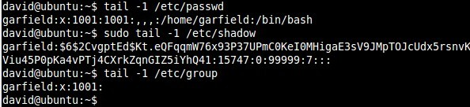
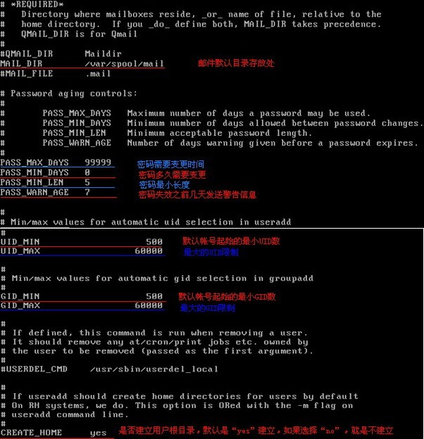
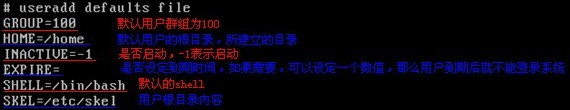

## 权限
**用户类型**<br/>
1. owner(所有者)
2. group(所属组)
3. other(其他用户)
**基本权限类型**<br/>
1. r(读):对于普通文件就是查看的权限，对于目录就是进入目录内部的权限<br/>
2. w(写):对普通文件就是修改、删除的权限，对于目录就是添加、删除内部文件和删除目录的权限。<br/>
3. x(执行):对于可执行文件就是可执行的权限。<br/>
**查看文件权限**<br/>
`ls -l`得到如下结果:<br/>
-rwxr-x-wx 1 root wheel 430540 Dec 20 18:27 /bin/bash<br/>
说明：<br/>
1. 首字符表示文件类型<br/>
`-`，普通文件<br/>
`d`，目录<br/>
`l`，符号链接<br/>
`c`，字符设备文件<br/>
`b`，块设备文件<br/>
`p`，先进先出文件<br/>
`s`, 套接字文件<br/>
2. 第2到10个字符则表示所有者、所属组和其他用户的权限<br/>
`rwx`，表示所有者拥有读、写和执行的权限<br/>
`r-x`，表示所属组拥有读、执行的权限<br/>
`-wx`，表示其他用户拥有写、执行的权限<br/>
3. 1表示该文件拥有一个硬链接<br/>
4. root为文件的所有者<br/>
5. wheel为文件的所属组<br/>
6. 430540为文件大小，以block为单位，若要以KB等作单位，则输入`ls -lh`<br/>
7. Dec 20 18:27 最后修改日期<br/>
8. /bin/bash为文件的绝对路径<br/>

**查看用户信息**<br/>
````
// 查看当前用户
whoami

// 查看当前用户所属组
groups

// 查看其他用户所属组
groups 用户1 用户2
````
**改变所有者和所属组**<br/>
注意：当前用户为root才能执行下列操作。<br/>
````
// 改变所有者
chown 用户名 文件路径

// 改变所属组
chgrp 用户组 文件路径

// 改变所有者和所属组
chown 用户名.用户组 文件路径

// 递归改变所有者和所属组
chown -R 用户名.用户组 目录路径
````
**改变权限**<br/>
有两种模式来设置权限，分别是符号模式和数字模式。<br/>
1. 符号模式<br/>
````
// 为所有者、所属组和其他用户添加执行的权限
chmod +x 文件路径
// 为所有者、所属组和其他用户删除执行的权限
chmod -x 文件路径

// 为所有者添加执行的权限
chmod u+x 文件路径
// 为所属组添加执行的权限
chmod g+x 文件路径
// 为其他用户添加执行的权限
chmod o+x 文件路径
// 为所有者、所属组添加执行的权限
chmod ug+x 文件路径

// 为所有者、所属组和其他用户添加写、执行的权限，取消读权限
chmod =wx 文件路径
// 为所有者、所属组添加写、执行的权限，取消读权限
chmod ug=wx 文件路径
````
2. 数字模式<br/>
权限三元组使用三位二进制数表示，且使用1表示有权限，0表示无权限。那么有rwx权限时，则表示为111；无权限时表示为000<br/>
而使用`chmod`设置时，不能直接使用三位二进制数表示权限，需要将二进制数转为八进制数才是有效入参。<br/>
权限与数字模式映射<br/>
````
rwx 7
rw- 6
r-x 5
r-- 4
-wx 3
-w- 2
--x 1
--- 0
````
````
// 为所有者、所属组和其他用户添加写、执行的权限，取消读权限
chmod 333 文件路径
````
**unmask**<br/>
当通过进程创建文件时，系统会参考unmask提供的权限来设置文件的权限。<br/>
unmask是用于告诉操作系统禁止用户类型的哪些权限，示例：<br/>
````
// 查看unmask值
# unmask
// 回显结果为022，转为符号模式就是----w--w-，意思是禁止所属组、其他用户的写权限（而不是添加写权限）
````
**用户、用户组信息文件**<br/>
`/etc/passwd`：<br/>
`/etc/shadow`：<br/>
`/etc/group`：<br/>

**管理用户**<br/>
`adduser [-u uid] [-g group] [-d home] [-s shell]`，添加用户<br/>
&emsp;`-u`,用户标识<br/>
&emsp;`-g`,用户所属的用户组标识<br/>
&emsp;`-d`,以已存在的目录作为用户的家目录<br/>
&emsp;`-s`,定义shell<br/>
示例:<br/>
````
// 添加用户标识 fsjohnhuang 
# adduser fsjohnhuang
````
通过`/etc/passwd`、`/etc/shadow`和`/etc/group`文件内容，检查用户是否创建成功。<br/>
<br/>
在创建用户时系统会根据`/etc/login.defs`和`/etc/default/useradd`文件的内容对新用户做基本设置。<br/>
`/etc/login.defs`文件<br/>
<br/>
<br/>
`/etc/default/useradd`文件<br/>
<br/>


**创建、删除用户组**<br/>
**参考**<br/>
http://blog.csdn.net/fan_zhen_hua/article/details/2050009
http://blog.csdn.net/xsz0606/article/details/5256719
http://blog.chinaunix.net/uid-20671208-id-3488852.html


## 进程
**`ps`**<br/>
查看进程<br/>
````
// 显示所有用户进程，显示用户和时间
# ps -aux
````


## 查找
**`locate`**<br/>
  用于模糊搜索文件(目录)的绝对路径。<br/>
  示例：<br/>
````
// 凡是绝对路径当中含jdk字符串的文件（目录）均被搜索出来
fsjohnhuang@fsjohnhuang~# locate jdk
````
失败示例：<br/>
````
// 在家目录添加文件mytest.md
fsjohnhuang@fsjohnhuang~# touch mytest.md
fsjohnhuang@fsjohnhuang~# locate mytest
````
上述例子再添加mytest.md后马上通过locate搜索mytest的绝对路径,但什么都搜不到。那是因为locate命令是从系统db中搜索的，而这个系统db是定时在晚上与文件系统的目录结构同步，因此刚才添加文件信息无法通过locate搜索出来。这也是locate的速度必find高的原因。我们可以通过`sudo updatedb`命令手动方式同步系统db,现在就可以通过locate来搜索了。<br/>
进阶<br/>
````
// 精确查找文件（目录),那么就只有文件或目录名为jdk才匹配成功
locate -b "\jdk"
// 精确查找文件（目录),那么就只有文件或目录名含jdk才匹配成功
locate -b "jdk"
````
**`find`**<br/>
  用于在特定目录(默认是当前目录)下根据文件名称、文件类型等信息搜索文件相对特定目录的相对路径。<br/>
示例:<br/>
````
// 在当前目录下搜索
find -name "mytest.md"
// 使用通配符
find -name "mytest*"

// 在特定目录下搜索
find /home/fsjohnhuang

// 仅列出普通文件
find -type f
// 仅列出目录
find -type d

// 对find搜索出来的文件或目录执行其他命令 
// -exec 其他命令 ';'
// 而'{}'就是代表find搜索出来的文件或目录
find -exec ls -l '{}' ';'
````
**`grep`**<br/>
  在文本字符串当中查找。<br/>
````
// 基本格式:grep 字符串 文件名
grep hello a.txt

// 不区分大小写
grep -i hello a.txt

// 显示行号
grep -n hello a.txt
````
**ack-grep**<br/>
  对于代码的查找可以使用ack-grep。<br/>
  教学地址:happycasts.net
**which**<br/>
  用于搜索命令的可执行文件所在位置。<br/>
  如`which cat`将返回/bin/cat<br/>
**whereis**<br/>
  用于搜索命令的可执行文件、源码文件和man文件所在位置。<br/>
  如`which cat`将返回`cat: /bin/ls /usr/share/man/man1/ls.1.gz /usr/share/man/man1p/ls.1p.gz`<br/>
