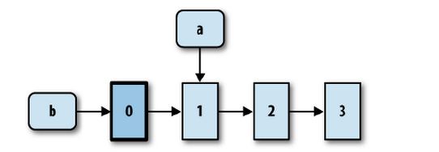
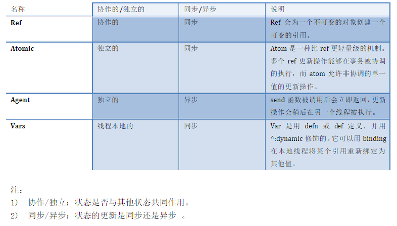

<br/>

## OOP的本质
当代的OO语言只关注状态（可变状态），依靠悲观锁在进行并发控制，缺乏良好的并发模型和消息机制。<br/>
大部分OO语言都没有提供内置的有效的消息传递机制，而是通过设计模式来弥补，导致编程工作量增大，影响代码的可读性。<br/>
OOP的优势是对现实世界的建模，而不是数据处理。<br/>
两段业内名言：<br/>
>如果我们现在回头看一下面向对象这个思想是从哪来的，如果以基于消息传递机制的Smalltalk-80的特性来衡量现在的状态继承和面向对象的使用方式，我们不禁要问，我们是不是已经走错路了？”  ——2010伦敦QCon大会采访
>只关注状态，在类和基于映像的语言里缺乏良好的并发模型和消息机制。  ——Dave Thomas博士

## FP（函数式编程）
### 概述
1. 编程范式
2. 程序运行就是一系列的数学函数运算
3. 以lambda calclate为基础
4. 函数为first-class，采用闭包创造出高阶函数
5. 避免状态、变量和副作用
6. 支持lazy evaluation和引用透明性

### Immutable data
没有OO语言的variable，而是binding。Clojure中称之为PDS（Persistent Data Structures），就是数据结构及其值是不可变的。好处是：<br/>
1. 提高程序效率；
2. 为并发编程提供有力支持；
3. 更容易进行数据版本管理。

### 引用透明性
就是相同的输入一定会返回相同的输出，即一个函数的计算过程不会因为任何外部环境的改变而发生变化。<br/>
引用透明性与Immutable data密切相关。<br/>
````
;; binding a with list (1 2 3)
(def a '(1 2 3))
;; cons 0 to a
(def b (cons a 0))
;; pritnln "The 'a' is (1 2 3)"
(println "The 'a' is" a)
;; pritnln "The 'b' is (0 1 2 3)"
(println "The 'b' is" b)
````
<br/>
a和b都指向同一个序列，但起点不同。<br/>

### Function is first-class
就是函数可作为另一个函数的输入和输出。<br/>

### lazy evaluation
对表达式的求值是按需进行，当真正需求表达式的结果时才执行求值操作。最小化某一时刻的计算量，从而达到最大化节省空间和时间的目的。<br/>

### 闭包
偏函数
柯里化


## Clojure
作者：Rich Hickey<br/>
2007年10月第一次发布<br/>
核心优势：代码即数据（code-as-data）&句法抽象<br/>

Clojure的每个操作必为以下三种形式的一种：special form,function,macro<br/>
Clojure中没有语句只有表达式，而表达式必定有一个返回值。<br/>
`(function-position)`被称为列表（list），而function-position称为符号（symbol），而一个函数名、Java类型名、宏和special form名称均称为符号。其余则称为字面值。<br/>

提供的数据结构：regular expression, list, map, set, vector, metadata<br/>
序列（sequence）是集合的统一逻辑视图。<br/>
序列相关的方法：要么就是写集合，要么就是以集合中的部分元素作为运算数来经过一系列计算得到结果。<br/>
````
seq 根据参数生成序列
first、rest和next定位和遍历序列中的值
lazy-seq 根据参数生成懒加载序列，大多数seq函数都是lazy
````
Clojure没有提供堆栈（stack）的集合类型。但可以通过以下操作来自行实现
````
conj，推一个值到集合的头部，注意：仅对列表操作才推到头部，而对vector则推到尾部
pop，从集合的头部弹出并删除一个值，注意：仅对列表操作才操作头部，而对vector则操作尾部
peek，从集合的头部弹出一个值，注意：仅对列表操作才操作头部，而对vector则操作尾部
````

### 数据类型
````
String: "Clojure"
Boolean: true,false
Nil: nil
Character: \a,\u00ff,\o41,\tab
Keyword: :tag, :doc
Symbol: (defn sum [& nums] (apply + nums))中的sum
Regular expression: #"(\d+)-(\d+)"
Number: 42, 0xff,2r111,040 -> long
        3.14 -> double
        42N -> clojure.lang.BigInt
        0.01M -> java.math.BigDecimal
        22/7 -> clojure.lang.Ratio
````
### 集合
````
List: 链表，(list 1 2 3) 或 '(1 2 3)
Vector：类似数组，索引访问。 [1 2 3]或(vec (range 1 4))
Map: kv结构。{:name "Clojure" :age 5}
Set:集合，消除重复。#{1 2 3 3}
````

### Clojure是支持可变状态的
采用STM（Software Transactional Memory）技术来对可变状态及其并发操作进行控制，完全是由语言来控制。<br/>
STM使用一种称为多版本并发控制（MVCC）的技术，而该技术被一些主流数据库所使用。<br/>

### STM的四种操作模式
<br/>
图中左上角的代码做了这些事： <br/>
1. 用ref定义了一个支持并发的引用（这个引用指向了一个不可变的值“A”）。这个ref 引用是可变的。然后，我们将这个ref引用赋给引用my-data。  <br/>
2. 用dosync宏定义了一个事务。在这个事务中，我们使用ref-set函数将my-data所代 表的ref引用的值由“A”改为了“B”。 3. 这个事务的执行过程是协作和并发的。“可协作的”意味着我们可以在dosync宏中执行 一到多个并发操作。dosync宏保证这些操作永远是按顺序执行的。至于并发控制方面已在图中说明了。<br/>
<br/>
<br/>

### Special Form
#### quote
所有Special Form均可以被quote修饰，被quote修饰的form会被延迟计算。而eval函数会马上计算参数form
````
'(+ 1 2) ;; -> (+ 1 2)
(eval '(+ 1 2)) ;; -> 3
````
#### do
do会按提供的顺序计算内部的表达式，并返回最后一个表达式的值。其他special form（如fn、let、loop和try，及衍生的defn等）均在其内部隐式嵌套do special form。
````
(do
  (println "evaluate first")
  (println "evaluate second"))
````
#### def、defn、defmacro、defonce和defprotocal
在当前命名空间中（重）定义一个绑定。

#### let
用于绑定本地变量

#### 解构
````
(def v [1 2 3 "test"])
(let [[x _ y z] v]
  (println z (+ x y))) ;; "test 4"
(let [[x & rest] v]
  (println rest)) ;; "(2 3 "test")"

(def c [4 ["test" 3]])
(let [[x [y z]] v]
  (println x y z)) ;; "4 "test" 3"

(def m {:k 4 "test" 3 42 ["cd" 2] :d {:a "aVal"}})
(let [{a :k b "test" [c d] 42 {e :a} :d} v]
  (println a b c d e)) ;; "4 "test" 3 "cd" 2 "aVal""
````
通过let解构map的高级用法
````
(def m1 {:a 5, :b 10})
;; :or 用于设置默认值
(let [{a :unknown, b :b, :or {a 20}} m]
  (+ a b));; ->30

(def m2 {:a 5, :b 10, :c 20})
(let [{:keys [a b c]} m2]
  (+ a b c));; ->35
(let [{:keys [:a :b :c]} m2]
  (+ a b c));; ->35

(def m3 [1 2 :a 10 : b 20])
(let [x y & {:keys [a b]} m3]
  (+ a b));; ->30
(let [x y & {:keys [:a :b]} m3]
  (+ a b));; ->30

(defn m4 [t & {:keys [n v] :or {v "undefine"}}]
  (println "The value of" n "[type=" t "] is" v))
(m4 "String" :n "string") ;; "The value of string[type=String] is undefine"
(m4 "String" :n "string" :v "test") ;; "The value of string[type=String] is test"
````
#### fn
##### 1. 匿名函数
````
;; (fn* [x & rest] (- x (apply + rest)))
(#(- % (apply + %&)) 5 4 3 2 1) ;; -> -5

;; (fn* [p1_59# p2_60#] (Math/pow p1_59# p1_60#))
(read-string "#(Math/pow %1 %2)")
````
#### 2. （重）定义当前名称空间的函数
遵循先定义后使用的规则。
````
(defn concat-rest
  "concat the rest args to a string"
  [x & rest]
  (apply str (butlast rest)))
(concat-rest 0 1 2 3 4) ;; "123"
````
#### 3. 定义多个局部函数
不遵循先定义后使用的规则。
````
(letfn [(ok? [n] 
         (println "ok?" n)
	 (println (check n)))
	(check [n]
	 (println "check" n)
	 (= n 1))]
	   (ok? 1))
;; 结果
ok? 1
check 1
true
````
#### 流程控制
##### 1. if
````
(if "hi" \t) ;; \t
(if 0 \t) ;; \t
(if nil "hi" \t) ;; \t
(if false "hi" \t) ;; \t
````
##### 2. if-let 
##### 3. cond
````
#(cond
  (< % 0) "negative"
  (> % 0) "positive"
  :else "zero")
````
以第一个匹配的对子作为返回值

##### 4. conp
##### 5. when 
##### 6. when-let 
##### 5. when-let 
##### 命令式循环结构
doseq、dotimes均构建在recur之上，而recur则是在不消耗堆栈空间的情况下将控制转回循环的起始位置（loop或函数的定义位置）。<br/>
recur是低级的回路和迭代操作，应尽量使用doseq或dotimes。<br/>
在对集合或序列进行迭代时，map、redure和for等函数是更好的选择。<br/>
````
(loop [x 5] 
  (if (neg? x) x (recur (dec x))) ;; -> -1

(defn countdown [x]
  (if (zero? x)
    :blastoff!
    (do (println x)
      (recur (dec x)))))
(countdown 5)
5
4
3
2
1
:blastoff!
````
#### 实例化Java对象
通过.或new的special form来实例化。<br/>

#### eval
将输入作为表达式来运算，并返回运算结果。<br/>
````
(eval (read-string "(reduce + (range 1 4))")) ;; -> 6
````

### STM
#### Java的并发模型
1. 直接引用可变状态（耗费大量精力来保证其一致性）
2. 采用锁来保护（悲观锁策略）
3. 死锁的风险
4. 无法进行组合
5. 出错后回滚困难
#### STM
1. 更新是原子的
2. 更新是一致的
3. 更新是隔离的
#### Ref
Ref会为一个不可变的对象创建一个可变的引用，而可变引用的的修改则要在事务之下才能修改
````
(def a (ref "test1"))
a ;; <Ref@1758b59: "test1">
@a ;; "test1"
(deref a) ;; "test1"

;; set ref without transaction
(ref-set a "test2")
;; IllegalStateException No transaction running  clojure.lang.LockingTransaction.getEx (LockingTransaction.java:208)

(dosync (ref-set a "test2"))
@a ;; "test2"
````

#### Atom
````
(def visitors (atom #{}))
(swap! visitors conj "Stu")
@visiter
(deref visiter)
````
swap!，用于更新atom引用，语法为`(swap! r update-fn & args)`<br/>

## Clojure书籍
Programming Clojure,Second Edition（易入门，基于Clojure1.3）
Clojure Programming(O'Reilly出品，基于Clojure1.3)
Clojure in Action
The Joy of Clojure(比较深入)
Clojure-Functional Programming for the JVM（易入门，有中文版）

## Clojure站点
1. 官网 http://clojure.org
2. 文档 http://clojuredocs.org
3. 题库 http://www.4clojure.com
4. 构建库 https://clojars.org
5. 中文用户组 http://cnlojure.org

high-signal and low-noise，高密度的内容

metaprogramming capabilities is a feature of Lisp.
通过macro可以自行增强语言的特性

## Functional Language
1. Functions are first-class objects.
2. Data is immutable.
3. Functions are pure, that is, they have no side effects.

Imperative Language(命令语言)

Clojure的函数均继承了Callable和Runnable，因此匿名函数可直接作为Thread构造函数的入参使用
````
(.start (Thread. #(println "Hello" (Thread/currentThread))))
````

## REPL
1. Special Variable
执行结果会自动保存到*1、*2和*3当中
````
user=> (str "hello" 1)
user=> (str "hello" 2)
user=> (str "hello" 3)
user=> *1 ;; "hello1"
user=> *2 ;; "hello2"
user=> *3 ;; "hello3"
````
2. 查看stack trace
最后一个Exception的信息会保存到*e中，也可以通过pst函数来打印stacktrace信息。
````
user=>*e
user=>(pst)
````
3. 加载.clj内容
通过绝对路径或相对于REPL工作目录的路径来加载.clj文件
````
(load-file "temp.clj")
````

## 名称空间
1. `(require quoted-namespace-symbol)`
引入名称空间，但需要通过namespace-qualified name来调用名称空间中的函数。
````
(require 'clojure.java.io)
(def file (clojure.java.io/file "path.txt"))
````
强制从新加载名称空间
````
(require 'clojure.java.io :reload)
````

2. `(refer quoted-namespace-symbol)`
将名称空间中的函数映射到当前名称空间中，那么就直接使用函数name就可以调用该函数，但必须调用通过`require`来引入名称空间先
````
(require 'clojure.java.io)
(refer 'clojure.java.io)
(def t (file "path.txt"))
````

3. `(use quoted-namespace-symbol)`
就是`require`和`refer`的合并
````
(use 'clojure.java.io)
(def t (file "path.txt"))
````
强制从新加载名称空间
````
(use 'clojure.java.io :reload)
````

## 获取文档(docstring)
````
;; 获取函数的docstring
(doc name)
````
````
;; 查找函数的docstring包含这个keyword的函数
(find-doc keyword)
````
````
;; 获取Clojure function的源码
(source ref)
````
````
;; 获取对象所属的Java类对象
(class [1 2 3])
````
````
;; 获取Java父类对象
(ancestors (class [1 2 3]))
````
````
;; 判断对象是否是某个类的实例
(instance? (class []) [])
````

## Conventions for Parameter Names
````
a, A Java array
agt, An agent
coll, A collection
expr, An expression
f, A function
idx, Index
r, A ref
v, A vector
val, A value
````

## Forms

