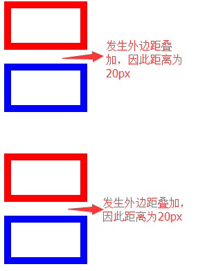
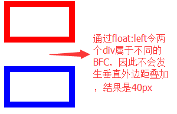
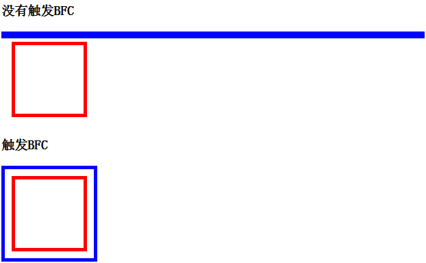
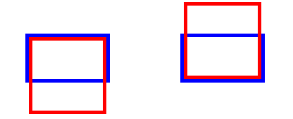
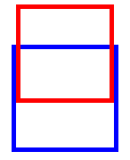

# [BFC](http://www.w3.org/TR/CSS21/visuren.html#block-formatting)(Block Formatting Context，块级格式上下文)
CSS2.1的概念。CSS3中作出改动称为[flow root](http://www.w3.org/TR/css3-box/#block-level0)。<br/>
IE6、7不支持BFC，而是采用hasLayout。<br/>

## 行为特性
### 1. 当相邻的块级元素均触发了各自的BFC时（即两者不位于同一个BFC），则它们的之间的垂直外边距（margin-top、margin-bottom）不会发生叠加（[Collapsing margins](http://www.w3.org/TR/CSS21/box.html#collapsing-margins)）。否则会发生叠加。<br/>
**叠加**<br/>
````
<style type="text/css">
  .o{
    float: left;
  }
  .i{
    width: 100px;
    height: 50px;
  }
  .i1{
    border: solid 10px red;
    margin-bottom: 20px;
  }
  .i2{
    border: solid 10px blue;
    margin-top: 20px;
  }
</style>
<div class="i i1">
</div>
<div class="i i2">
</div>
<br/>
<br/>
<br/>
<div class="o">
  <div class="i i1">
  </div>
  <div class="i i2">
  </div>
</div>
````
<br/>
**不叠加**<br/>
````
<style type="text/css">
  .o{
    float: left;
    width: 120px;
  }
  .i{
    width: 100px;
    height: 50px;
    float: left;
  }
  .i1{
    border: solid 10px red;
    margin-bottom: 20px;
  }
  .i2{
    border: solid 10px blue;
    margin-top: 20px;
  }
</style>
<div class="o">
  <div class="i i1">
  </div>
  <div class="i i2">
  </div>
</div>
````
<br/>

### 2. 拥有BFC的元素，其边框不能与子元素的外边距重叠。
在普通流下无法显示BFC的这一特性，要通过浮动定位才能显示。
````
<style type="text/css">
  .o{
    border: solid 5px blue;
  }
  .without-bfc{
  }
  .with-bfc{
    float: left;
  }
  .i{
    float: left;
    width: 100px;
    height: 100px;
    margin: 10px;
    border: solid 5px red;
  }
</style>
<h3>没有触发BFC</h3>
<div class="o without-bfc">
  <div class="i"></div>
</div>
<br clear="all"/>
<h3>触发BFC</h3>
<div class="o with-bfc">
  <div class="i"></div>
</div>
````
<br/>

## [BFC高度的计算方式](http://www.w3.org/TR/CSS2/visudet.html#root-height)
当BFC内只包含行内元素（inline-level）时，则BFC高度为最顶的行内元素的上边框到最底的行内元素的下边框的距离。<br/>
当BFC内包含块级元素（block-level）时，则BFC高度为最顶的块级元素的上外边框到最底的块级元素的下外边框的距离。<br/>
````
<style type="text/css">
 .o{
   border: solid 5px blue;
   margin: 50px;
 }
 .with-bfc{
    float: left;
 }
 .i{
    width: 100px;
    height: 100px;
    border: solid 5px red;
  }
 .i1{
    margin-bottom: -50px;
  }
 .i2{
    margin-top: -50px;
  }
</style>
<div class="o with-bfc">
  <div class="i i1"></div>
</div>
<div class="o with-bfc">
  <div class="i i2"></div>
</div>
````
<br/>

注意：<br/>
 1. 绝对定位（absolutely positioned children）的子元素在计算BFC高度时会被忽略；<br/>
 2. 相对定位（relatively positioned children）的子元素在计算BFC高度时会被纳入，但会忽略其偏移值。
````
<style type="text/css">
 .o{
   border: solid 5px blue;
   margin: 50px;
 }
 .with-bfc{
    float: left;
 }
 .i{
    width: 100px;
    height: 100px;
    border: solid 5px red;
    float: left;
  }
 .i1{
    position: relative;
    top: -50px;
  }
 .i2{
  }
</style>
<div class="o with-bfc">
  <div class="i i1"></div>
</div>>
````
<br/>
3. 浮动定位的子元素在计算BFC高度时也被纳入。<br/>

## 触发BFC
1. 对于普通流中的块级元素，通过`overflow除了visible以外的值（hidden、auto、scroll）`来触发；<br/>
2. 将元素设置为浮动定位（`float不为none`）和绝对定位（`position: absolute`或`position: fixed`）时，也会触发BFC；<br/>
3. 块级容器如（`display:inline-block/table-cell/table-caption/flex/inline-flex`）均为触发BFC;<br/>
4. fieldset元素也会触发BFC。<br/>

### [匿名框](http://www.w3.org/TR/CSS21/tables.html#anonymous-boxes)――table-cell触发BFC的内情

#### CSS table model
基于HTML4 table model，没有规定文档语言预定义了table相关的元素，而是通过`display`样式属性来赋予table样式到任意的元素。<br/>
````
table{ display: table; }
tr{ display: table-row; }
thead{ display: table-header-group; }
tbody{ display: table-row-group; }
tfoot{ display: table-footer-group; }
col{ display: table-column; }
colgroup{ display: table-column-group; }
td, th{ display: table-cell; }
caption{ display: table-caption; }
````
在table相关元素中设置上述属性会被忽略。因为table相关元素会采用其他算法来处理的。<br/>
#### Anonymous table objects
除HTML4外不是所有的文档语言包含所有table相关元素。会自动创建缺失的表格元素，至少要有`table/inline-table`、`table-row`和`table-cell`三种元素。<br/>
创建步骤：<br/>
1. 清理无用元素 
2. 产生缺失的子元素
3. 产生缺失的父元素

## Formatting Context（格式化上下文）
是CSS2.1规范的一个概念。表示页面中的一块渲染区域，并且有一套渲染规则，它决定子元素将如何定位，以及和其他元素的关系和相互作用。<br/>
CSS2.1中包含BFC和IFC，而CSS3中还新增了GFC和FFC。<br/>
CSS布局的对象和基本单位是box，页面有多个box组成。根据元素的类型和display属性来决定box的类型。block-level box可以参与到BFC中，而inline-level box可参与到IFC当中。而FC则决定旗下所有box的渲染规则。<br/>
