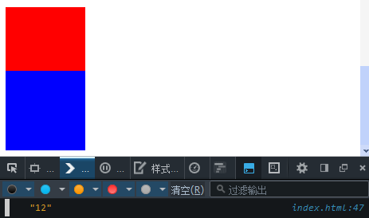
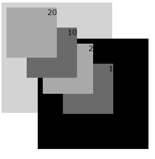
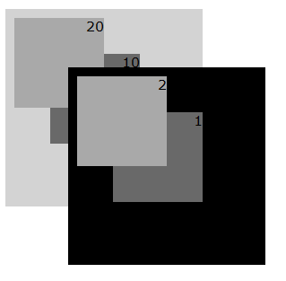

# Layered presentation
## z-index
CSS2.1中从3个维度来定位每个box。除了水平和垂直维度外，还有一个就是沿z-axis堆叠的维度。并将z-axis分为多个stacking context，而z-index的值则为相对于当前stacking context的相对值。<br/>
根元素(html/body)默认会创建一个root stacking context，其下可包含多个stacking context，且每个stacking context也可以包含0~N个stacking context。<br/>

## box堆叠规则
1. 在同一个stacking context下，z-index相同：按照box对应的元素在document tree下的顺序，后者位于前者的上面（back-to-front）。
````
<!-- 两种情况下，d2均排在d1的后面，因此d2在z-axis上位于d1的上面 -->
<div id="d1">
  <div id="d2">
  </div>
</div>

<div id="d1">
</div>
<div id="d2">
</div>
````
2. 在同一个stacking context下，z-index不同，数值大位于上面。
````
<!-- d1的z-index为12，而d2的z-index为0，所以d1在d2的上面 -->
<div id="d1" style="position:relative;z-index: 12;">
</div>
<div id="d2" style="z-index: 0;margin-top:-20px;">
</div>
````
3. 在不同的stacking context下，则往父box搜索直到两个box位于同一个stacking context下，在比较两者的z-index属性值，然后遵循数值大位于上面。
````
<div>
  <div id="d1" style="position:relative; z-index:10;">
	<div id="d4" style="background:red; width:100px; height:100px;position:relative; z-index:9999;">d3</div> 
  </div>
  <div id="d2" style="background:blue; width:50px; height:50px; position:relative; top: -120px; z-index:9;">d2</div>
  <div id="d3" style="background:green; width:50px; height:50px; position:relative; top: -80px; position:relative; z-index:11;">d3</div>
</div>
````
!()[zIndex2.png]<br/>
4. 在不同的stacking context下，子stacking context中的box为位于父stacking context中的box之上。
````
<div style="background:blue; width:100px; height:100px; position:relative; z-index:10;">
  <div style="background:red; width:50px; height:50px; position:relative; z-index:-10;"></div>
</div>
````
!()[zIndex3.png]

## 对于non-positioned box
z-index永久为0，即使设置成功，但实际渲染时也是0。
````
<div id="test1" style="z-index:12;width:100px;height:100px;background:red;"></div>
<div id="test2" style="z-index:10;width:100px;height:100px;background:blue;margin-top:-20px;"></div>

<script type="text/javascript">
  window.getComputedStyle = window.getComputedStyle || function(el){
    return  el.currentStyle
  }
  var zIndex = window.getComputedStyle(document.getElementById('test1'))['zIndex']
  console.log(zIndex) // 显示12
</script>
````


## 对于positioned box
z-index可设置且实际渲染时则所设置的z-index值来决定堆叠的位置。当z-index不是0时，则该会在该box内创建一个新的stacking context，而新的stacking context的父stacking context则是box所属的stacking context。

## 兼容性
IE6、7中并非positioned box+z-index不为0才创建stacking context，而是positioned box就会创建stacking context。
````
<style>
    .parent{width:200px; height:200px; padding:10px;}
    .sub{text-align:right; font:15px Verdana;width:100px; height:100px;}
    .lt50{left:50px;top:50px;}
</style>
 
<div style="position:absolute; background:lightgrey;" class="parent">
  <div style="position:absolute;z-index:20;background:darkgray;" class="sub">20</div>
  <div style="position:absolute;z-index:10;background:dimgray;" class="sub lt50">10</div>
</div>
 
<div style="position:absolute;left:80px;top:80px;background:black;" class="parent">
  <div style="position:absolute;z-index:2;background:darkgray;" class="sub">2</div>
  <div style="position:absolute;z-index:1;background:dimgray;" class="sub lt50">1</div>
</div>
````
符合W3C标准的：<br/>
<br/>
IE6、7的：<br/>
<br/>

