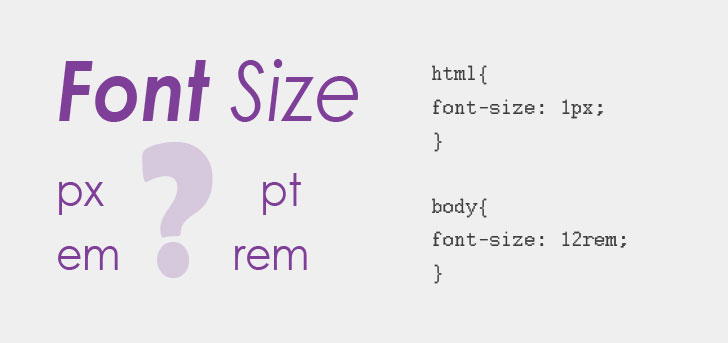
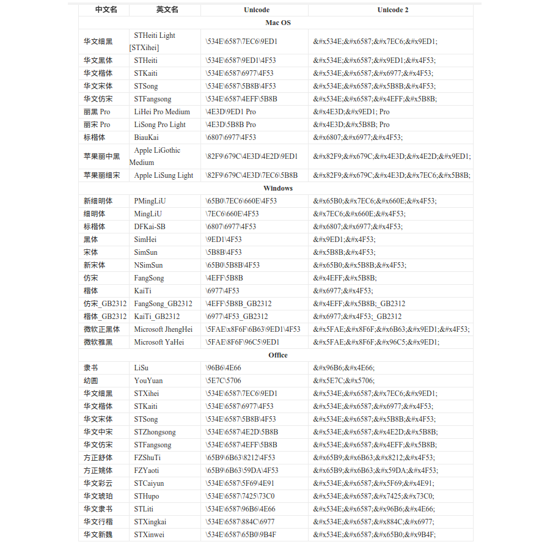

## 字体类型(Typeface Type)
### 1. 衬线体(Serif)
 衬线是笔画末端的装饰部分，用于更清晰地标明笔触末端，提高辨识率从而提高阅读速度。另外衬线字体感觉会更正统。下图红色部分就是衬线。<br/>
<br/>
 网页中英文衬线字体有`Times New Roman`和`Georgia`(下图为12px的Times New Roman左 和 Georiga右)。<br/>
<br/>
 网页中中文衬线字体有`宋体`。<br/>

### 2. 非衬线体/无衬线体(Sans-serif)
<br/>
 网页中英文无衬线字体有`Arial`,`Verdana`,`Tahoma`,`Helivetica`,`Calibri`等.(下图由左至右依次为Arial,Verdana,Tahoma)<br/>
<br/>
 10px~12px的衬线字体在屏幕下难以辨认，因此网页中常用无衬线字体而非衬线字体。(下图为10px的Verdana和Times New Roman对比)<br/>
<br/>

### 3. 等宽字体(Monospace)
 等宽字体仅针对西文字体。由于英文字母的宽度各不相同，导致编程时代码排版很难看。在DOS命令中，看到的均是等宽字体。<br/>
 编程对等宽字体的要求：<br/>
 1. 所有字体等宽<br/>
 2. 字体简洁、清晰和规范<br/>
 3. 支持ASCII码为128以上的扩展字符集（如GBK,gb2312和unicode等）<br/>
 4. 空白字符(ASCII:0x20)与其他字符等宽<br/>
 5. 1,I和i能容易地区分<br/>
 6. 0,o和O能容易地区分<br/>
 7. 双引号、单引号前后部分易于区分，最好是镜像对称<br/>
 8. 标点符号外形清晰，尤其是大括号、圆括号和方括号<br/>
 宽字体有`Courier`和`Courier New`等<br/>

### 4. 手写体/书法体(Calligraphy)
### 5. 符号体(Symbol)
  Windows中最著名符号就是Webdings。<br/>
<br/>

### CSS设置字体
CSS中通过`font-family`来设置字体.
````
font-family: "Microsoft YaHei", sans-serif; /* 中文为微软雅黑, 英文采用非衬线字体 */
````
 属性值通过逗号`,`分隔多个字体名称, 当浏览器在解析渲染字体时会从左至右搜索,当在字体名称对应的字体库中存在该字体时,则渲染.否则就搜索下一个字体名称对应的字体库.若均搜索失败则使用浏览器默认的字体库.<br/>
 字体名称分为*字体族名称(family-name)*和*类族名称(generic-family)*<br/>
 *字体族名称(family-name):* 是具体的字体名称, 如"times","courier","arial"<br/>
 *类族名称(generic-family):* 是字体类型名称而具体的字体则由浏览器决定, 如"serif","sans-serif","cursive","fantasy","monospace"<br/>
 **注意:**<br/>
 1. `font-family`中设置的字体不会被浏览器自动下载, 字体是否可用则完全依靠客户端是否已安装该字体而已.<br/>
 2. 属性值必须以*类族名称(generic-family)*结尾确保字体会以正确的形式解析渲染.<br/>
 3. *类族名称(generic-family)*后的*字体族名称(family-name)*不会生效,如:A是`font-family:arial,sans-serif,"宋体"`,B是`font-family:arial,"宋体",sans-serif`而浏览器默认字体为"微软雅黑",那么将A通过微软雅黑显示中文,而B则用宋体显示中文.这是因为搜索到sans-serif就已经在浏览器默认字体库中找到字体了,因此不会搜索宋体字库.<br/>

 推荐的字体:`font-family:"宋体", "黑体", "微软雅黑",Arial, Helvetica, sans-serif;`<br/>
 由与使用中文来设置字体族名称,会导致IE9下通过行距实现垂直居中的失效(还有其他兼容性问题),因此建议使用unicode来代替中文.推荐的字体:`font-family:"\5B8B\4F53","\9ED1\4F53","\5FAE\8F6F\96C5\9ED1",Arial, Helvetica, sans-serif;`<br/>

## 字体样式
常见的字体样式为：正常(Normal)、粗体(Bold)和斜体(Italic)<br/>
粗体(Bold)：会让字体颜色更深、更粗；<br/>
斜体(Italic)：用于在当前段落中强调某段文字。<br/>

### CSS设置字体样式
CSS中通过`font-style`来设置正常和斜体两种字体样式。
````
font-style: normal; /* 默认样式 */
font-style: italic; /* 斜体 */
font-style: oblique; /* 倾斜的字体 */
/*
 由于italic是指使用字体库中该字体的斜体，而不是所有的字体都实现了斜体，所以对于没有实现斜体的字体可采用oblique在显示层面令字体倾斜。
 另外附上CSS2.0上边的解释你参考下：
 italic和oblique都是向右倾斜的文字, 但区别在于Italic是指斜体字，而Oblique是倾斜的文字，对于没有斜体的字体应该使用Oblique属性值来实现倾斜的文字效果.
*/
````
CSS中通过`font-weight`(字重)来设置加粗的字体样式。
````
font-weight: normal; /* 默认样式 */
font-weight: bold; /* 粗体 */
font-weight: bolder; /* 粗体 */
font-weight: lighter; /* 细体 */
font-weight: 100; /* 字重代号 */
font-weight: 200; /* 字重代号 */
font-weight: n00; /* 字重代号 */
font-weight: 900; /* 字重代号 */
````
100~900为字重代号，字体库会针对不同的字重代号提供不同等级的粗细程度的设计。如Zurich字体所包含的Zurich Light对应100~300三个代号，Zurich Regular对应400，Zurich Medium对应500，Zurich Bold对应600~700，Zurich Black对应800，Zurich UltraBlack对应900。

## 字号单位
网页中一般使用11pt/12px的字号，正文则采用11.5pt/14px的字号。<br/>
<br/>
### 1. 点(point/pt)
````
  72 pt = 1 inch // 1英寸是72个点
  1 pica = 12 pt // 1皮卡是12个点
````
### 2. 像素(pixel/px)
 像素是屏幕上最小的图像单元，通俗上说就是屏幕上的一个点。不会根据父元素的字号自动缩放。
### 3. DPI/PPI(Dots Per Inch/Pixel Per Inch)
 两者均是解析度(Resolution)的单位，分别表示1英寸下有多少个点或像素，数值越大表示颗粒越细，图像越细腻、清晰。<br/>
 对于扫描仪、打印机等则采用DPI。对于屏幕则采用PPI。意义上是一样的。<br/>
```` 
介质   		解析度    
照片   		240dpi~300dpi
杂志   		133dpi~150dpi
精美的书	175dpi~200dpi
高质量的书	350dpi~400dpi
屏幕		72ppi
````
由于屏幕的解析度比书籍、图片的低，因此物理大小相同的字体书上的会比屏幕上的清晰很多，也是因为这样物理大小相同的字体，书籍上可以使用衬底字体，而屏幕上则需要无衬底字代替。

### 4. 相对于小写字母x的高度(x-height/ex)
 1ex = 小写字母x的高度。也是基线(baseline)与中位线(median)的垂直距离。
### 5. 相对字体大小(em)
 1em = 字体的大小的100%。会根据父元素的字号自动缩放。浏览器默认的字号为16px，若没有父元素没有设置字号则使用浏览器默认字号，则1em = 16px, 0.75em = 12px, 0.625em = 10px。通过将body的字号这是为`font-size: 62.5%`，那么此时子元素1em = 10px, 1.2em = 12px了。
 **注意：**<br/>
````
p{
  font-size: 1.2em;
}
.test{
  font-size: 1.2em;
}
<p class="test">Test的字号为1.44em * 16px = 23px</p>
````
### 6. 根em(root em/rem)
  CSS3新增的相对单位，IE9开始支持。设置rem的元素字号是相对于`<html>根元素`的字号而定，而不是父元素的字号而定。
````
p {
  font-size: 14px; /* 对于lteIE8则设置固定的字号 */
  font-size: .875rem; /* 对于lgeIE9则设置相对于html元素的字号 */
}
````
单位转换工具：http://pxtoem.com/

## 间距
### 1. 行距/行间距(Leading/Line-height)
 行距就是相邻行之间基线的距离。一般以em作为单位，也就是根据字体大小来设置行距。W3C建议浏览器的默认行距为1.0em~1.2em。若行距过小则会造成阅读时容易“串行”。经验值行距为1.5em最为适合。<br/>
 基线(baseline)是大部分字母所“坐”的，字体的下降部(descender)之上的直线。大部分字体（全部大写字母和部分小写字母）总是紧贴基线，并且位于基线之上。中文与英文的大写字母情况一样。<br/>
<br/>

### 2. 字间距(Tracking/Letter-spacing)
 字母之间的距离。 

### 3. 字距调整(Kerning)
 是一种因视觉需要而做的技术处理。就是在两个特定的字符连排时，单独调整它们的字距使之与众不同。

## ClearType
 Windows/Mac OS提供的针对LCD液晶荧幕的字体平滑工具。利用LCD色条排列的特性。<br/>
 WindowsXP开始引入ClearType，但默认是关闭的。Windows Vista则默认开启。<br/>
### 原理
 将R、G、B各个次像素发光并进行色调微调，从而达到实际分辨率以上(水平方向分辨率的3倍)的纤细文字的显示效果。<br/>
 LCD规定屏幕分辨率与物理发光点(最大分辨率)相同时，显示效果最佳。<br/> 
 而LCD的每个物理发光点实际上是由RGB三个栅条水平排列而成。在ClearType前，发光点与RGB栅条的关系是固定的，也就是发光点是独立的；是ClearType则是任意连续的RGB栅条则可组成一个发光点，也就是发光点是相交的并且是动态的。
 
 Windows原来是通过点阵字库+抗锯齿技术来实现在CRT上清晰度上是没有问题的。<br/>
 OSX的优美黑体在LCD上也没问题<br/>
 Linux通过“字体渲染”技术，显示矢量中文黑体。<br/>
### 注意
 依赖字体(矢量字体)和操作系统的支持。<br/>
 微软雅黑（非衬线字体）支持ClearType。<br/>
### 矢量字体
 矢量字体是可以无限地平滑缩放。在使用时通过OS的字体引擎自动解析渲染为实际像素，然后才能在屏幕上显示。但对于字号较小的字体，由于其所占的像素较少自动解析渲染会出现很多问题(笔画粗细不匀、字体模糊等)，因此需要设计师为每个字号的每个字体嵌入提示信息，这技术称为Hinting(字形微调)。这些提示信息包括在不影响字体识别的前提下，去掉一些笔画等。字体引擎就会根据提示信息解析矢量字体。<br/>
 而在不采用ClearType的时候，Windows则通过在宋体的矢量字库中内嵌12px,14px,16px和18px等点阵字体来保证小字号字体的清晰度。<br/>
 
## 中文字体库
### Windows
 Windows下的宋体、黑体等均由中国北京的中易公司开发，因此称为中易宋体、中易黑体。
### Mac OSX
 Mac OSX下的宋体、黑体等均由中国北京的华文公司开发，因此称为华文宋体、华文黑体。
### Ubuntu+Chromium/chrome39
 标准字体:"Times New Roman"<br/>
 Serif字体:"Times New Roman"<br/>
 Sans-serif字体:"Arial"<br/>
 等宽字体:"Monospace"<br/>
 <br/>
 chrome中英文字号小于12px时(如9pt),则会自动增加为12px.可通过`-webkit-text-size-adjust:none;`来保持小于12px的字号.<br/>


## 分辨率
分为**显示分辨率(屏幕分辨率)**和**图像分辨率(解析度)**两个方向
###显示分辨率(屏幕分辨率)
 是屏幕图像的精密度，可是区域尺寸相同的前提下，分辨率越高图像越清晰。
###图像分辨率(解析度)
 以单位英寸中包含的像素点数量。指图像中存储的信息量，除了PPI还有PPC(每厘米的像素数量)来衡量。图像分辨率决定图像输出的质量，图像分辨率、位分辨率和图像尺寸一起决定文件大小。若文分辨率为32位，图像尺寸不变，而图像分辨率增加1倍，则文件大小增加3倍。<br/>
### DPI 
 设备分辨率/输出分辨率，指的是各类输出设备每英寸所含的点数。
### 位分辨率
 又称为位深，用于衡量每个像素存储信息的位数，决定像素可标记的色彩等级上限。常见的有8、16、24和32位。若一幅8bit位深的图像，那么每个像素能够表现的色彩等级是256级。
 


## Ref
http://design.yesky.com/273/8841773.shtml<br/>
http://baike.baidu.com/link?url=OcfVwoAY66-PChDZmbBqEsUuC-h3lEa817IaSOPaVrOEB5c0e5uZlTKizdY8PrbP-JGQbKbwA-mYHj4cf4qHyq<br/>
http://www.cnblogs.com/leejersey/p/3662612.html<br/>
http://www.divcss5.com/rumen/r295.shtml<br/>
http://www.divcss5.com/css-hack/c344.shtml<br/>
http://www.zhangxinxu.com/wordpress/2010/06/%E5%8F%AF%E7%94%A8%E6%80%A7%E4%B9%8B%E6%B5%8F%E8%A7%88%E5%99%A8%E9%BB%98%E8%AE%A4%E5%AD%97%E4%BD%93%E4%B8%8Ecss%E5%AD%97%E4%BD%93/<br/>

