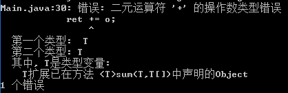
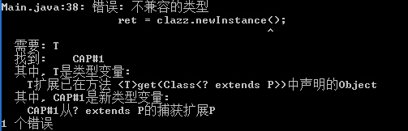

# 泛型(类型参数化)


## 通配符`?`

如果Foo是Bar的子类型,而G是带泛型的类型,则G<Foo>不是G<Bar>的子类.
````
List<Apple> apples = new ArrayList<Apple>();
List<Fruit> fruits = new ArrayList<Fruit>();
fruits = apples; // 抛出异常

// 但添加子类实例则没问题
fruits.add(new Apple());
````
而数组Object[]是String[]的父类型。
````
Object[] objs = new String[1];
````
也就是泛型不是协变
#### 协变


通配符`?`用于标识类型为未知类型,因此可赋予任何类型参数的实际类型给它.
````
List<?> fruits = new ArrayList<Fruit>();
fruits = new ArrayList<Apple>();
````
当集合的类型参数为`?`时则只能添加`null`到集合中,因为null是所有类的子类.一般用于检索元素，而不作添加元素。
````
Collection<?> c = new ArrayList<String>();
c.add(null);
c.add(new Object()); // 抛出异常
````
单纯使用通配符和不使用泛型的效果是一样的.
````
// 不使用泛型的情景
void forEach(List lst){
  for (Object item : lst){
    System.out.println((String)item);
  }
}
List lst = new ArrayList();
lst.add("Test");
forEach(lst);

// 使用通配符的情景
void forEach2(List<?> lst){
  for (Object item : lst){
    System.out.println((String)item);
  }
}
List<String> lst = new ArrayList<String>();
lst.add("Test2");
forEach2(lst);
````

### 边界通配符`? extends`
用于限制参数类型必须为哪个类或其子类.
````
void forEach(List<? extends Fruit> lst){
  for (Fruit item : lst){
    System.out.println(item.getName());
  }
}
List<Apple> lst = new ArrayList<Apple>();
forEach(lst);

List<? extends Fruit> olst = new ArrayList<Apple>();
olst.add(new Apple());
````

### 边界通配符`? super`
用于限制参数类型必须为哪个类或其超类.
对于集合而言,则集合元素限制为这个类或其子类型的实例.因为无法得知父类是什么,更无法知道是否向上兼容.
````
void forEach(List<? extends Apple> lst){
  for (Fruit item : lst){
    System.out.println(item.getName());
  }
}
List<Fruit> lst = new ArrayList<Fruit>();
forEach(lst);

List<? super Apple> olst = new ArrayList<Fruit>();
olst.add(new Apple());
olst.add(new Fruit()); // 将抛出异常
````

## 泛型方法
````
<T> T fromArray2Lst(T[] a, List<T> b){
  for (T o : a){
    b.add(o);
  }
  return 0;
}
Integer[] array = {1,2,3};
List<Integer> lst = new ArrayList<Integer>>();
fromArray2Lst(array, lst);

List<Number> lst = new ArrayList<Number>();
fromArray2Lst(array, lst);
````
类型参数`<T>`必须放在返回值类型前.T的实际类型可以由T类型的实参的数据类型隐式决定.
但当有重载的情况时则需要显式指明.
````
class Main{
	<T> void go(T t){
	  System.out.println("generic function");
	}
	void go(String str){
	  System.out.println("normal function");
	}

	public static void main(String[] args){
          Main main = new Main();
          main.go("haha"); // 输出normal function
          main.<String>go("haha"); // 输出generic function
 	} 
}
````
下列两种方式效果一样
````
public static <T extends Number> T getNum(Class<T> clazz){
  T ret = null;
  try{
    ret = clazz.newInstance();
  }
  catch(InstantiationException|IllegalAccessException e){}
  return ret;
}

public static <T> T getNum(Class<? extends Number> clazz){
  T ret = null;
  try{
    ret = (T)clazz.newInstance();
  }
  catch(InstantiationException|IllegalAccessException e){}
  return ret;
}
````


````
<T> T sum(T orig, T[] a){
  T ret = orig;
  for (T o : a)
    ret += o; 
  return ret;
}
Integer ret = sum(0, {1,2,3});
````
结果：与执行`Object a = 1, b = 2; a + b`是一样的。
<br/>
````
public <T> T getNum(Class<? extends P> clazz){
  T ret = null;
  try{
    ret = clazz.newInstance();
  }
  catch(InstantiationException|IllegalAccessException e){}
  return ret;
}
class P{}
getNum(P.class);
````
结果：与执行`P p = new Object`是一样的。
<br/>


### JDK1.6开始支持泛型方法重载,但需要返回值不同才行
````
void go(List<String> lst){}
int go(List<int> lst){}
````

### 采用擦写的方式导致以下效果
````
List<String> l1 = new ArrayList<String>();
List<Integer> l2 = new ArrayList<Integer>();
System.out.println(l1.getClass() == l2.getClass()); // true
````

### 不能對泛型(不带通配符)使用instanceof
````
List lst = new ArrayList<String>();
if (lst instanceof List<String>){} // 抛异常
if (lst instanceof List<?>){}
````

### 泛型数组
只能使用通配符来创建泛型数组
````
List<?>[] lsa = new ArrayList<String>[10]; // 抛异常
List<?>[] lsa = new ArrayList<?>[10];

List<String> list = new ArrayList<String>();
list.add("test");
lsa[0] = list;
System.out.println(lsa[0].get(0));
````

## 泛型类或接口
除了异常类、枚举或匿名内部类外，其他类或接口均可带类型参数。<br/>
类型参数命名推荐：<br/>
````
K——键，比如映射的键。
V——值，比如List、Set的内容，Map中的值
E——异常类
T——泛型

注意：泛型类的类型参数只能用于实例方法、字段中，而不能用于类方法、字段上。<br/>
````
实例：Map接口的定义
````
public interface Map<K,V>{
  public void put(K key, V value);
  public V get(K key);
}
````
实例：ArrayList的定义
````
public class ArrayList<E> implements List<E> {
	public ArrayList(Collection<? extends E> c)
}
````

类型参数主要用于帮助编译器进行类型推理。

### 泛型自绑定


协变、桥接模式和类型擦除。

### 泛型实现的两种思想
1. Code specialization：在实例化一个泛型类或泛型方法时将产生一份新的目标代码（字节码或二进制码）。如针对一个泛型List，当程序中出现List<String>和List<Integer>时，则会生成List<String>,List<Integer>等的Class实例。
2. Code shareing：对每个泛型只生成唯一一份目标代码，该泛型类的所有实例的数据类型均映射到这份目标代码中，在需要的时候执行类型检查和类型转换。如针对List<String>和List<Integer>只生成一个List<Object>的Class实例。

C++的模板（template）是典型的Code specialization。由于程序中出现多少种List，就会生成多少个Class实例，因此会造成代码膨胀（Code Bloat）。
而Code specialization的问题是浪费空间，例如在集合中本质上存放的是一系列的指针，没必要因元素类型的不同来创建不同类型的集合。
而Java则采用Code sharing的思想，而Code sharing则通过类型擦除来实现。

类型擦除的过程：
1. 将所有泛型参数用其最左边界的类型来替换。
2. 移除所有类型参数
````
interface Comparable<T>{
  int compareTo(T that);
}
final class NumericVal implements Comparable<NumericVal>{
  public int compareTo(NumericVal that){ return 1;}
}
````
擦除后：
````
interface Comparable{
  int compareTo(Object that);
}
final class NumericVal implements Comparable{
  public int compareTo(NumericVal that){ return 1;}
  // 编译器自动生成桥接方法
  public int compareTo(Object that){
    return this.compareTo((NumbericVal)that);
  }
}
````

泛型类型占位符最终的类型是如何决定的
1. 首先会根据extends后的条件进行限制，默认为Object。
2. 然后根据实际调用时的实参类型。
````
<T> T say(T arg1, T arg2){ return arg1;}
1. arg1和arg2的实参数据类型相同，则T为实参的数据类型
2. 若两者不相同（也称为交叉类型），则T为extends后的条件进行限制的类型
````

#### 擦写带来的问题
1. 无法通过同一个泛型类来区分方法签名
2. 泛型类的类字段是共享的。

#### 准则
1. JVM中没有泛型，只有普通类和普通方法
2. 所有泛型类的类型参数在编译时都会被擦除
3. 创建泛型类对象时请指明类型，以便让编译器尽早地做类型检查
4. 不要忽视编译器的警告信息，那意味着有潜在的ClassCastException等着你

参考
http://justjavac.iteye.com/blog/1741638
