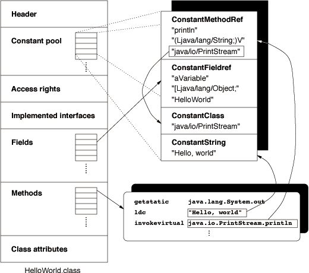

# 语言无关性
Java的规范被拆分为Java语言规范（The Java Language Specification）和Java虚拟机规范（The Java Virtual Machine Specification）<br/>
语言A+语言A的编译器->class文件（字节码），class+jvm->可执行程序。Java中变量、关键字和运算符号等最终会编译成1~N条字节码命令，因此Java不支持的语法不代表字节码无法支持。<br/>
# Class文件
Class文件均对应唯一一个类或接口。但类和接口不一定存在于文件中（可通过类加载器直接生成）。<br/>

## 文件结构
Class文件是一组以字节为基础单位的二进制流，各数据项间没有分隔符，因此整个文件几乎都是程序运行的必要数据。<br/>
数据项占用1个字节以上的空间时，则按照Big-Endian顺序进行存储。<br/>
Class文件格式采用类似于C语言结构体的伪结构体来存储数据，内部仅有两种数据类型：无符号数和表。<br/>
无符号数：用于描述数字、索引引用、数量值或UTF-8编码的字符串<br/>
表：复合数据类型，由N个无符号数和N个表组成，所有表的类型习惯以"_info"结尾<br/>

Class文件整体格式，注意：每项内容间没有分隔符<br/>
````
类型 		       名称      	    数量
 u4  		       magic      	     1
 u2  		   minor_version             1
 u2  		   major_version             1
 u2  		constant_pool_count          1
 cp_info	   constant_pool	 constant_pool_count - 1
 u2		   access_flags		     1
 u2		   this_class		     1
 u2		   super_class		     1
 u2	         interfaces_count	     1
interface_info     interfaces		 interfaces_count
 u2		  fields_count               1
field_info	     fields		 fields_count
 u2               method_count               1
method_info	     methods		 method_count
 u2		 attributes_count            1
attribute_info       attributes	         attributes_count
````
**魔数（Magic Number）**：用于确定该文件是否为一个可被JVM接受的Class文件。gif、jpeg等文件中均存在魔术，用于标识文件类型。而只要魔数值还没被广泛使用，则开发者可自定义该值，而Class文件的魔数值为0xCAFEBABE，并命名为Oak。<br/>
**次版本号（Minor Version）和主版本号（Major Version）**：用于标识Class文件是通过JDK哪个版本编译出来的。JDK1.0为45, 后续版本则+1。JDK1.7可以支持版本号为51.0及以下的。<br/>
**常量池**：<br/>
由常量池计数器（constant_pool_count）和常量池表（constant_pool）构成。常量池的第0项常量空出来表示“不引用任何一个常量池项目”，因此常量池的索引从1开始。<br/>
常量池存放两种类型的常量，两者的数据类型均为表：字面量（Literal）和符号引用（Symbolic References）<br/>
字面量：文本字符串、声明为final的常量值等<br/>
符号引用：类和接口的全限定名（Fully Qualified Name）、字段的名称和描述符（Descriptor）、方法的名称和描述符。JVM通过符号引用来为对象分配内存空间。<br/>
JDK7以前有11种常量结构类型，而JDK7更好地支持动态语言因此追加3种。14种常量结构类型的结构均不同，但第一个字节都是作为标志符。<br/>
````
常量结构类型                  	标志               描述
CONSTANT_Utf8_info		  1             UTF-8缩略编码的字符串
CONSTANT_Integer_info		  3		整型字面量
CONSTANT_Float_info		  4		浮点数字面量
CONSTANT_Long_info		  5		长整型字面量
CONSTANT_Double_info		  6		双精度浮点型字面量
CONSTANT_Class_info		  7		类或接口的符号引用
CONSTANT_String_info		  8		字符串类型字面量
CONSTANT_Fieldref_info		  9		字段的符号引用
CONSTANT_Methodref_info		 10		方法的符号引用
CONSTANT_InterfaceMethodref_info 11		接口方法的符号引用
CONSTANT_NameAndType_info	 12		字段或方法的部分符号引用
CONSTANT_MethodHandle_info	 15		方法句柄
CONSTANT_MethodType_info	 16		标识方法类型
CONSTANT_InvokeDynamic_info	 18		表示一个动态方法调用点
````
CONSTANT_Utf8_info的结构<br/>
````
tag：u1，标志符
length：u2，字符串长度为多少个字节
bytes：字符串的UTF8缩略编码后的字节数组
````
类、接口、方法、字段名均以CONSTANT_Utf8_info的结构存储，而length的长度为2个字节（65535），因此若类、接口、方法、字段名长度超过65535则编译器会报错。<br/>
而UTF-8缩略编码的编码方式是，`\u0001`到`\u007f`以1byte存储（即1~127的ASCII码存储方式），`\u0080`到`\u07ff`以2bytes存储，而`\u0800`到`\uffff`则以UTF-8方式存储。<br/>
CONSTANT_Class_info的结构<br/>
````
tag：u1，标志符
name_index：u2，指向常量池中一个CONSTANT_Utf8_info结构类型的常量，代表类或接口的全限定名称。
````
通过`javap -verbose <类、接口全限定名>`，获取计算后的字节码内容。<br/>
CONSTANT_Integer_info的结构<br/>
````
tag：u1，标志符
bytes：u4，Big-endian存储的int值
````
CONSTANT_Float_info的结构<br/>
````
tag：u1，标志符
bytes：u4，Big-endian存储的float值
````
CONSTANT_Long_info的结构<br/>
````
tag：u1，标志符
bytes：u8，Big-endian存储的long值
````
CONSTANT_Double_info的结构<br/>
````
tag：u1，标志符
bytes：u8，Big-endian存储的double值
````
CONSTANT_String_info的结构<br/>
````
tag：u1，标志符
name_index：u2，指向常量池中一个CONSTANT_Utf8_info结构类型的常量，代表字符串字面量。
````
CONSTANT_Fieldref_info的结构<br/>
````
tag：u1，标志符
name_index：u2，指向常量池中一个CONSTANT_Class_info结构类型的常量，代表字段所属类或接口的符号引用。
name_index：u2，指向常量池中一个CONSTANT_NameAndType_info结构类型的常量，代表字段描述符。
````
CONSTANT_Methodref_info的结构<br/>
````
tag：u1，标志符
name_index：u2，指向常量池中一个CONSTANT_Class_info结构类型的常量，代表方法所属类或接口的符号引用。
name_index：u2，指向常量池中一个CONSTANT_NameAndType_info结构类型的常量，代表方法描述符。
````
CONSTANT_InterfaceMethodref_info的结构<br/>
````
tag：u1，标志符
name_index：u2，指向常量池中一个CONSTANT_Class_info结构类型的常量，代表方法所属接口的符号引用。
name_index：u2，指向常量池中一个CONSTANT_NameAndType_info结构类型的常量，代表方法描述符。
````
CONSTANT_NameAndType_info的结构<br/>
````
tag：u1，标志符
name_index：u2，指向常量池中一个CONSTANT_Utf8_info结构类型的常量，代表方法、字段名称的字符串字面量。
name_index：u2，指向常量池中一个CONSTANT_Utf8_info结构类型的常量，代表方法和字段描述符的字符串字面量。方法的描述符为入参+返回值（如(Z)Ljava/lang/String;）；字段的描述符为字段的数类型。
````
CONSTANT_MethodHandle_info的结构<br/>
````
tag：u1，标志符
reference_kind：u1，值1~9，代表句柄的类型，不同类型具有不同的字节码行为。
reference_index：u2，
````
CONSTANT_MethodType_info的结构<br/>
````
tag：u1，标志符
descriptor_index：u2，指向常量池中一个CONSTANT_Utf8_info结构类型的常量，表示方法的描述符。
````
CONSTANT_InvokeDynamic_info的结构<br/>
````
tag：u1，标志符
bootstrap_method_attr_index：u2，值为指向引导方法表bootstrap_methods[]数组的有效索引。
name_and_type_index：u2，指向常量池中一个CONSTANT_NameAndType_info结构类型的常量，表示方法名和描述符。
````
**访问标志（access_flags）**<br/>
用于标识类或接口的访问信息（不单单是访问修饰符）。<br/>
````
标志名称          标志值            含义
ACC_PUBLIC        0x0001         public类型
ACC_FINAL	  0x0010         类使用了final修饰符
ACC_SUPER	  0x0020         允许使用invokespecial字节码指令。JDK1.0.2后编译出来的类该标志必须为true
ACC_INTERFACE     0x0200	 接口
ACC_ABSTRACT	  0x0400	 抽象类或接口
ACC_SYNTHETIC	  0x1000	 该类非用户代码生成的
ACC_ANNOTATION    0x2000    	 该类为注解
ACC_ENUM	  0x4000	 该类为枚举
````
上述标志通过与运算获取最终值。<br/>
**类索引（this_class）、父类索引（super_class）和接口索引集合（interfaces）**<br/>
类索引（this_class）：指向常量池中一个CONSTANT_Class_info结构类型的常量<br/>
父类索引（super_class）：指向常量池中一个CONSTANT_Class_info结构类型的常量。Java中所有类均有父类，除了`java.lang.Object`外。<br/>
接口索引集合（interfaces）：interface_count为接口计数器，若计数器为0则表示没有继承接口，因此interfaces将不占空间。<br/>
**字段表（field_info）**：<br/>
用于存放类或接口的字段。注意：<br/>
1. 超类和接口中继承而来的字段均不会包含在这里；<br/>
2. Java代码中没有出现的字段可能会出现在这里，例如内部类的字节码会包含外部类的字段。<br/>
3. Java中类的字段名必须不同，而字节码中只要字段的描述符不一样，则字段名可以相同。<br/>
表数据项结构如下：<br/>
````
access_flag：u2，访问信息，访问标志通过与运算后的结果。
name_index：u2，指向常量池中一个CONSTANT_Utf8_info结构类型的常量，代表字段的简单名称。
descriptor_index：u2，指向常量池中一个CONSTANT_Utf8_info结构类型的常量，代表字段的数据类型。
attribute_acount：u2，字段的属性表长度，为0时attributes将不占空间。属性表用于存储字段的额外信息。
attributes：acctirbute_info，属性表数据项。若java代码中声明为final static int m=123;，则会有ConstantValue属性，并指向常量123。
````
access_flag的值<br/>
````
标志名称          标志值            含义
ACC_PUBLIC        0x0001         public类型
ACC_PRIVATE       0x0002         private类型
ACC_PROTECTED     0x0004         protected类型
ACC_STATIC        0x0008         static类型
ACC_FINAL         0x0010         final类型
ACC_VOLATILE      0x0040         volatile
ACC_TRANSIENT     0x0080         transient 
ACC_SYNTHETIC     0x1000         字段有编译器自动产生的 
ACC_ENUM      	  0x4000         enum
````
**方法表（method_info）**：<br/>
用于存放类或接口的方法。注意：<br/>
1. 超类中继承而来的方法均不会包含在这里，除非重写了超类的方法；<br/>
2. Java代码中没有出现的方法可能会出现在这里，例如默认的构造函数。<br/>
3. Java中的重载必须要参数签名不同才可以，而字节码中只需描述符不同就可以了（也就是说只需返回值不同就可以了）。<br/>
表数据项结构如下：<br/>
````
access_flag：u2，访问信息，访问标志通过与运算后的结果。
name_index：u2，指向常量池中一个CONSTANT_Utf8_info结构类型的常量，代表方法的简单名称。
descriptor_index：u2，指向常量池中一个CONSTANT_Utf8_info结构类型的常量，代表方法的刹那参数列表和返回值类型。
attribute_acount：u2，字段的属性表长度，为0时attributes将不占空间。属性表用于存储方法的额外信息。
attributes：acctirbute_info，属性表数据项。
````
access_flag的值<br/>
````
标志名称          标志值            含义
ACC_PUBLIC        0x0001         public类型
ACC_PRIVATE       0x0002         private类型
ACC_PROTECTED     0x0004         protected类型
ACC_STATIC        0x0008         static类型
ACC_FINAL         0x0010         final类型
ACC_SYNCHRONIZED  0x0020	 同步方法
ACC_BRIDGE	  0x0040	 方法由编译器产生的桥接方法
ACC_VARARGS	  0X0080 	 方法接受不定参数
ACC_NATIVE	  0x0100	 本地方法
ACC_ABSTRACT	  0x0400	 抽象方法
ACC_STRICTFP	  0x0800	 方法为scriptfp
ACC_SYNTHETIC	  0x1000	 方法由编译器自动产生
````
**属性表（attribute_info）**：<br/>
所在的位置分为两种：<br/>
1. 位于字段表、方法表的每个表项后，用于提供字段、方法的额外信息。<br/>
2. 位于方法表后，提供类和类文件的额外信息。Java代码中对于类的类型为RetenionPolicy.CLASS或RetentionPolicy.RUNTIME的注解则会存放在这里。<br/>
属性表的表项长度不一，只要表项名称唯一即可。<br/>
表项整体结构：<br/>
````
attribute_name_index：u2，属性项名称，指向常量池的CONSTANT_Utf8_info结构类型的常量。
attribute_length：u4，属性项整体的字节数。
info：不同类型的属性项具有不同的结构。
````
Code属性<br/>
位于方法表项的属性表中，用于存放方法体信息。<br/>
结构如下：<br/>
````
attribute_name_index：u2，属性项名称，指向常量池的CONSTANT_Utf8_info结构类型值为Code的常量。
attribute_length：u4，属性项整体的字节数。
max_stack：u2，操作数栈（Operand Stacks）容量。JVM会根据这个值来分配栈帧（Stack Frame）中操作数栈的容量。
max_locals：u2，代表局部变量表容量。JVM为局部变量分配内容的最小单位是Slot，32bytes及以下的变量占1个Slot，64bytes则占2个Slot。局部变量包含——方法参数（隐含this入参）、Exception Hanlder Parameter（catch中的异常变量）、方法体中定义的局部变量。当离开某局部变量的作用域，那么就会释放该变量所占的Slot并给其他局部变量使用。
code_length：u4，表示code的字节数
code：字节指令和指令入参的混合数组，每个指令和入参各占1个字节。若在定义中某指令需要入参，那么该指令后的字节为入参字节，否则为指令字节。
exception_table_length：u2，try...catch中捕获的异常对象数目
exception_table：exception_info，try...catch中捕获的异常对象信息。
结构为：
  start_pc：u2，监测异常发生的起始字节命令偏离量
  end_pc：u2，监测异常发生的结束字节命令偏离量
  handler_pc：u2，当发生catch_type指定的异常类型或其子类时，则执行该无符号数指向的CONSTANT_Method_info符号引用。
  catch_type：u2，监测的异常类型，指向常量池的CONSTANT_Class_info常量。为0时表示无论是否发生异常均会执行。
attributes_count：u2，Code属性的子属性数量
attributes：Code属性的子属性数组
````
Exceptions属性<br/>
位于方法表项的属性表中，用于存放方法描述符后throws关键字后面罗列的异常信息。<br/>
结构如下：<br/>
````
attribute_name_index：u2，属性项名称，指向常量池的CONSTANT_Utf8_info结构类型值为Code的常量。
attribute_length：u4，属性项整体的字节数。
number_of_exceptions：u2，异常类型地址数组长度。
exception_index_table：异常类地址数组，指向常量池CONSTANT_Class_info常量。
````
LineNumberTable属性<br/>
位于方法表项的属性表中，用于存放Java源码与字节码行号的对应关系。<br/>
通过`javac -g:lines <java文件>`即可在编译时生成。<br/>
结构如下：<br/>
````
attribute_name_index：u2，属性项名称，指向常量池的CONSTANT_Utf8_info结构类型值为Code的常量。
attribute_length：u4，属性项整体的字节数。
line_number_table_length：u2, 对应关系表长度。
line_number_table：对应关系项表。
 结构如下：
   start_pc：u2，字节码的行号
   line_number：u2，Java的行号
````
LocalVariableTable属性<br/>
位于方法表项的属性表中，用于存放Slot槽的变量与Java代码中变量之间的映射关系。通过`javac -g:vars <java文件>`可在编译时生成（默认是没有的）。若没有生成该属性时，则其他项目引用该方法时入参会以`arg0 arg1`等代替。<br/>
结构如下：<br/>
````
attribute_name_index：u2，属性项名称，指向常量池的CONSTANT_Utf8_info结构类型值为Code的常量。
attribute_length：u4，属性项整体的字节数。
local_variable_table_length：u2，对应关系表长度。
local_variable_table：对应关系项表。
  结构如下： 
    start_pc：u2，代表局部变量作用域的起始偏移量。
    length：u2，代表局部变量作用域的有效范围长度。
    name_index：u2，指向CONSTANT_Utf8_info常量，表示局部变量名
    descriptor_index：u2，执行CONSTANT_Utf8_info常量，表示局部变量的数据类型
    index：u2，表示局部变量位于Slot槽的位置索引，对于long、dobule等>32bit的变量，它们占用了index和index+1的Slot槽位置。
````
SourceFile属性<br/>
位于文件中，用于存放Class文件的源码文件名称。<br/>
结构如下：<br/>
````
attribute_name_index：u2，属性项名称，指向常量池的CONSTANT_Utf8_info结构类型值为Code的常量。
attribute_length：u4，属性项整体的字节数。
sourcefile_index：u2，指向CONSTANT_Utf8_info常量，代表源码文件名称。
````
ConstantValue属性<br/>
位于字段表项中，用于告诉JVM自动为静态变量赋值。<br/>
字段赋值的三种方式：<br/>
1. 实例字段均在构造函数`<init>`中赋值；
2. 静态字段，在静态构造函数`<clinit>`中赋值；
3. 静态字段，通过ConstantValue属性自定值，有JVM自定赋值。
Oracle的javac会对`static final`且数据类型为基础类型或String的变量采用3的赋值方式，而对于`static`或数据类型不是基础类型或String的则通过<clinit>初始化。<br/>
`final`的字段在定义时马上赋值则也含ConstantValue属性，但没有赋值时是不含ConstantValue属性的<br/>
结构如下：<br/>
````
attribute_name_index：u2，属性项名称，指向常量池的CONSTANT_Utf8_info结构类型值为Code的常量。
attribute_length：u4，属性项整体的字节数。
constantvalue_index：u2，指向CONSTANT_Long_info、CONSTANT_Float_info、CONSTANT_Double_info、CONSTANT_Integer_info或CONSTANT_String_info常量。
````
InnerClasses属性<br/>
位于类中，用于记录内部类宿主类的关联关系。<br/>
结构如下：<br/>
````
attribute_name_index：u2，属性项名称，指向常量池的CONSTANT_Utf8_info结构类型值为Code的常量。
attribute_length：u4，属性项整体的字节数。
number_of_classes：u2，内部类数量
inner_classes：内部类信息表
  结构如下：
    inner_class_info_index：u2，指向CONSTANT_Class_info常量，表示内部类的符号引用
    outer_class_info_index：u2，指向CONSTANT_Class_info常量，表示宿主类的符号引用
    inner_name_index：u2，指向CONSTANT_Utf8_info，内部类的名称，匿名内部类则为0
    inner_class_access_flags：u2，访问信息标志。
````
Deprecated和Synthentic属性<br/>
Deprecated属性用于标识类、方法或字段已过期，Java代码中通过@Deprecated标识。<Br/>
Synthetic属性用于表示类、方法或字段为编译器自动生成，除了<init>和<clinit>外其他由编译器自动生成的类、方法或字段要么含有Synthetic属性，要么access_flag含ACC_SYNTHETIC<br/>
两个的结构一样：<br/>
````
attribute_name_index：u2，属性项名称，指向常量池的CONSTANT_Utf8_info结构类型值为Code的常量。
attribute_length：u4，属性项整体的字节数。
````
Signature属性<br/>
用于字段表和方法表项下，标识字段或方法的描述符<br/>


全限定名：将全限定类名的,换成/并在末尾添加;作为分隔符，例如`java.lang.String`的且全限定名为`java/lang/String;`<br/>
简单名称：除去类型和参数修饰的字段名和方法名，例如`public static void main(String[] args)`的简单名称是`main`<br/>
描述符：描述字段的数据类型，方法的参数列表（包含数量、类型和顺序）和返回值。<br/>
描述符中数据类型的标识字符：<br/>
````
标识字符         数据类型
B                  byte
C		   char
D		   double
F                  float
I		   int
J                  long
S                  short
Z	 	   boolean
V		   void
L		   对象类型（L+对象的全限定名），如java.lang.Object则为Ljava/lang/Object;
````
数组类型的表示方式：每一维度使用一个前置的`[`，例如`java.lang.String[][]`则表示为`[[Ljava/lang/String;`。<br/>
方法的表示方式：`(参数类型)返回值类型`，例如`int makeArray(java.lang.String source, char[] dest, int destOffset)`则表示为`(Ljava/lang/String;[CI)I`<br/>

### Byte Endian
多字节数据项中的字节在内存的存储顺序，也称作Byte Ordering或Byte Order。<br/>
Big-Endian（大端存储）:指低地址存放最高有效字节（MSB）。高位字节写入低位地址，低位字节写入高位地址（高低、低高），符合人类思维。<br/>
Little-Endian（小端存储）:指低位地址存放最低有效字节（LSB）。高位字节写入高位地址，低位字节写入低位地址（高高、低低），符合计算机处理。<br/>
示例——0x123456<br/>
````
内存结构          Big-Endian    Little-Endian 
----------	   --------       --------
| ...... | 高位    | .... |       | .... |
| 0x1002 | 	   | 0x56 |       | 0x12 |
| 0x1001 |	   | 0x34 |       | 0x34 |
| 0x1000 | 低位    | 0x12 |       | 0x56 |
----------	   --------       --------
````
MSB(Most Significant Byte)，最高有效字节<br/>
LSB(Least Significant Byte)，最低有效字节<br/>
示例——0x123456
````
MSB就是0x12
LSB就是0x56
````
而地址最低位指向MSB还是LSB则决定是Big-Endian还是Little-Endian了。<br/>
**注意：**<br/>
1. 所有网络协议均采用Big-endian方式传输数据，因此Big-endian也称为网络字节序。当从Big-endian传输0x123456到Little-endian时会得到0x563412<br/>
2. x86CPU采用Little-endian，而PowerPC采用Big-endian。<br/>
3. 在linux下的/usr/include的endian.h或machine/endian.h或feature.h下确定Byte Endian，瑞BYTE_ORDER(或_BTYE_ORDER或__BYTE_ORDER)为1234就是LE，若为4321则为BE<br/>

## 字节码指令
JVM指令由*操作码（Opcode）*和*操作数（Operands）*组成。<br/>
JVM采用面向操作数栈的架构，因此大多数指令都只含操作码而已。<br/>
**操作码**<br/>
即字节码指令，Java采用定长的操作码（1byte），因此指令集的操作码总数不能超过256条。<br/>
每个操作码对应一个命令名称，命令名称由[操作码助记符+]操作符组成。操作码助记符用于标记所操作的数据类型（i-int,l-long,s-short,b-byte,c-char,f-float,d-double,a-reference），也就是说这些操作码是与特定的数据类型绑定的。有些操作码不区分数据类型（如arraylength），有些不涉及数据类型（如go）。<br/>
注意：对于大多byte、short、boolean、char数据类型，是没有独立的操作码与之绑定的，实际操作上是通过将它们转换为int类型后通过与int数据类型绑定的操作码来执行<br/>
带符号扩展（Sign-Extend）
 场景：byte、short->int
带零扩展（Zero-Extend）
 场景：boolean、char->int
**操作数**<br/>
采用操作长度不对齐的存储格式，就是存储无符号数0x1234时采用0x12 0x34的方式存储，当获取时则通过JVM在运行时重建出具体数据结构。
````
(0x12 << 8) | 0x34
````
若采用长度对齐的存储方式，则直接取出即可。<br/>
好处：节省填充位和间隔符号;<br/>
缺点：降低一些性能<br/>

`<n>`表示`0,1,2,3`，如`iload_<n>`表示指令`iload_0`、`iload_1`、`iload_2`、`iload_3`<br/>
### 1.加载和存储指令
  用于在栈帧的Slot槽（局部变量表）与操作数栈之间来回传输数据。<br/>
````
  操作数栈->局部变量表：Tstore、Tstore_<n>
  局部变量表->操作数栈：Tload、Tload_<n>
  常量->操作数栈：bipush、sipush、ldc、ldc_w、ldc2_w、aconst_null、iconst_m1、iconst_<i>、iconst_<l>、iconst_<f>、iconst_<d>
    bipush <operands>：将<operands>压栈，如 int num = 1; -> 
         0:bipush 1 // 压栈  
         2:istore_1 // 弹出栈顶栈帧并存放到局部变量表的第二个Slot中
    iconst_m1：将-1压栈
    ldc <operands>：将CONSTANT_String_info常量压栈
  扩充局部变量表的访问索引：wide
````

### 2.运算指令
用于对操作数栈顶的两个数据进行运算就，并将结果重新压栈。运算分为整型和浮点型数据运算两种<br/>
````
加法：Tadd <aperands>，弹出操作数栈顶元素，然后栈顶元素+<aperands>后，将结果压栈
减法：Tsub
乘法：Tmul
除法：Tdiv
求余：Trem
取反：Tneg
位移：Tshl、Tshr、Tushr
位或：Tor
位于：Tand
位异或：Txor
局部变量自增：iinc <Slot> <int>，直接操作Slot槽的变量，将<Slot>中的变量+<int>并保存在<Slot>中。注意：全程均没有操作数栈参数。
  int a = 1;
  a++; // -> iinc 1, 1
  a += 3; // -> iinc 1, 3
比较：Tcmpg、Tcmpl
  Tcmpl：弹出操作数栈顶的两个(float或dobule类型)栈帧并对两者进行比较后将结果压栈。比较规则如下（栈顶元素为A，第二个元素为B）：
	B > A -> 1
	B = A -> 0
	B < A -> -1
	B or A is NaN -> -1
  Tcmpg：弹出操作数栈顶的两个(float或dobule类型)栈帧并对两者进行比较后将结果压栈。比较规则如下（栈顶元素为A，第二个元素为B）：
	B > A -> 1
	B > A -> 1
	B = A -> 0
	B < A -> -1
	B or A is NaN -> 1
````

### 3.类型转换指令
JVM直接支持数值类型的宽化类型转换。因此无需显式的转换指令<br/>
````
int -> long、float或double
long -> float、double
float -> double
````
对于窄化而理性转换，则需要显式的转换指令：i2b、i2c、i2s、l2i、f2i、d2i、d2l和d2f。<br/>
double或float->int或long的规则：
````
1. NaN -> 0
2. 采用向零舍入模式取整的方式获取整型v，若v在int或long的表示范围，则采用v
3. 若v超出int或long的表示范围，则采用int或long的最大或最小正数
````
向零舍入模式取整：12.99->12<br/>
double->float的规则：
````
1. NaN -> NaN
2. 采用近似数舍入模式获取一个float表示范围内的数v
3. 若v的绝对值太小，则返回正负零
4. 若v的绝对值太大，则返回正负无穷大
````
近似数舍入模式取整(四舍五入)：12.1222224d -> 12.122222<br/>

### 4.对象创建与访问指令
````
创建对象：new <operands>，新建对象并将其压栈，<operands>指向CONSTANT_Class_info常量
创建数组：newarray、anewarray、mulianewarray。
访问类字段和实例字段：getstatic、putstatic、getfield、putfield
````
putfield <oprands>：首先会弹出操作数栈顶的头两个元素。操作数栈的栈顶元素为将要赋予的值，而栈顶第二个元素为操作的对象或类，<oprands>为指向CONSTANT_Fieldref_info常量的地址。
````
数组元素->操作数栈：Taload
操作数栈->数组：Tastore
获取数组长度：arraylength
检查类实例类型：instanceof、checkcast
  instanceof <operands>：弹出操作数栈顶的reference元素，若栈顶元素是<operands>所指向的CONSTANT_Class_info的实例或子类实例，则将1压栈，否则将0压栈。
````

### 5.操作数栈管理指令
````
弹出1、2个栈帧：pop、pop2
复制栈顶1、2个栈帧：dup、dup2
复制栈顶1个栈帧并将新的栈帧压栈：dup_x1
复制两次栈顶1个栈帧并将新的栈帧压栈：dup_x2
复制栈顶2个栈帧并将新的栈帧压栈：dup2_x1
复制两次栈顶2个栈帧并将新的栈帧压栈：dup2_x2
将栈顶两个栈帧互换：swap
````

### 6.控制转移指令
````
条件分支：ifeq,iflt,ifle,ifne,ifgt,ifge,ifnull,ifnonnull,if_icmpeq,if_icmpne,if_icmplt,if_icmpgt,if_icmple,if_icmpge,if_acmpeg和if_acmpne
  if_icmp<cond> <operands>：<cond>的取值范围为[eq,ne,lt,le,gt,ge]，操作均为先弹出操作数栈的头两个元素，当第二元素<cond>栈顶元素成功时则跳转到<operands>所指的字节码命令行继续执行。
  	if_icmple <operands>：首先弹出操作数栈顶两个int元素，当第二元素小于等于栈顶元素时跳转到<operands>所指的字节码命令行继续执行。
  if_acmp<cond> <operands>：<cond>的取值范围为[eq,ne]，操作均为先弹出操作数栈顶两个reference元素，当第二元素<cond>栈顶元素成功时则跳转到<operands>所指的字节码命令行继续执行。
  ifnonnull <operands> / ifnull <operands>：首先弹出操作数栈顶的reference并判断是否为null。
  if<cond> <operands>：<cond>的取值范围为[eq,ne,le,lt,gt,ge]，操作均先弹出操作数栈顶int元素，并与0进行<cond>比较，成功时则跳转到<operands>所指的字节码命令行继续执行。
        ifle <operands>：首先弹出操作数栈顶元素，若该元素小于等于0则跳转到<operands>所指的字节码命令行继续执行。
复合条件分支：tableswitch,lookupswitch
  tableswitch用于case值密集时，lookupswitch用于case值稀疏时，这个由编译器决定。
  tableswitch <default> <min> <max> <min-case> ... <max-case>：先弹出操作数栈顶int元素，然后检查元素值是否在<min>和<max>的范围内（包含两头），若是则跳转到<min-case> ... <max-case>中对应的case地址继续执行。否则就跳转到<default>指定的地址继续执行。
  lookupswitch <default> <count> <case-0> ... <case-n>：先弹出操作数栈顶int元素，然后按一定的算法在<case-0> ... <case-n>中匹配出有效项并跳转到相应地址继续执行。否则就跳转到<default>指定的地址继续执行。
  
  Java7支持String switch语法，首先是通过tableswitch/lookupswitch对String的hashcode进行匹配，然后在对String字面量进行匹配，然后才执行case的内容。因此性能降低不少。
无条件分支：goto,goto_w,jsr,jsr_w,ret
````
对于char,boolean,byte,short的条件分支比较操作，均采用int类型的指令处理。对于long,float和double类型的则通过比较运算指令（Tcmpg,Tcmpl等）得到int数值后在采用int类型的执行处理。<br/>

### 7.方法调用和返回指令
方法调用指令与数据类型无关<br/>
````
invokespecial：用于调用构造函数、私有方法和父类方法。
invokevirtual：根据对象的实际类型进行分派。Java中常见的分派方式
invokeinterface：在运行时搜索一个实现该接口的对象的方法
invokestatic：调用类方法
invokedynamic：在运行时动态解析出调用点限定符所引用的方法。
````
上述指令均以栈顶元素出栈并作为操作的对象和类<br/>
````
aload_0 // 将this压栈
invokevirtual 5# // 调用this.doSomething()
````

返回执行跟数据类型有关<br/>
````
ireturn、lreturn、freturn、dreturn、areturn和return。
````
上述指令会弹出操作数栈顶栈帧，并返回。<br/>

### 8.异常处理指令
````
显示抛出异常：athrow
````

### 9.同步指令
JVM支持方法级别和方法内部的同步，两者均使用管程（Monitor）来支持。<br/>
  方法级别的同步是隐式的，无需字节码指令支持，而是通过方发表项的access_flag是否含ACC_SYNCHRONIZED访问标志来判断在执行该方法前是否需要获取管程。<br/>
  方法内部的同步语句块则通过monitorenter和monitorexit指令来独占和释放管程。由于字节码中会自动在异常处理中加入monitorexit指令，因此即使同步语句块非正常退出依然会释放管程。<br/>


JVM实现的方式有两种：<br/>
1. 将byte code在加载和执行时，翻译成另一种虚拟机的指令集；<br/>
2. 将byte code在加载和执行时，翻译成宿主机CPU的本地指令集（JIT代码生成技术）。<br/>


面向操作数栈架构<br/>
寄存器架构<br/>

方法调用（分派、执行过程）<br/>

Hibernate、Spring会通过动态字节码修改来改变类的行为。<br/>
ASM可动态修改字节码，然后再载入JVM，从而实现stub或proxy classes。开发者需要支持操作bytecode<br/>
cglib依赖ASM，将Java代码注入已有的类、方法中。开发者只需操作java<br/>

## 参考
http://blog.jamesdbloom.com/JavaCodeToByteCode_PartOne.html(译文：http://www.importnew.com/13107.html)<br/>
《深入理解Java虚拟机——JVM高级特性与最佳实践》<br/>
