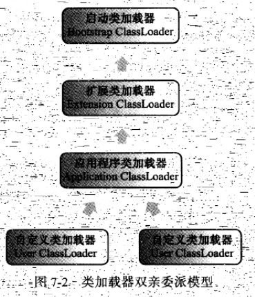

## 类加载的流程
加载（Loading）<br/>
链接（Linking）：验证（Verification）、准备（Preparation）、解析（Resolution）(可以在初始化后再执行，称为动态绑定或晚期绑定)<br/>
初始化（Initialization）<br/>
使用（Using）<br/>
卸载（Unloading）<br/>

加载、链接和初始化是交叉混合式进行的，不是加载完成后执行链接，也不是链接完成后执行初始化的。<br/>
HotSpot中通过`-XX:+TraceClassLoading`可以输出类加载的信息。<br/>

## 加载（Loading）
除了`/lib`下如rt.jar等类外由内置于JVM的启动类加载器（BootstrapClassLoader）加载外，其他类均有JVM外置的继承于`java.lang.ClassLoader`的类加载器实现加载操作。<br/>
因此整个加载过程，仅加载阶段是Java程序员可控制的，而其他阶段则是由JVM完全控制。<br/>
分为三个步骤：<br/>
1. 通过一个类的全限定名来获取定义此类的二进制字节流（源是多样的，可以是JAR、EAR、WAR，或网络中数据库中获取，也可以是通过动态代理技术来动态生成代理类）；<br/>
  在读取类的二进制字节流时，链接阶段的验证子阶段的文件格式验证已经开始了，文件格式验证用于保证读取进入来的数据能够正确解析并存储于方法区中（Class文件格式由JVM规范规定，而方法区的数据结构由JVM自行决定），只有通过文件格式验证后才能存储到方法区中。<br/>
  若验证失败则抛出`java.lang.VerifyError`或其子类异常。<br/> 
  
2. 将字节流所代表的静态存储结构（Class文件结构）转化为方法区的运行时数据结构。<br/>

3. 在内存中生成一个代表类或接口的`java.lang.Class`对象，作为操作该类或接口在方法区中数据的入口。<br/>
  HotSpot的Class对象存储在方法区中。

对于数组类型的加载，是加载数组的组件类型，然后由JVM自动创建数组类型。如SuperClass[]则加载LSuperClass类，然后由JVM创建[LSuperClass数组类。也就是说Java将数组封装成一个类，对数组的操作均被封装成数组对象的方法，如size()就是获取数组的长度。<br/>


## 链接（Linking）
### 验证（Verification）
首先对于被反复使用和验证过的类，验证过程是非必要的。可以通过`-Xverify:none`来关闭验证，可缩短虚拟机加载的时间。<br/>
1. 文件格式验证<br/>
  操作对象：二进制字节流<br/>
  目的：验证是否符合Class文件格式的规范。<br/>
2. 元数据验证<br/>
  操作对象：方法区中的类或接口的信息<br/>
  目的：对字节码描述的类的元数据信息进行语义分析，保证符合Java语言规范。<br/>
  类的元数据信息包括：<br/> 
   1. 类的父类信息（全限定名、修饰符等）;<br/> 
   2. 类的父类字段、方法信息；<br/> 
   3. 类的信息（全限定名、修饰符等）;<br/> 
   4. 类的字段、方法信息；<br/> 
   等等。**注意：不含方法体信息！**<br/>
3. 字节码验证<br/>
  操作对象：方法区中的类或接口信息的Code属性<br/>
  目的：对方法体语句进行语义分析，保证方法运行时不会出现危害JVM安全的事件<br/>
  由于这种语义分析需要执行类似于下列等检查，因此需要进行类型推导这一十分耗时的操作。<br/>
  1. 检查操作数栈的数据类型与指令的操作数类型兼容；<br/>
  2. 检查跳转指令不会跳转到方法体外的字节码指令上；<br/>
  3. 检查类型转换是安全的。<br/>
  JDK1.6在Code属性中添加了一个StackMapTable的属性，用于描述方法中所有基本块（Basic Block，按控制流拆分的代码块）开始时本地变量表和操作数栈引用的状态。然后字节码验证时则进行类型检查而不是类型推导，从而提高验证的性能。可通过`-XX:-UseSplitVerifier`来关闭类型检查回归到类型推导，或通过`-XX:+FailOverToOldVerifier`来设置当类型检查失败就采用类型推导。<br/>
  JDK1.7则只能采用类型检查了。<br/>
  但StackMapTable的数据依然可以被篡改，而这就是JVM开发团队需要考虑的了。<br/>
  注意：字节码验证时会触发父类或所实现的接口的符号引用的解析（也就是会触发类加载过程）。<br/>
4. 符号引用验证<br/>
  操作对象：方法区中的类或接口信息<br>
  目的：对类的符号引用和类的实际信息（类、字段、方法等）进行验证，保证符号引用可成功解析为直接引用，并当前类可以成功访问直接引用<br/>
  在执行链接阶段的解析子阶段时，会对符号引用进行符号引用验证，验证包括以下等内容：<br/>
  1. 通过符号引用中字符串描述的全限定名是否可以在方法区中找到对应的类。<br/>
  2. 通过符号引用中对字段、方法的简单名和描述符是否可以在方法区找到对应的字段和方法。<br/>
  3. 当前实例是否有权限访问符号引用的类、字段和方法。<br/>
  若验证失败则会抛出`java.lang.IncompatibleClassChangeError`的子类`java.lang.IllegalAccessError`、`java.lang.NoSuchFieldError`和`java.lang.NoSuchMethodError`等。<br/>

### 准备（Preparation）
  在方法区为类变量分配内存空间，并初始化为0。
````
// 经过准备阶段后，value类变量将存储在方法区中，值为0。123的赋值操作将在初始化阶段进行。
public static int value = 123;
````
各类型的零值<br/>
````
int 0
long 0L
short (short)0
char '\u0000'
byte (byte)0
boolean false
float 0.0f
double 0.0d
reference null
````
  对于类常量（类静态常量），则直接初始化为ConstantValue属性的值。
````
// 经过准备阶段后，value类变量将存储在方法区中，值为123。
public static final int value = 123;
````

### 解析（Resolution）
  不一定要在类加载时执行，可以在运行时调用时才执行。就是将常量池内的符号引用替换为直接引用。<br/>
**符号引用（Symbolic References）**<br/>
  以一组符号来描述所引用的目标（类、接口、方法、字段等）。只要能无歧义地定位到目标即可，并且与JVM的实际内部布局无关，而引用的目标也不一定已经加载到内存中。符号引用的形式已经由JVM规范规定了<br/>  
**直接引用（Direct References）**<br/>
  直接引用可以是直接指向目标的指针、相对偏移量或一个能间接定位到目标的句柄。如果有了直接引用则目标必定已经在内存中存在了。<br/>

  在执行newarray,checkcast,getfield,getstatic,instanceof,invokedynamic,invokeinterface,invokespecial,invokestatic,invokevirtual,ldc,ldc_w,multianewarray,new,putfiled和putstatic这16个字节码指令执行前先对它们使用的符号引用进行解析。<br/>
  除了invokedynamic指令外，其他指令触发符号引用解析为直接引用后，将会对直接引用作缓存避免重复解析。（或者不作缓存，但JVM会保证第一解析成功则后续也会解析成功，失败则后续解析一样会收到相同的异常）。而invokedynamic则每次解析均不同。<br/>
  解析主要针对类或接口（CONSTANT_Class_info）、字段（CONSTANT_Fieldref_info）、类方法（CONSTANT_Methodref_info）、接口方法（CONSTANT_InterfaceMethodref_info）、方法类型（CONSTANT_MethodType_info）、方法句柄（CONSTANT_MethodHandle_info）和调用点限定符（CONSTANT_InvokeDynamic_info）7种符号引用进行。（后三种是JDK1.7新增的动态语言支持信息相关）<br/>
**1. 类或接口的解析**<br/>
  将类D中的符号引用N解析为直接引用C，首先将N的全限定名传递给D的类加载器去加载类C，然后进过加载、验证、准备阶段，并因为字节码验证而加载父类或实现的接口。一旦任何一个类或接口的加载失败则符号引用N解析为直接应用C的操作就会被宣告失败<br/>
  成功解析后则进行符号引用验证，检查D是否具备访问C的权限。若不具备则抛出`java.lang.IllegalAccessError`<br/>
   
**2. 字段的解析**<br/>
  首先对`CONSTANT_Fieldref_info`的`class_index`项所指向的符号引用进行类或接口解析。若解析成功后得到类或接口的直接引用C，则在C中查找简单名称和字段描述符与`CONSTANT_Fieldref_info`的`name_index`项所指向的内容相匹配的直接引用，若失败则从下往上递归搜索C所实现的接口中是否有匹配的，若失败则从下往上递归搜索C所实现的父类中是否有匹配的，若失败则抛出`java.lang.NoSuchFieldError`。<br/>
  若成功解析直接引用，则进行符号引用验证，失败则抛出`java.lang.IllegalAccessError`<br/>

**3. 类方法的解析**<br/>
  首先对`CONSTANT_Methodref_info`的`class_index`项所指向的符号引用进行类或接口解析。若解析成功后得到类或接口的直接引用C，则在C中查找简单名称和字段描述符与`CONSTANT_Methodref_info`的`name_index`项所指向的内容相匹配的直接引用，若失败则从下往上递归搜索C所实现的父类中是否有匹配的，若失败则从下往上递归搜索C所实现的接口中是否有匹配的（若成功说明C是一个抽象类并抛出`java.lang.AbstractMethodError`），若失败则抛出`java.lang.NoSuchMethodError`。<br/>
  若成功解析直接引用，则进行符号引用验证，失败则抛出`java.lang.IllegalAccessError`<br/>
 
**4. 接口方法的解析**<br/>
  首先对`CONSTANT_InterfaceMethodref_info`的`class_index`项所指向的符号引用进行接口解析。若解析成功后得到类或接口的直接引用C（若C不是接口则抛出`java.lang.IncompatibleClassChangeError`），则在C中查找简单名称和字段描述符与`CONSTANT_InterfaceMethodref_info`的`name_index`项所指向的内容相匹配的直接引用，若失败则从下往上递归搜索C的父接口中是否有匹配的，若失败则抛出`java.lang.NoSuchMethodError`。<br/>
  

## 初始化（Initialization）
  类和接口均有初始化过程，实质上就是执行字节码中的`<clinit>`构造函数。<br/>
  类中静态字段和静态代码块均被代码重排到`<clinit>`函数中进行赋值等操作。并且父类必须已经初始化后再初始化子类<br/>
  接口的静态字段也被代码重排到`<clinit>`函数中进行赋值操作。但不要初始化该接口前必须其父接口完成了初始化，而是在真正使用到父接口（静态常量字段）时才触发初始化。
  JVM会自动处理多线程环境下`<clinit>`函数的同步互斥执行。因此若在`<clinit>`执行耗时的操作则会阻塞其他线程的执行<br/>


### 主动引用
JVM规范规定以下5种情况，则必须执行初始化（加载、链接自然会在之前进入执行状态）<br/>
1. 遇到new, getstatic, putstatic或invokestatic这4条字节码指令时，若类没有进行过初始化，则需要先触发初始化。对应的Java代码为通过关键字new一个实例，读或写一个类变量，调用类方法。<br/>
2. 使用`java.lang.reflect`包中的方法操作类时，若类没有进行过初始化，则需要先触发初始化。<br/>
3. 当初始化一个类时，若其父类还没初始化则会先初始化父类。<br/>
4. 当虚拟机启动时，虚拟机会初始化入口函数所在的类。<br/>
5. JDK1.7增加动态语言的支持。如果一个`java.lang.invoke.MethodHandle`实例最后的解析结果是REF_getStatic,REF_putStatic,REF_invokeStatic的方法句柄，而这个句柄所在的类没有进行初始化，则需要先触发初始化。<br/>

除了上述5种情况外，其他引用类的方式是不会触发初始化的，并称为被动引用。<br/>
通过子类访问父类静态字段不会导致子类初始化，仅仅会导致父类初始化。<br/>
Java代码中创建数组对象，不会导致数组的组件类（如SuperClass[]的组件类为SuperClass）初始化。因为创建数组类的字节码指令是newarray。<br/>
类A访问类B的静态常量不会导致类B的初始化。因为在编译阶段会将类使用到的常量直接存储到自身常量池的引用中，因此实际上运行时类A访问的是自身的常量与类B无关系。<br/>


## 类加载器
  对于任意一个类，都需要由加载它的类加载器和该类本身一同确立它在JVM中的唯一性。<br/>

### 分类 
1. Bootstrap ClassLoader（启动类加载器）：HotSpot中由C++实现并且作为JVM的一部分（其他类加载器均有JAVA实现并且不作为JVM的一部分），负责将<JAVA_HOME>/jre/lib目录中或-Xbootclasspath参数所指定的路径中或-Dsun.boot.class.path系统属性所指定的路径中特定名称的类库加载到JVM（如rt.jar等，所以即使将自己的类库放在<JAVA_HOME>/jre/lib下也不会被加载）<br/>
查看Bootstrap ClassLoader加载的核心类库：<br/>
````
java.net.URL[] urls = sun.misc.Launcher.getBootstrapClassPath().getURLs();
for (java.net.URL url : urls){
  System.out.println(url.toExternalForm());
}
// 结果：
lib/resources.jar
lib/rt.jar
lib/sunrsasign.jar
lib/jsse.jar
lib/jce.jar
lib/charsets.jar
lib/jfr.jar
lib/classes
````
JVM启动时BootstrapClassLoader会加载rt.jar中的`sun.misc.Launcher`，而其他类加载的实现均在这个类里面。然后通过其他类加载器加载需要的类后执行入口函数main<br/>
在执行`sun.misc.Launcher`的构造函数时，会实例化一个ExtClassLoader和AppClassLoader实例，然后通过`Thread.currentThread().setContextClassLoader()`将AppClassLoader设置为默认的线程上下文类加载器。然后通过`Thread.currentThread().getContextClassLoader()`获取线程上下文类加载来加载需要的类。这样Bootstrap ClassLoader就可以利用子类加载器来加载需要的类了。JNDI、Servlet就是这样<br/>

ClassLoader
SecureClassLoader
URLClassLoader
ExtClassLoader AppClassLoader

`java.net.URI`
`java.net.URL`
`java.net.URLClassLoader`
StringTokenizer


2. Extension ClassLoader（扩展类加载器）：由`sun.misc.Launcher$ExtClassLoader`实现，负责加载<JAVA_HOME>/jre/lib/ext目录中或java.ext.dirs系统变量所指定的路径中的所有类库<br/>
3. Application ClassLoader（System ClassLoader，应用程序类加载器/系统加载器）：由`sun.misc.Launcher$AppClassLoader`实现，可通过`java.lang.ClassLoader.getSystemClassLoader`获取。负责加载ClassPath或-cp或java.class.path系统属性上指定的类库。若程序中没有自定义自己的类加载器，则默认使用该类加载器<br/>
````
ClassLoader appClassLoader = ClassLoader.getSystemClassLoader();
ClassLoader extClassLoader = appClassLoader.getParent();
ClassLoader bootstrapClassLoader = extClassLoader.getParent(); // 由于BootstrapClassLoader在程序中是不可见的，因此返回null
````
4. User ClassLoader（用户自定义类加载器）：<br/>
<br/>

除了Bootstrap ClassLoader外，其他类加载器均可被开发者直接使用。而Bootstrap ClassLoader则通过双亲委派模型来间接使用。<br/>

虽然ClassLoader称为类加载器，但除了类文件外还可以用于加载图片、音频等资源的URL。（资源需要放在ClassPath目录下）相关的API：<br/>
`URL getResource(String name)`，通过资源名称获取<br/>
该方法会通过父类加载器搜索资源，失败后就调用findResource(String)来搜索资源。<br/>
`URL getSystemResource(String name)`相当于`ClassLoader.getSystemClassLoader().getResource(name)`。<br/>

````
// 会触发test.A的初始化操作（会执行<clinit>方法）
Class.forName("全限定类名")
Class.forName("全限定类名", true, this.getClass().getClassLoader())

// 不会触发test.A的初始化操作（不会执行<clinit>方法）
Class.forName("全限定类名", false, this.getClass().getClassLoader())
ClassLoader.getSystemClassLoader().loadClass("test.A")
Thread.currentThread().getContextClassLoader().loadClass("test.A")
````
````
// User ClassLoader
public class MyCL extends URLClassLoader{
  private static File file = new File("c://classes");
  public MyCL(){
    super(getUrl());
  }
  public static URL[] getUrl(){
    try{
	return new URL[]{file.toURL()};
    }catch(MalformedURLException e){
	return new URL[0];
    }
  }
}
````
````
public class FileSystemClassLoader extends ClassLoader { 

    private String rootDir; 

    public FileSystemClassLoader(String rootDir) { 
        this.rootDir = rootDir; 
    } 

    protected Class<?> findClass(String name) throws ClassNotFoundException { 
        byte[] classData = getClassData(name); 
        if (classData == null) { 
            throw new ClassNotFoundException(); 
        } 
        else { 
            return defineClass(name, classData, 0, classData.length); 
        } 
    } 

    private byte[] getClassData(String className) { 
        String path = classNameToPath(className); 
        try { 
            InputStream ins = new FileInputStream(path); 
            ByteArrayOutputStream baos = new ByteArrayOutputStream(); 
            int bufferSize = 4096; 
            byte[] buffer = new byte[bufferSize]; 
            int bytesNumRead = 0; 
            while ((bytesNumRead = ins.read(buffer)) != -1) { 
                baos.write(buffer, 0, bytesNumRead); 
            } 
            return baos.toByteArray(); 
        } catch (IOException e) { 
            e.printStackTrace(); 
        } 
        return null; 
    } 

    private String classNameToPath(String className) { 
        return rootDir + File.separatorChar 
                + className.replace('.', File.separatorChar) + ".class"; 
    } 
 }
````
同一个类加载器实不能重复加载同一个类型否则会抛出`java.lang.LinkageError: duplicate class definition`。由于`java.lang.ClassLoader#loadClass`会对加载的类进行缓存，并在执行重复加载操作时，直接返回缓存中的类，因此默认在不重写loadClass方法时不会抛出该异常。但下列代码将发生问题<br/>
````
public Class<?> loadClass(String name) throws ClassNotFoundException{
  try{
    // 使用AppClassLoader加载
    return ClassLoader.getSystemClassLoader().loadClass(name);
  }
  catch(ClassNotFoundException e){
    // 内部通过getResource获取资源后，通过defineClass执行各种验证。
    // 当发现方法区已经给类信息时则抛异常
    return this.findClass(name);
  }
}
````

## 卸载
虚拟机规范：<br/>
 A class or interface may be unloaded if and only if its class loader is unreachable. The bootstrap class loader is always reachable; as a result ， system classes may never be unloaded.<br/>
只有当加载该类型的类加载器实例( 非类加载器类型) 为unreachable 状态时，当前被加载的类型才被卸载. 启动类加载器实例永远为reachable 状态，由启动类加载器加载的类型可能永远不会被卸载<br/>
Unreachable状态的解释：<br/>
 1 、A reachable object is any object that can be accessed in any potential continuing computation from any live thread.<br/>
 2 、finalizer-reachable: A finalizer-reachable object can be reached from some finalizable object through some chain of references, but not from any live thread. An unreachable object cannot be reached by either means.<br/>
也就是说
1. 加载器的类实例已经被回收。
对于Bootstrap、Ext和Sys类加载器来说正常情况下是不会被回收的，只有用户自定义类加载器才可以。通过`java -verbose:class Main`指向以下代码。
````
import java.net.*;
import java.io.*;

public class Main{
	public  static class MyURLClassLoader  extends  URLClassLoader { 
	   public  MyURLClassLoader() { 
	      super (getMyURLs()); 
	   } 

	   private   static  URL[] getMyURLs() { 
	    try  { 
	       return   new  URL[]{ new  File ("d:/").toURL()}; 
	    }  catch  (Exception e) { 
	       e.printStackTrace(); 
	       return   null ; 
	    } 
	  } 
	} 

	public static void main(String[] args) throws IOException{
	 try  { 
            MyURLClassLoader classLoader =  new  MyURLClassLoader(); 
            Class classLoaded = classLoader.loadClass("RMDIR"); 
            System.out.println(classLoaded.getName()); 
   
            classLoaded =  null ; 
            classLoader =  null ; 
  
           System.out.println(" 开始GC"); 
           System.gc(); 
           System.out.println("GC 完成"); 
	   System.in.read();
         }  catch  (Exception e) { 
             e.printStackTrace(); 
         } 
	}
}
````


### 双亲委派模型
  当一个类加载器收到类加载的请求，首先会将请求委派给父类加载器，这样一层一层委派到Bootstrap ClassLoader。然后加载器根据请求尝试搜索和加载类，若搜索失败则向子类加载器反馈信息，然后子类加载器才尝试自己去加载。<br/>
  JAVA中采用组合的方式实现双亲委派模型，而不是继承的方式。<br/>
  注意：请求是从子类加载器单向流动到父类加载器的。<br/>

### 非双亲委派模型
1. 涉及SPI（Service Provider Interface）的加载动作（JNDI,JDBC,JCE,JAXB和JBI等）<br/>
  由于JNDI服务等接口打包在rt.jar，由Bootstrap ClassLoader加载。而JNDI的实现则由各个独立厂商开发（SPI）且部署在应用的ClassPath路径下，而Bootstrap ClassLoader无法加载ClassPath路径下的类库。Java设计团队引入线程上下文类加载器（Thread Context ClassLoader），JNDI服务通过线程上下文加载器来加载SPI代码，实现父类加载器请求子类加载器完成类加载的动作（违背了双亲委派模型的思想）。
  线程上下文加载器通过`java.lang.Thread.setContextClassLoader()`方法设置，默认使用父线程的线程上下文加载器，如果全局范围内均没有设置过，则就是应用程序类加载器。<br/>
2. OSGi等实现代码热替换（HotSwap）和模块热部署（Hot Deployment）的技术。<br/>

## 自定义ClassLoader加载类和卸载类
1. 继承java.lang.ClassLoader，覆盖loadClass方法，动态搜索Class文件和使用defineClass方法。
2. new ClassLoader(类路径)即可。

`URLClassLoader(URL[] urls[, ClassLoader parent = appClassLoader])`

## URI、URL、URN
由互联网之父Tim Berners-Lee引入的用于识别、定位和命名互联网资源。<br/>

URL和URN是URI的子范畴。
URI是以字符串表示的某种统一的资源标识。格式为`[scheme:]scheme-specific-part[#fragment]`。<br/>
`[scheme:]`，URI的名称空间标识符。<br/>
`scheme-specific-part`，格式由具体的`[scheme:]`决定，用于标识资源。<br/>
URI分为绝对URI和相对URI两种，绝对URI就是格式完整的`[scheme:]scheme-specific-part`，如http://fsjohnhuang.cnblogs.com。绝对URI以对标识符出现的环境无依赖的方式引用某种资源。而相对URI则不是以`[scheme:]`为开头，如/articles/articles.html。相对URI以对标识符出现的环境有依赖的方式引用某种资源。
实例：<br/>
`````
当前浏览器正在浏览http://fsjohnhuang.cnblogs.com
<a href="//test.com">test</a>
//test.com是相对URI，解析时依赖标识符出现的环境，得到http://test.com

<a href="mailto:fsjohnhuang@xxx.com">mailto:fsjohnhuang</a>
mailto:fsjohnhuang@xxx.com是绝对URI
`````
URI又分为不透明和分层两种。<br/>
不透明：`scheme-specific-part`不是以正斜杆(/)开头的绝对URI。如`mailto:fsjohnhuang@xxx.com`或`news:com.lang.java`等。由于不透明的URI不用于分解，因此不需要对`scheme-specific-part`的信息进行有效性验证。<br/>
分层：`scheme-specific-part`是以正斜杠(/)开始的绝对或相对的URI。<br/>
格式：`[//authority][path][?query][#fragment]`
`[//authority]`，表示授权机构组件，以一对正斜杆开头authority可以基于主机也可以基于注册的，然后以正斜杆、问号或没有后续符号作为authority的结束。而authority格式为`[userinfo@]host[:port]`，如`fsjohnhuang@github.com:80`，fsjohnhuang为用户信息，github.com为主机，80为端口号。<br/>
`[path]`，path组件根据授权机构组件识别资源的位置。`[path]`由一系列的路径片段（path segment）组成，路径片段间以正斜杆(/)作分隔符。若第一个路径片段以正斜杆开头则表示该路径为绝对路径，否则则为相对路径。<br/>
`[?query]`，query组件用于识别要传递给资源的数据，用于影响资源的行为或返回的数据。<br/>
`[#fragment]`，在成功获取资源后，通过fragmemt聚焦到资源某个部分。<br/>

对于特定的URI组件实例，对于<br/>
1. null表示未定义的字符串组件；（注意null与空字符串是不同的）<br/>
2. -1表示未定义的正数组件；<br/>

标准化（Normalization）：去除.和..<br/>
解析化（Resolution）：相对于基本URI来解析另一个URI。若基本URI为相对URI则解析出来的也是相对URI，若节本URI是绝对URI则解析出来的也是绝对URI<br/>
相对化（Relativization）：Resolution的反向操作<br/>
````
For any two normalized URIs u and v, 
u.relativize(u.resolve(v)).equals(v)  and
u.resolve(u.relativize(v)).equals(v)  .
````


URI(统一资源标识)不能定位或读取/写入资源。
URL(统一资源定位)，是URI的一种。由于URL的`[scheme:]`为已知的网络协议，并且将URI与某种协议处理程序（一种资源定位器和根据协议建立的约束规则与资源通讯的读/写机制）绑定。

而URI一般不能为资源提供持久有效的名称，因此URN（统一资源命名）则负责全球唯一、持久不变的资源命名工作，即使资源已经无效依然会保留该资源的名称。<br/>

URL = URI + 已知的网络协议作为`[scheme:]` + 资源定位器<br/>
必须是绝对URI，依据scheme来解析scheme-specific-part的内容，并有scheme来决定解析URI的stream handler。

URN = URI + 持久不变的资源名称<br/>
mailto,news,isbn是URN

## `java.net.URI`
构造函数`URI(String uri)`，对格式无效的uri会抛出`URISyntaxException`。<br/>
类方法`URI.create(String uri)`，对格式无效的uri会捕获内部抛出的`URISyntaxException`，然后在抛出unchecked的`IllegalArgumentException`。<br/>
当构造了一个URI实例后，就可以通过下列API来获取各URI组件了<br/>
````
getAuthority()
getFragment()
getHost()
getPath()
getPort()
getQuery()
getScheme()
getSchemeSpecificPart()
getUserInfo()

isAbsolute()，URI是否是绝对URI
isOpaque()，URI是否不透明
equals(Object o)和compareTo(Object o)来比较两个URL是否一样。
````
URI类支持基本的URI操作有 标准化（normalization）分解（resolution） 和 相对化（relativization）。
`normalize()`，返回符合标准的URI新对象。如`x/y/../z/./q`->`x/z/q`<br/>
`resolve(String/URI uri)`，进行反向解析，以入参作为相对URI，以resolve方法所属对象作为基本URI来得到一个新的标准的URI对象<br/>
`relativize(URI uri)`，相对化操作，就是获取URI中的相对URI<br/>
````
URI uriBase = new URI("http://www.somedomain.com");
URI uriRelative = new URI("x/../y");
URI uriResolve = uriBase.resolve(uriRelative); // http://www.somedomain.com/y
URI uriRelativized = uriBase.relativize(uriResolve); // y
````

`URI#toURL()`，将URI转换为URL。<br/>

## 系统属性
  指与用户程序相关的OS配置信息和软件信息（包含用户程序中各库、框架等的属性信息）。<br/>
`Properties System.getProperties()`，获取所有系统属性。<br/>

cmd/shell中启动JVM时设置系统属性<br/>
````
$ java -Djava.ext.dirs=lib com.test.Test
````
设置log4j的配置文件路径，则可以将log4j.xml打包到jar中了
````
$ java -Dlog4j.configuration=file:/lib/log4j.xml com.test.Test
````

`{long} System.nanoTime`，获取当前微妙时间<br/>

## java.util.StringTokenizer
用于将字符串按某个分隔符进行切片成一组tokens。<br/>
过时的API，建议使用java.util.regex下的类来替代。<br/>

## java.io.StreamTokenizer


NoClassDefFoundError
ClassNotFoundError
