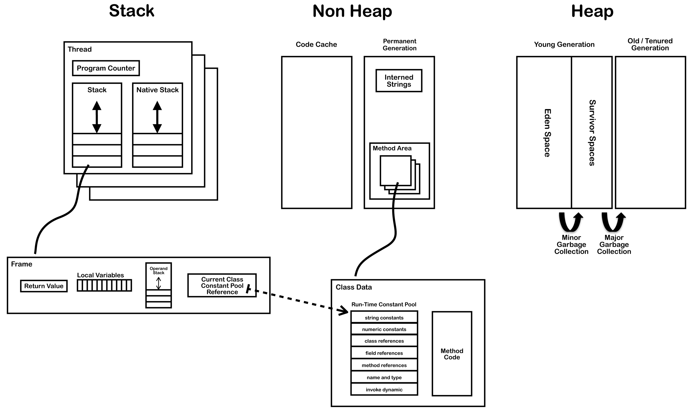

原地址：http://blog.jamesdbloom.com/JVMInternals.html<br/>

##前言
  本文将介绍JVM内部架构。下图展示符合Java7规范的JVM内部主要组件。<br/>
<br/>
  下面我们将上述组件分为线程相关和线程独立两种类型来介绍。<br/>
##目录
Thread
 &emsp;Per Thread
 &emsp;program Counter (PC)
 &emsp;Stack
 &emsp;Native Stack
 &emsp;Stack Restrictions
 &emsp;Frame
 &emsp;Local Variables Array
 &emsp;Operand Stack
 &emsp;Dynamic Linking
Shared Between Threads
 &emsp;Heap
 &emsp;Memory Management
 &emsp;Non-Heap Memory
 &emsp;Just In Time (JIT) Compilation
 &emsp;Method Area
 &emsp;Class File Structure
 &emsp;Classloader
 &emsp;Faster Class Loading
 &emsp;Where Is The Method Area
 &emsp;Classloader Reference
 &emsp;Run Time Constant Pool
 &emsp;Exception Table
 &emsp;Symbol Table
 &emsp;Interned Strings (String Table)

## Thread
  JVM允许进程包含多个并发的线程。Hotspot JVM中的Java线程与OS线程是一一对应的。当线程工作存储区（thread-local storage）、配置缓存（allocation buffers）、同步对象（synchronized objects）、栈和本地栈（stacks）和程序计数器（pragram counter）等Java线程相关的状态均准备好后，就会启动OS线程并有OS线程执行run函数。OS负责线程的调度。当以正常方式或异常抛出的方式退出run函数，OS线程均会判断当前Java线程的终止是否会导致进程的终止（进程的工作线程是否都终止了？），若要终止进程的化，则释放Java线程和OS线程所占的资源，否则就释放Java线程的资源，并回收OS线程。<br/>

### JVM System Threads  
  若你用过jconsole或其他调试工具，你会发现除了主线程外还存在数个有JVM创建的系统线程。Hotspot JVM的系统线程有这5个：<br/>
####1. VM thread（虚拟机线程）
  VM thread 用于为一些需要防止堆变化操作提供执行环境，当要执行防止堆变化的操作时，就是要求JVM启动安全点（safe-point）,此时将会暂停GC、线程栈操作、线程恢复和偏向锁解除。
####2. Periodic task thread（周期性任务线程）
  Periodic task thread负责定时事件（如interrupts），用于周期性执行计划任务。
####3. GC threads（垃圾回收线程）
  GC threads 负责不同类型垃圾回收活动。
####4. Compiler threads（编译器线程）
  Compiler threads用于在运行时将字节码编译为CPU本地代码。
####5. Signal dispatcher thread（信号量分发线程）
  Singal dispatcher thread用于接收发送给JVM的信号量，并将其分发到合适的JVM方法来处理。

### Per Thread
  每个线程的执行环境均有以下的组件。
####1. Program Counter(PC)（程序计数器）
  用于存放当前指令（或操作码）的地址，若该指令为本地指令那么PC为undefined。当执行完当前指令后PC会自增（根据当前指令的定义自增1或N）从而指向下一个指令的地址，那么JVM就可以知道接下来要执行哪个指令了。事实上PC存放的是方法区（Method Area）中的内存地址。
####2. Stack（堆栈）
  每个线程有自定独立的堆栈用于存放在该线程执行的方法。堆栈是一个后进先出（LIFO）的数据结构，元素称为栈帧（frame）。当将要在线程上执行某方法时，则需要将代表该方法的栈帧压栈，当方法执行完毕后（正常退出或抛出未处理的异常）则将栈帧弹栈。栈帧可能分配在堆上（heap），而堆栈并不需要连续的存储空间。
####3. Native Stack（本地堆栈）
  不是每种JVM都支持本地方法，对于支持本地方法的JVM它门会提供线程本地堆栈。若JVM实现了通过C链接模型（C-linkage Model）来实现JNI，那么本地堆栈实质就是C堆栈（入参顺序和返回值均与C程序一致）。本地方法一般都可以调用Java方法，此时会在Java的堆栈中压入一个栈帧并按执行Java方法的流程处理。
##### Stack Restrictions（堆栈约束）
  堆栈的容量有动态和固定两种。当栈帧数量大于堆栈容量时就会抛出StackOverflowError；当堆中没有足够内存来分配新栈帧时则抛出OutOfMemoryError。
####4. Frame（堆栈的元素——栈帧）
#####1. Local Varibles Array（局部变量表）
  局部变量表用于存放方法执行过程中this引用、方法入参和局部变量。对于静态方法而言方法参数从局部变量表的第一位开始（下标为0），对于实例方法而言方法参数从局部变量表的第二位开始（下标为1，第一位是this引用）。局部变量表内可包含以下类型数据，boolean/byte/char/long/short/int/float/double/reference/returnAddress。<br/>
  局部变量表的每个元素占32bit，每32bit称为1个slot。上述所支持的类型中除了long和double外均占1个slot，而它俩就占2个slot。
#####2. Operand Stack（操作数栈）
  在执行方法内部的字节码指令时需要使用操作数栈，大多数JVM的字节码指令是用于操作操作数栈（压栈、弹栈、赋值栈帧、栈帧互换位置或执行方法操作栈帧），实现数据在操作数栈和局部变量表之间频繁移动。示例如下：
````
//java code
int i;

// bytecode
0: iconst_0 // 将0压栈
1: istore_1 // 弹栈并将值赋值到局部变量表的第二个Slot槽中
````
#####3. Dynamic Linking（动态链接）
  每个栈帧均包含一个指向运行时常量池（runtime constant pool）的引用。该引用指向当前将要调用的方法所述的类，通过这个引用来实现动态链接。<br/>
  C/C++的代码会被编译成一个一个独立的对象文件，并通过静态链接将对多个对象文件生成一个执行文件或dll类库。在链接阶段所有的符号引用会被直接引用取代，而直接引用则为相对于可执行文件的进程入口地址的相对地址。而Java的链接阶段是在运行时动态发生的。<br/>
  当将Java类编译成字节码时，所有对变量和方法的引用将被保存为常量池表中的一条条符号引用表项，这些符号引用为逻辑引用而不是指向物理内存地址的引用。JVM可以选择不同的时刻将符号引用转换为直接引用。一种是当class文件加载并验证通过后，这种称为静态处理（eager or static resolution）；另一种是在使用时才转换为直接引用，这种称为懒处理（lazy or late resolution）。对于字段通过绑定来处理，对于对象或类则通过将符号引用转换直接引用来识别，动态链接后原有的符号引用将被直接引用替换，因此对于同一个符号引用，动态链接的操作仅发生一次。假如直接引用的类还未加载，则会加载该类。而直接引用所包含的地址相对于变量和方法在运行时的地址。

## Shared Between Threads
### Heap（堆）
  堆用于在运行时分配对象和数组。由于栈帧的容量是固定的，因此无法将对象和数组等容量可变的数据存放到堆栈中，而是将对象和数组在堆中的地址存放在栈帧中从而操作对象和数组。由于对象和数组是存放在堆，因此需要通过垃圾回收器来回收它们所占的内存空间。垃圾回收机制将堆分成3部分：<br/>
  1. 新生代（再细分为初生空间和幸存空间）
  2. 老年代
  3. 永久代
### Memory Management（内存管理）
  对象和数组不能被显式地释放，必须通过垃圾回收器来自动回收。一般的工作步骤如下：  1. 新创建的对象和数组被存放在新生代;
  2. 次垃圾回收将会对新生代作操作，存活下来的将从初生空间移至幸存空间;
  3. 主垃圾回收（一般会导致应用的其他所有线程挂起），会将新生代的对象爱嗯挪动到老年代;
  4. 每次回收老年代对象时均会回收永久代的对象。当他们满的时候就会触发回收操作。
### Non-Heap Memory（非堆内存）
  非堆内存包含下列这些:<br/>
  1. 永久代
   1.1. 方法区
   1.2. 字符串区
  2. 代码缓存
   用于存放被JIT编译器编译为本地代码的方法。
### Just In Time (JIT) Compilation（JIT编译）

### Method Area（方法区）
### Class File Structure（文件结构）
### Classloader（类加载器）
### Faster Class Loading（更快的类加载）
### Where Is The Method Area（方法区在哪？）
### Classloader Reference（类加载器引用）
### Run Time Constant Pool（运行时常量池）
### Exception Table（异常表）
### Symbol Table（符号表）
### Interned Strings (String Table)（字符串表）


biased locking?
linking and dynamic linking?


内存：
http://www.bdqn.cn/news/201304/8591.shtml
http://blog.csdn.net/guofansen/article/details/7265966
http://www.matrix.org.cn/resource/upload/article/2006_10_07_093827_SujcOugNNd.pdf
http://www.cnblogs.com/redcreen/archive/2011/03/29/1999032.html
http://www.blogjava.net/calvin/archive/2005/10/14/15527.html
