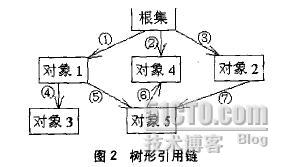
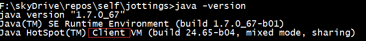
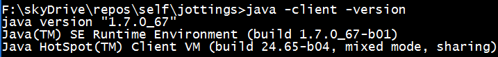
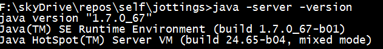

## 需要垃圾收集的内存区域 ―― 堆（新生代、老年代和方法区）
## 确定对象存活
1. 引用计数算法（Reference Counting）<br/>
  对象内含一个引用计数器，每当一个地方引用它时+1，当引用失效时-1。为0时表示对象不再被使用了。实现简单、效率高，但无法处理循环引用的问题。COM、FlashPlayer、Python和Squirrel均使用引用计数算法来管理内存。<br/>
2. 可达性分析算法（Reachability Analysis）<br/>
  通过一系列成为GC Roots的对象作为起始点，开始向下搜索，搜索经过的路径称为引用链（Reference Chain），当对象与GC Roots之间没有引用链相连，则表示该对象不可用。由于JDK1.2提供4种引用类型（强、软、弱、虚），因此判断对象是否可达性有以下两个规则：<br/>
  1. 单条引用链的可达性以最弱的一个引用类型来决定；<br/>
  2. 多条引用链的可达性以最强的一个引用类型来决定；<br/>
  例如：<br/>
  <br/>
  我们假设图2中引用①和③为强引用，⑤为软引用，⑦为弱引用，对于对象5按照这两个判断原则，路径①-⑤取最弱的引用⑤，因此该路径对对象5的引用为软引用。同样，③-⑦为弱引用。在这两条路径之间取最强的引用，于是对象5是一个软可及对象。

  GC Roots包括：<br/>
  虚拟机栈帧中局部变量表中的reference类型对象<br/>
  方法区中reference类型的类属性<br/>
  方法区中reference类型的常量<br/>
  本地方法栈中JNI引用的对象<br/>

## JDK1.2的四种引用类型
1. 强引用（Strong Reference），如`Object obj = new Object()`这类引用，只要强引用还存在GC永远不会收回被引用的对象。<br/>

  下面的三种引用，均是将原来存放堆对象地址的变量值改为存放特定引用类型的对象，然后这个特定引用类型的对象则存放堆对象地址。那么栈帧中局部变量表变量依然是强引用，而引用的是特定引用类型的对象，而特定引用类型对象存放堆对象的引用则各具特点。<br/>
  下面三种引用位于`java.lang.ref`包，且均继承`java.lang.ref.Reference`。通过get()方法获取实际的对象，若该实际对象已经被回收，则返回null。<br/>
2. 软引用（Soft Reference, java.lang.ref.SoftReference），用于描述还有用但非必须的对象。系统在发生OOM之前会回收软引用的对象，假如回收后还是空间不足才抛出OOM。<br/>
  可以用于实现内存敏感的高速缓存。可以与引用队列（ReferenceQueue）联合使用，若对象被回收，则JVM会将引用添加到引用队列<br/>
````
ReferenceQueue q = new ReferenceQueue();

// 获取数据并缓存
Object obj = new Object();
SoftReference sr = new SoftReference(obj, q);

// 下次使用时
Object obj = (Object)sr.get();
if (obj == null){
  // 当软引用被回收后才重新获取
  obj = new Object();
}

// 清理被收回后剩下来的软引用对象
SoftReference ref = null;
while((ref = q.poll()) != null){
  // 清理工作
}

````
  
3. 弱引用（Weak Reference），发生GC时必定被回收的对象。可以与引用队列（ReferenceQueue）联合使用，若对象被回收，则JVM会将引用添加到引用队列<br/>
4. 虚引用（Phantom Reference），又称为幽灵引用或幻影引用，虚引用既不会影响对象的生命周期，也无法通过虚引用来获取对象实例，仅用于在发生GC时接收一个系统通知。必须与引用队列（ReferenceQueue）联合使用，通过检查引用队列中是否有该虚引用来监测对象是否已经被回收。<br/>
````
ReferenceQueue queue = new ReferenceQueue();
Object obj = new Object(); // Strong Reference
PhantomReference pr = new PhantomReference(obj, queue); // Phantom Reference
obj = null; // Clear Strong Reference
````

`java.lang.ref.ReferenceQueue`
http://hongjiang.info/java-referencequeue/

`java.util.WeakHashMap`，键对象为弱引用。当键对象被垃圾回收时，对应的值对象的引用会从Map中删除。<br/>
````
WeakHashMap map = new WeakHashMap();
map.put(new Object, new Object);
````

## 回收算法
## 垃圾收集器
## 内存分配


## GC日志
  每个收集器的日志格式均不相同，但JVM将其维持为具有一定共性的日志格式。<br/>
````
33.124: [GC [DefNew: 3324K->152K(3712K), 0.0025925 secs] 3324K->152K(11904K), 0.0031680 secs
````
33.124为GC发生时离JVM启动经过的秒数。<br/>
GC/Full GC为GC的类型。<br/>
[DefNew 表示后续数据为新生代垃圾回收前和后的内存空间使用情况，括号的数值如(3712K)为该区域的内容容量。根据不同的垃圾收集器名称将有所不同。Serial收集器的是DefNew（Default New Generation）；Serial Old收集器则是DefOld；ParNew收集器的是ParNew（Parallel New Generation）；Parallel Scavenge收集器的是PSYoungGen。<br/>
0.0025925 secs表示GC执行耗时<br/>
3324K->152K(11904K) 表示GC前后堆空间使用情况（堆的总容量）。<br/>
````
100.667: [Full GC [Tenured: 0K->210K(10240K), 0.0149142 secs] 4603K->210K(19456K), [Perm: 2999K->2999K(21248K), 0.0 150007 secs] [Times: user=0.01, sys=0.00, real=0.02 secs]
````
[Times: user=0.01, sys=0.00, real=0.02 secs]，与Linux的time命令输出一致，user表示用户态消耗的CPU时间、sys表示内核态消耗的CPU时间和real表示操作从开始到结束经过的墙钟时间（Wall Clock Time = CPU时间 + IO等阻塞操作所耗费的时间），在多核环境中，user+sys>=real。<br/>


GC类型：
新生代GC（Minor GC）：执行频繁，回收速度比较快。在将Eden区域的幸存对象移至Survivor区域，或在允许分配担保失败时，将对象从新生代移至老年代<br/>
老年代GC（Major GC / Full GC）：会出现STW（Stop-The-World），一般会伴随至少一次的Minor GC（但Parallel Scavenge收集器则会直接进行Full GC）。回收速度比Minor GC慢10倍以上。将新生代的幸存。调用`System.gc()`会触发Full GC。<br/>


`-XX:+PrintGCDetails`，JVM发生垃圾收集行为时会打印内存回收日志，并在程序退出时输出当前的内存各区域分配情况。如何将日志保存到文件中？<br/>

`-Xmn10M`，将堆中10M空间分配给新生代。<br/>
`-XX:SurvivorRatio=8`，表示Eden区与Survivor区空间比例是8:1<br/>


吞吐量（Throughput）= 运行用户代码时间/(运行用户代码时间 + 垃圾收集时间)<br/>

## 常量
通过final关键字修饰的字段、局部变量。<br/>
常量字段，初始化的时机有两种，一种是定义时初始化，另一种是在构造函数中初始化。<br/>
局部变量，初始化的时机有两种须，一种是定义时初始化，另一种是在定义后初始化。<br/>


## JVM有Client模式、Server模式两种运行模式。
### 介绍
在`jre/bin`有client和server两个目录，分别代表JVM的两种运行模式。<br/>
client运行模式，针对桌面应用，加载速度比server模式快10%，而运行速度为server模式的10分之一。client下默认的堆容量`-Xms1M -Xmx64M`<br/>
server运行模式，针对服务器应用。server下默认的堆容量`-Xms128M -Xmx1024M`<br/>
通过`java -version`查看JVM的默认运行模式。<br/>
<br/>
通过`java -client -version`查看JVM的client运行模式环境。<br/>
<br/>
通过`java -server -version`查看JVM的server运行模式环境。<br/>
<br/>

### 运行模式切换
#### 1. 临时切换
在启动JVM时显式指定运行模式，如：以server模式运行com.cnblogs.fsjohnhuang.master.Daemon<br/>
````
$ java -server com.cnblogs.fsjohnhuang.master.Daemon
````
#### 2. 永久切换
修改JAVA_HOME/jre/lib/i386/jvm.cfg文件。<br/>
jvm.cfg文件原内容：<br/>
````
-client KNOWN
-server KNOWN
-hotspot ALIASED_TO -client
-classic WARN
-native ERROR
-green ERROR
````
修改为即可以server模式作为默认的JVM运行模式<br/>
````
-server KNOWN
-client KNOWN
-hotspot ALIASED_TO -client
-classic WARN
-native ERROR
-green ERROR
````

抢先式中断（Preemptive Suspension）
主动式中断（Voluntary Suspension）

System.gc();
System.runFinalization();

## finalize函数

## JVM有product build、debug build和fastdebug build三种类型的版本
fastdebug build的编译教程：http://agapple.iteye.com/blog/1056599<br/>
