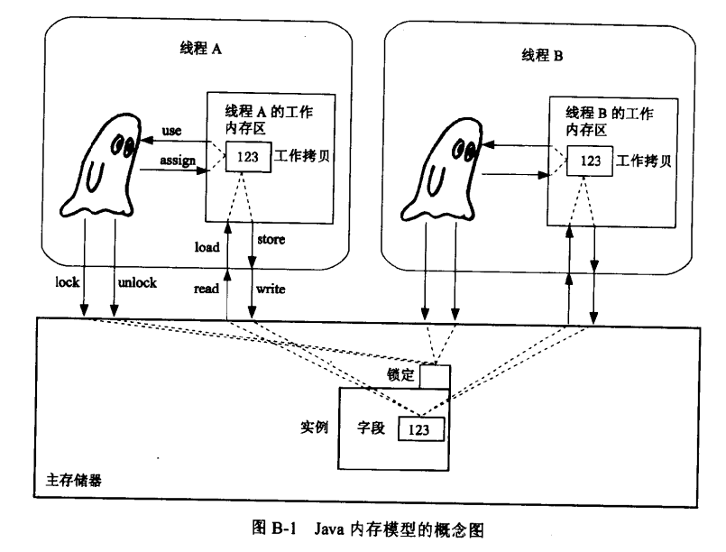

Pattern是不依存于特定语言，依存特定语言的称作idiom（惯用语）。<br/>

并发（concurrent）<br/>
并行（parallel）<br/>

当所有工作线程退出后程序才会正式退出
而由于myThread是工作线程，而不是守护线程（Daemon thread），
因此当主线程退出后，而myThread线程仍在运行，因此程序还没有退出。


`Thread.sleep(long ms[, int ns]) throws InterruptedException`，让当前线程挂起ms毫秒和ns纳秒。若要半路唤醒线程则要调用interrupt方法。<br/>

##线程的共享互斥
synchronized(静态)方法和synchronized语句块的等价写法：<br/>
**实例方法**<br/>
````
class Test{
	public synchronized void exec(){
		.............
	}
}
// 等价于
class Test{
	public void exec(){
		synchronized(this){
			..................
		}
	}
}
````
**类方法**<br/>````
class Test{
	public static synchronized void exec(){
		.............
	}
}
// 等价于
class Test{
	public static void exec(){
		synchronized(Test.class){
			..................
		}
	}
}
````
synchronized包裹的代码范围就是临界区。<br/>
临界区的操作将被看作为不可分割的原子操作（atomic operation）。在java中对对象和基本类型int、boolean等的赋值和引用操作均为原子操作，但java语言规格中定义long、double类型变量的赋值和引用均不是原子操作，但部分jvm的实现仍将long、double类型变量的赋值和引用操作实现成原子操作（由于与jvm相关，因此有风险）。另外通过volatile关键字标识的变量，对其进行赋值、引用操作均原子操作，因此可以通过`volatile long myVar = 12L;`来保证<br/>
synchronized用于获取实例的锁，若某线程获取实例的锁才能执行临界区的代码，当执行完或抛出异常后则会自动释放锁。<br/>
volatile的更太多信息需要了解Java内存模型<br/>
**注意：每个实例紧隐含一把锁，若线程A获取锁后，线程B则不能执行该实例的任何临界区代码。可看一下示例**<br/>
````
class Locker{
	public static void main(String[] args){
		Locker self = new Locker();
	
		SharedResource sr = self.new SharedResource();		
		Thread sleepT = new Thread(self.new MyThread(true, sr));
		Thread t = new Thread(self.new MyThread(false, sr));

		System.out.println("请选择：");	
		System.out.println("1. 先调用sleepThenPrint，再调用print方法");	
		System.out.println("2. 先调用print，再调用sleepThenPrint方法");	
		int choice = 1;
		try{
			choice = System.in.read();
		}
		catch(IOException e){}
		System.out.println("开始！");	
		if (choice == '1'){
			sleepT.start();
			t.start();
		}
		else{
			t.start();
			sleepT.start();
		}
	}

	class SharedResource{
		synchronized void print(){
			System.out.println("print");
		}
		synchronized void sleepThenPrint(){
			try{
				Thread.sleep(2000);
			}
			catch(InterruptedException e){}
			System.out.println("sleepThenPrint");
		}
	}

	class MyThread implements Runnable{
		private final boolean on_off; 
		private final SharedResource sr;

		public MyThread(boolean on_off, SharedResource sr){
			this.on_off = on_off;
			this.sr = sr;
		}

		@Override
		public void run(){
			if (on_off)
				sr.sleepThenPrint();
			else
				sr.print();
		}
	}
}
````


## 线程的协调
### wait set (等待集合)
每个实例除了包含隐式的管程外，还包含一个wait set，当调用实例的wait方法时，当前线程就会被挂起、释放当前实例资源（离开实例对应的管程），然后被放入wait set中。<br/>
当发生下列线程将从wait set中退出。<br/>
1. 有其他线程调用实例的notify方法来唤醒该线程；
2. 有其他线程调用实例的notifyAll方法来唤醒wait set中的所有线程；
3. 有其他线程调用实例的interrupt方法来唤醒该线程；
4. wait方法到期。
因此Object实例的wait、notify和notifyAll就是操作wait set。<br/>
**注意：实例的wait、notify和notifyAll只能在synchronized方法和synchronized语句块中使用。否则会抛出java.lang.IllegalMonitorStateException**<br/>
#### Object#notify
当前线程调用Object#notify方法，会从notify方法所属实例的wait set中唤醒一个线程（若此时wait set中有多个线程，则有Java系统决定唤醒哪个）。但此时被唤醒的线程并未开始执行，因为当前线程仍然独占实例管程，只要等当前线程释放锁后，被唤醒的线程才会从上次执行的位置开始执行。<br/>
#### Object#notifyAll
当前线程调用Object#notify方法，会从notifyAll方法所属实例的wait set中唤醒所有线程。使用notifyAll可防止部分线程不被唤醒导致异常的问题，因此稳健性较好。但由于notify每次仅唤醒一个线程因此性能较好。<br/>


## 多线程程序的评量标准（Doug lea的分类方式）
1. 安全性——对象状态依照原有设计变化<br/>
  thread-safe（线程安全）：2~N个线程使用而不危机安全性的类。java.util.Vector是thread-safe，而java.util.ArrayList则非thread-safe，当经过处理后仍可实现thread-safe，这种情况称为thread-compatible。<br/>
2. 生存性——能完成特定业务功能处理
3. 复用性
4. 性能

## Single Threaded Execution Pattern
共享资源角色（SharedResource）：由多个线程访问的类，该类的方法分为<br/>
1. safeMethod(安全方法)，多线程同时访问也不会发生问题。<br/>
2. unsafeMethod(不安全方法)，多线程同时访问也会发生问题，需要额外添加防范使其成为thread-safe。而只能让单线程执行的程序范围，称为临界区（critical section或critical region）<br/>

调用synchronized方法和代码块比一般方法和代码块性能会低些。<br/>
因此JDK提供的集合类大多数是非线程安全的，可通过下列方法转换为线程安全集合类<br/>
````
java.util.Collections.synchronizedCollection
java.util.Collections.synchronizedList
java.util.Collections.synchronizedMap
java.util.Collections.synchronizedSet
java.util.Collections.synchronizedSortedMap
java.util.Collections.synchronizedSortedSet
````
**引入的潜在问题**<br/>
1. 死锁(Deadlock)<br/>
  当达到下面的条件时，就有可能发生死锁：<br/>
  1. 具有多个共享资源角色<br/>
  2. 线程会同时锁定2~N个共享资源角色<br/>
  3. 锁定共享资源角色的顺序有2~N种。<br/>
2. 继承异常(Inheritance anomaly)<br/>
  子类可能会扩展出没有加以防卫的unsafeMethod，导致使用子类的多线程程序出现问题。<br/>
3. 降低执行性能<br/>
  使用synchronized关键字的方法体和语句块被成为临界区。<br/>
  1. 进入临界区前需要获取锁，这个操作消耗一定时间（因此减少进入临界区的操作可提高性能）；<br/>
  2. 当由于临界区已经锁定而无法进入时（这种情况被称为线程冲突），线程则进入等待状态，程序的性能则下降（因此缩小临界区范围，减少冲突次数）<br/>


## Immutable
Immutable类<br/>
实例的内部状态(即是字段值)不会被改变。多线程访问实例时无需获取锁。<br/>
适用于多线程的read-read场景下。<br/>
````
class Person{
	private final String name;
	private final String addr;
	Person(String name, String addr){
		this.name = name;
		this.addr = addr;
	}

	public String getName(){
		return name;
	}
	public String getAddr(){
		return addr;
	}

	@Override
	public String toString(){
		return name + "@" + addr;
	}
}
````
Java类库中的Immutable类<br/>
````
java.lang.String
java.lang.Boolean
java.lang.Integer
java.lang.Byte
java.lang.Character
java.lang.Double
java.lang.Float
java.lang.Long
java.lang.Short
java.lang.Void // 仅用于reflection 和 serialization上，无法创建Void的实例

java.awt.Color
````
由于对资源仅进行read操作是十分少见的。因此我们可以对同一资源的操作进行分类immutable和mutable，并且两者可以相互转换。（如String和StringBuffer）
````
class Person(){
	private final String name;
	private final String addr;
	Person(String name, String addr){
		this.name = name;
		this.addr = addr;
	}
	Person(PersonBuffer pb){
		this(pb.getName(), pb.getAddr());
	}

	public String getName(){
		return name;
	}
	public String getAddr(){
		return addr;
	}

	@Override
	public String toString(){
		return name + "@" + addr;
	}
}
class PersonBuffer(){
	private String name;		
	private String addr;		

	PersonBuffer(String name, String addr){
		this.name = name;
		this.addr = addr;
	}

	PersonBuffer(Person person){
		this(person.getName(), person.getAddr());
	}

	synchronized String getName(){
		return name;
	}
	synchronized String getAddr(){
		return addr;
	}

	synchronize void update(String name, String addr){
		this.name = name;
		this.addr = addr;
	}

	synchronize String toString(){
		return name + "@" + addr;
	}
}
````

## Guarded Suspension Pattern
场景：线程需等待警戒条件成立后再执行后续操作。<br/>
角色：GuardedObject（被防卫者）<br/>
GuardedObject含guardedMethod和stateChangingMethod，并且两个方法由不同的线程来执行。<Br/>
guardedMethod，检测实例的状态是否满足警戒条件，满足则执行后续操作，不满足则通过wait方法将线程推入wait set并释放实例的锁；<br/>
stateChangingMethod，修改实例的状态使其满足guadedMethod下的警戒条件，然后通过notify/notifyAll唤醒wait set中的线程。<br/>

**busy wait**<br/>
````
// 等待
while(!ready)
	Thread.yield(); // 线程没有被挂起，而是尽可能把CPU时钟交给其他线程。通过不断切换线程执行while(!ready)来作警戒条件判断，比较耗资源。	

// 唤醒
ready = true;
````
**spin lock（旋锁）**<br/>
仅指通过循环、递归方式不断判断警戒条件，而没有指出是使用guarded wait还是busy wait实现方式，还是两样一起用。<br/>
部分硬件实现同步机制也称为spin lock。<br/>
**polling**<br/>
轮询，反复检查某个事件是否发生，当发生时就进行对应的处理。<br/>

##Balking Pattern
场景：线程检查警戒条件，当不成立时则中途退出而不是等待。<br/>
角色：GuardedObject（被防卫者）<br/>
GuardedObject含guardedMethod和stateChangingMethod，并且两个方法由不同的线程来执行。<Br/>
guardedMethod，检测实例的状态是否满足警戒条件，满足则执行后续操作，不满足则退出临界区并释放实例的锁；<br/>
stateChangingMethod，修改实例的状态使其满足guadedMethod下的警戒条件。<br/>

## Guarded Timeout Pattern
Guarded Sespension Pattern和Balking Pattern均为极端情况，而Guarded Timeout Pattern则是折衷的办法。<br/>
场景：线程检查警戒条件，当不成立时则等待一段时间再检查警戒条件是否成立，若不成立则退出。在等待的期间可能被其他线程通知警戒条件已经成立进而执行后续操作。<br/>
角色：GuardedObject（被防卫者）<br/>
GuardedObject含guardedMethod和stateChangingMethod，并且两个方法由不同的线程来执行。<Br/>
guardedMethod，检测实例的状态是否满足警戒条件，满足则执行后续操作，不满足则通过wait(long timeout)方法将线程推入wait set并释放实例的锁；<br/>
stateChangingMethod，修改实例的状态使其满足guadedMethod下的警戒条件，然后通过notify/notifyAll唤醒wait set中的线程。<br/>
注意：由于无法区分唤醒执行guardedMethod线程的是notify/notifyAll还是wait超时，因此需要通过判断标识变量（flag）。<br/>

##自定义异常
1. 自定义可被修复的异常状态，则继承java.lang.Exception。<br/>
2. 自定义运行时发现，并且无法恢复的状态则继承java.lang.RuntimeException。<br/>

当调用Thread.sleep让当前线程休眠后，在其他线程中调用该线程实例的start方法，将导致该线程抛出IllegalThreadStateException。<br/>

## Producer-Consumer Pattern
当消费者和生产者各仅含一个实例时，就称为Pipe Pattern。<br/>
角色：Producer（生产者）、Consumer（消费者）、Data（前两者沟通的数据载体）和Channel（用于缓冲前两者的处理速度差，作为Data角色的中继站、通道）<br/>

## InterruptedException异常
方法定义后跟着throws InterruptedException，表示该方法需要花点时间，但可以取消。<br/>
````
java.lang.Object#wait throws InterruptedException
// sleep所属线程休眠
java.lang.Thread#sleep throws InterruptedException
// 等待join所属线程结束才继续当前线程
java.lang.Thread#join throws InterruptedException
````
上述方法均可以通过java.lang.Thread#interrupt函数来取消。<br/>
java.lang.Thread#interrupt函数实质上是修改线程的中断状态为true，而wait、sleep和join方法内部会不断检查线程的中断状态，若为true则抛出InterruputedException。因此若线程中没有执行wait、sleep或join方法而调用了interrupt方法，也不会抛InterruptedException异常。<br/>
另外还有2个方法与中断状态有关：<br/>
1. `java.lang.Thread#isInterrupted()`，检查中断状态。<br/>
2. `java.lang.Thread#interrupted()`，检查中断状态，并将其重置为false。<br/>
注意：<br/>
通过interrupt中断的线程操作，若之前独占了锁，是会被释放的。<br/>

**java.lang.Thread#stop()**<br/>
无论线程执行情况如何，都会被强行终结。即使正在执行临界区的代码，因此会导致临界区被执行了一半的可能，而临界区的代码应该作为原子操作——要么都执行要么都不执行。因此该方法已经被deprecated。

## Read-Write Lock Pattern
场景：数据的读写操作分离，并且同时进行会产生冲突。(read-write conflict 和 write-write conflict)<br/>
角色：Reader、Writer、SharedResource和ReaderWriterLock<br/>
Java语言没有提供对应的物理锁(如synchronized关键字)，需要攻城师们自行实现。<br/>

## Before/After Pattern
场景：保证方法的执行顺序。<br/>
````
before();
try{
	doSomething();
}
finally{
	after();
}
````
若修改为如下，方法的执行顺序有可能出现before()->after()，而不是正常的before()->doSomething->after()。
````
try{
	before();
	doSomething();
}
finally{
	after();
}
````

## Thread-Per-Message Pattern
场景：任务分配者与任务执行者分离，并且不关心任务执行情况、返回值和任务的执行顺序<br/>
角色：任务委托者（Client）、任务分配者（Host）、任务执行者（Helper）<br/>
Client将任务委托Host来执行，而Host则为每个Helper分配独立的线程，让Helper来执行。
注意：由于每个任务均由独立线程，因此Client发起任务委托操作的耗时=调用Host方法+创建线程+Helper方法<br/>

匿名内部类的实例方法中仅能引用外部的final变量。<br/>
匿名内部类在编译时已经生成了。<br/>

## Worker Thread Pattern
就是线程池。<br/>
场景：和Thread-Per-Message Pattern的一样<br/>
角色：任务委托者（Client）、通道（Channel）、任务执行者（Worker）和任务请求（Request）<br/>
Client将Request推送到Channel，Worker会自行获取Request并执行。<br/>

Worker Thread Pattern和Thread-Per-Message Pattern都是invocation和execution分离。<br/>
invocation和execution分离(含代码级别的分离、物理执行环境的分离——分别在两台计算机上执行)可以实现<br/>
1. 已invocation，在execution前中止执行。2. 执行一次invocation，执行多次execution。<br/>

## Future Pattern
场景：任务执行耗时较长，但不需要马上得知结果，只需要在未来某个时间获取结果即可。<br/>
角色：任务委托者（Client）、任务分配者（Host）、结果期待（Future）、实际任务执行者（RealData）和虚拟结果（VirtualData）。<br/>
Client向Host发起任务执行请求，Host分配RealData执行任务，并返回与RealData对应的Future。当RealData的任务执行完成后，则将返回值填入Future。而Client则可通过Future获取结果。VirtualData则为RealData和Future的契约<br/>
注意：Client获取返回执行的方式有多种<br/>
1. 从Future中获取，若RealData还没返回结果则等待；<br/>
2. 从Future中获取，若RealData还没返回结果则马上返回获取失败，Client在未来某个时间在尝试；<br/>
3. 通过回调函数，若RealData返回结果则调用回调函数通知Client。<br/>

## Two-Phase Termination Pattern
线程状态：<br/>
1. 作业中->终止处理中；<br/>
2. 终止处理中->线程结束。<br/>
场景：任务会一直运行，直到外界发起终止请求，而任务所在线程需要安全地结束线程（安全性），保证线程一定会被结束（生命性），收到终止请求后尽快完成终止处理（响应性）。<br/>
角色：终止请求发起者（TerminationRequester）和终止者（Terminator）
TerminationRequester向正在执行任务的Terminator发起终止请求，而Terminator每个工作周期都会检查终止标识来决定是继续工作还是执行终止任务。<br/>

**订阅系统终止事件**
系统终止时(调用System.exit(0)，或所有非Daemon Thread都结束时)可通过`java.lang.Runtime#addShutdownHook(Thread thread)`订阅系统终止事件。<br/>
````
public static void main(String[] args){
	System.out.println("main start!");

	Runtime.getRuntime().addShutdownHook(new Thread(){
			@Override
			public void run(){
				System.out.println("addShutdownHook");
			}
		});
	System.out.println("main exit!");
	System.exit(0);

	// 不会执行
	System.out.println("main end!");
}
````

## Thread-Specific Storage Pattern
可通过`java.lang.ThreadLocal`实现这一模式。<br/>
场景：通过线程特有的信息进行操作。<br/>
角色：


**线程特有信息的存放地方**<br/>
1. 线程外（thread-external）<br/>
通过`java.lang.ThreadLocal`实例存放线程特有信息，不用改写线程实现类，但由于存放与引用分离，因此确保其他类中是否有改动过线程特有信息。<br/>
2. 线程内（thread-internal）<br/>
通过在线程实现类中定义字段、局部参数等方式在线程内存放该线程特有的信息。<br/>

优点：<br/>
1. 不需要改变程序结构；<br/>
2. 共享互斥有java.lang.ThreadLocal处理，降低处理冲突时的风险。<br/>
缺点：<br/>
可将线程特有信息的存储操作遍布整个工程，而线程实例就是这些存储信息的context，因此当某个方法中获取的特有信息不正确就难以追踪问题了。<br/>

**线程间信息的关系分为Actor-based和Task-based两种思考模式**<br/>
线程分工：执行任务，提供执行任务所需的资源<br/>
Actor-based（着重于线程）
  线程自身携带工作所需的大部分信息（context、状态），然后从其他线程中获取小部分信息即可改变自身的内部状态和完成工作。这个线程被称作actor。<br/>
  Active Object Pattern就是这种思考模式。<br/>
Task-based（着重于工作）
  线程自身不携带工作所需的特定信息，而工作内容和所需信息一同打包成任务（Task），在线程间流转加工。因此线程均十分轻巧，并可重用。<br/>
  Worker Thread Pattern就是这种思考模式。<br/>
  可通过实现java.lang.Runnable接口来定义任务。而java.util.Timer和java.util.TimerTask就是基于Task-based思想。java.util.TimerTask implements Runnable，用于定义任务，而java.util.Timer则用于定期执行任务。<br/>


## Active Object Pattern
Active Object（主动对象），不仅拥有独立的线程，而且可以接收外界的异步消息，并经处理后返回结果。<br/>
场景：<br/>
角色：<br/>
1. 将方法 转换为 任务，从而实现invocation与execution分离。<br/>
2. 通过调用方法返回future，实现可以获取异步执行执行结果。<br/>
3. 在初始化Active Object时，动态配置任务的具体实现。<br/>

invocation与execution分离的实现方式之一：<br/>
定义操作接口，execution作为接口子类，而invocation则以proxy的形式继承操作接口，内部通过新增线程执行execution，或将invocation封装为任务信息传递到execution及关联的管控方法中。<br/>
Java的RMI（Remote Method Invocation）就是invocation与execution分离。<br/>

## 问题规模
  指问题的大小，为解决问题所需的工作量。<br/>

## Java内存模型
多线程的基本规则：
1. 数个线程所共享的字段，由synchronized或volatile保护；<br/>
2. synchronized负责线程的共享互斥；<br/>
3. volatile不负责线程的共享互斥。<br/>

### 主存储器（main memory）和工作存储器（working memory）
Java的内存模型将内存分为 主存储器 和 工作存储器。<br/>
**主存储器**：所有实例及实例的字段均保存在主存储器，并且线程无法直接操作主存储器的数据。<br/>
**工作存储器**：各线程拥有独立的工作存储器，当线程需要操作实例时，先将实例从主存储器拷贝到该线程的工作存储器中，然后才能对其进行操作，当执行赋值等改变实例状态等操作后，部分JVM会马上将数据同步到主存储器，而部分JVM则会等到某个时刻才会同步。而当下次引用同一实例或其字段时，部分JVM会直接获取工作存储器的，而部分JVM会从主存储器读取加载到工作存储器，然后再读取工作存储器的<br/>

### synchronized的两项功能
synchronized的作用为 “线程同步” 和 “内存同步”<br/>
线程同步：就是临界区同一时间仅能由单个线程执行。<br/>
内存同步：就是线程的工作存储器和主存储器的数据同步。当进入synchronized前，当前线程工作存储器的内容会同步到主存储区，然后清空。当进入synchronized执行临界区代码时，则根据需求从主存储器加载数据。当离开synchronized时，当前线程工作存储器的内容会同步到主存储区，但不会清空工作存储器的数据。<br/>
### volatile的两项功能
synchronized的作用为 “令long、double类型变量的赋值操作变为原子操作(atomic)” 和 “内存同步”<br/>
内存同步：引用实例或其字段时会先从主存储器读取加载到工作存储器，然后再引用工作存储器的。赋值时则会马上同步到主存储器<br/>
注意：原子操作和内存同步是两种操作，int的引用和赋值Java语言定义就是原子操作，但没有定义每次赋值将进行内存同步。通过修饰符volatile可标识对该字段的引用和赋值均触发内存同步操作。<br/>
### Double Checked Locking Pattern的危险性
在实现Single Pattern时，一般认为可以通过Double Checked Locking Pattern提高throughput。<br/>
````
class Factory{
	private static Factory instance;
	private Date date;

	private Factory{
		date = new Date();
	}

	public String getDate(){
		return String.format("%tF", date);		
	}

	static Factory createFactory(){
		if (null != instance){
			synchronized{
				if (null != instance)
					instance = new Factory();	
			}
		}

		return instance;
	}
}
````
但有可能会发生，线程A执行完`instance = new Factory();`但未退出synchronized块，仅intance实例被同步到主存储器，而`date = new Date()`还没同步到主存储器。而线程B执行`null != instance`返回false，然后直接返回instance，然后调用getDate()抛出NullPointException。
解决方法是类在加载时就初始化。
````
class Factory{
	private static Factory instance = new Factory();
	private Date date;

	private Factory{
		date = new Date();
	}

	public String getDate(){
		return String.format("%tF", date);		
	}

	static Factory createFactory(){
		return instance;
	}
}
````

## Java线程优先级
Java线程的优先级跟JVM有关，因此不同的JVM对于优先级的行为是不同的。有的是优先级高的占用CPU时钟周期较长，有的则是一直占用CPU直到执行结束为止。<br/>
Java的线程优先级是整数（int），并内置三个常用值：
````
Thread.MIN_PRIORITY // 优先级最低
Thread.NORM_PRIORITY // 默认的优先级
Thread.MAX_PRIORITY // 优先级最高
````
设置——`Thread#setPriority(int priority)`<br/>
获取——`{int} Thread#getPriority()`<br/>


