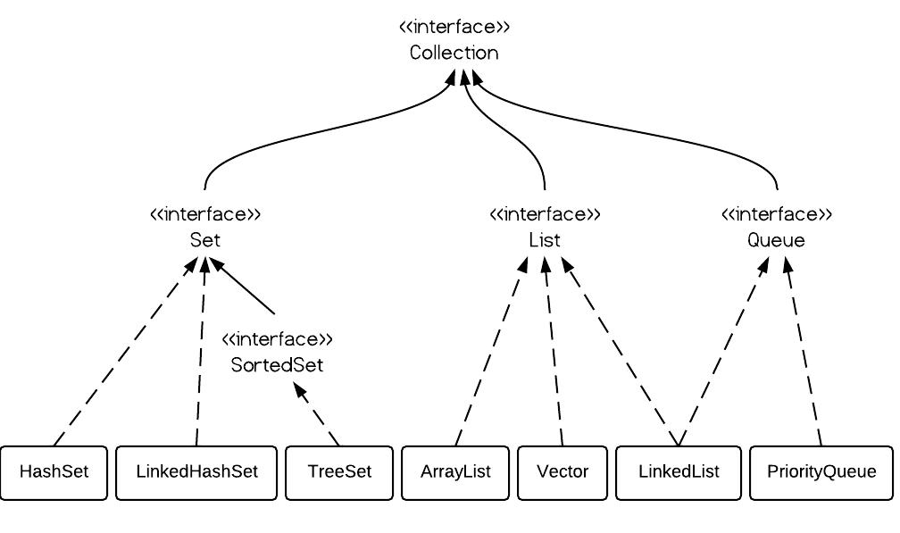

#
java.util.Iterable`
实现该接口的类，可被`foreach`遍历 
#`java.util.Iterator`
#`java.util.Enumeration`
#`java.util.Collection`
定义集合的CRUD基本操作接口，和转换为数组的接口。并没有对集合元素做任何限制 
#`java.util.List`继承`Collection`接口
列表：列表元素可有序排列，无唯一性要求。 
定义通过索引CRUD列表元素的操作接口，还有定义了返回ListIterator的接口 
#`java.util.Queue`
队列：队列元素有序排列，无唯一性要求，按找先进先出操作 
#`java.util.Map`
#`java.util.Vector`

## ArrayList
一个容量可变的数组.

## LinkedList
一个双向链表,在增删元素上性能比ArrayList好,但查询上却不如ArrayList.除了实现了List接口还实现了Queue接口,因此比ArrayList和Vector多一些如`offer()`,`peek()`和`poll()`等方法. 

## Vector
线程安全的ArrayList.当元素数目大于集合容量时,Vector的容量会翻倍增长,而ArrayList的容量会增多原来的50%. 

