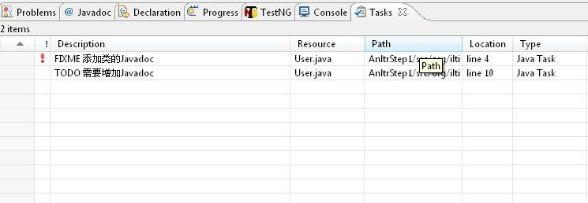

## 基础知识
**注释类型**<br/>
1. 单行<br/>
````
// 单行注释
String type = "单行注释";
````
2. 多行<br/>
````
/* 
 * 多行注释
 */
String type = "多行注释";
````
3. 文档注释<br/>
````
/**
 * 文档注释
 */
public class Dummy{}
````
javadoc仅提取文档注释<br/>

**快捷键**<br/>
1. 格式化：`Ctrl+Shift+F`<br/>
2. 添加/取消行注释：`Ctrl+/`<br/>


## javadoc
javadoc用于提取注释生成API文档，它不仅提取注释本身，还会将毗邻的类名和方法名一同提取到API文档中。<br/>
javadoc命令只能出现在文档注释当中。<br/>
可通过两种方式使用javadoc。<br/>
1. 嵌入的HTML<br/>
2. 文档标记(Doc tags)，就是以@开头的命令<br/>
注意：javadoc仅为访问控制符为public和protected的成员生成注释文档。<br/>

**2. 文档标记(Doc tags)**<br/>
`@see`：参考转向，也就是相关主题。javadoc在生成文档时会自动加入一个超链接“see also”条目，且javadoc不会检查超链接的有效性<br/>
示例：<br/>
````
/**
 * @see 全限定的类名称
 */
````
`@version`：版本信息<br/>
`@author`：作者信息, 多个`@author`标记需要放在一起声明<br/>
最佳实践：<br/>
````
/**
 * @author fsjohnhuang
 * @author email: fsjohnhuang@hotmail.com
 * @author tech blog: fsjohnhuang.cnblogs.com
 */
````
`@param`：参数信息<br/>
格式：`@param 参数名 说明`, 说明内容以下一个文档标记为结束<br/>
`@return`：返回值信息<br/>
格式：`@return 说明`<br/>
`@exception`：可能抛出的异常信息<br/>
格式：`@exception 全限定的类名称 说明`<br/>
`@deprecated`：用于建议用户不必再使用该功能，未来可能会屏蔽这一功能。<br/>

**示例**<br/>
````
/**
 * Description:这是文档注释
 * Copyright(C),2014,fsjohnhuang.github.com
 * Program: Test
 * Date: 2014.09.22
 * @author fsjohnhuang
 * @version 1.0
 */
public class Test{
  /**
   * 获取全名
   * @param shortName 名字缩写
   * @return 全名
   */
  public String getFullName(String shortName){
    return shortName + " Huang";
  }
}
````

**javadoc命令生成文档**<br/>
命令格式：`javadoc [options] [packagenames] [sourcefiles]`<br/>
`[options]`值：<br/>
````
  -public // 仅显示public类和成员
  -protected // 显示protected、public类和成员（缺省值）
  -package // 显示package、protected、public类和成员
  -private // 显示所有类和成员
  -d <directory> 输出文件的目标目录
  -version 包含@version字段
  -author 包含@author字段
  -splitindex 将索引分为每隔字母对应一个文件
  -windowtitle <text> 文档的浏览器窗口标题
````
示例：<br/>
为多个java文件生成文档<br/>
````
javadoc demo\Test.java demo\ECommand.java demo\EView.java
````
中文乱码问题??<br/>


## 参考
http://blog.csdn.net/Silver6wings/article/details/5394226<br/>
http://kelaocai.iteye.com/blog/227822

## 注释模板
**作用：**定义文件、类、方法等默认的注释格式<br/>
**设置注释模板的入口：**`Window->Preference->Java->Code Style->Code Template`，然后展开Comments节点。<br/>
**Comments节点下的元素**<br/>
`Files`节点（文件注释标签）<br/>
````
/**   
* @Title: ${file_name} 
* @Package ${package_name} 
* @Description: ${todo}(用一句话描述该文件做什么) 
* @author fsjohnhuang
* @date ${date} ${time} 
* @version V1.0   
*/
````
`Types`节点（类注释标签）<br/>
````
/** 
* @ClassName: ${type_name} 
* @Description: ${todo}(这里用一句话描述这个类的作用) 
* @author fsjohnhuang
* @date ${date} ${time} 
* 
* ${tags} 
*/
````
`Fields`节点（字段注释标签）<br/>
````
/** 
* @Fields ${field} : ${todo}(用一句话描述这个变量表示什么) 
*/ 
````
`Constructor`节点（构造函数注释标签）<br/>
````
/** 
* <p>Title: </p> 
* <p>Description: </p> 
* ${tags} 
*/
````
`Method`节点（方法注释标签）<br/>
````
/** 
* @Title: ${enclosing_method} 
* @Description: ${todo}(这里用一句话描述这个方法的作用) 
* @param ${tags}  参数说明 
* @return ${return_type}    返回类型 
* @throws 
*/
````
`Overriding Methods`节点（覆盖方法注释标签）<br/>
````
/*
* Title: ${enclosing_method}
*Description: 
* ${tags} 
* ${see_to_overridden} 
*/
````
`Delegate Methods`节点（代理方法注释标签）<br/>
````
/** 
* ${tags} 
* ${see_to_target} 
*/ 
````
`getter`节点（getter方法注释标签）<br/>
````
/** 
* @return ${bare_field_name} 
*/
````
`setter`节点（setter方法注释标签）<br/>
````
/** 
* @param ${param} 要设置的 ${bare_field_name} 
*/
````

**导入，导出注释模板**<br/>
在`Window->Preference->Java->Code Style->Code Template`下可导入导出注释模板<br/>


## Eclipse的任务管理器
**示例1**<br/>
````
/**
 * @Description TODO 获取姓名
 * @return 姓名
 */
public String getName(){
  return "";
}
````
**示例2**<br/>
````
/**
 * FIXME 在queryString的开头添加?号
 * @Description 从URL中萃取queryString
 * @param url URL字符串
 * @return queryString
 */
public String getQueryString(String url){
  String[] segments = url.split("?");
  return segments.length == 2 ? segments[1] : "";
}
````
通过任务管理器可以迅速查找TODO和FIXME标记的代码位置<br/>
<br/>
<br/>
**任务标签**<br/>
1. `FIXME`<br/>
2. `TODO`<br/>
3. `XXX`<br/>
4. 自定义任务标签<br/>
**管理任务标签**<br/>
进入`Windows->Preference->Java->Compile->Task Tags`，可自定义任务标签，和设置任务标签的级别（High,Normal和Low）
<br/>


## 打包
1. **jar**<br/>
用于将多个class或java文件，和其他资源文件压缩归档<br/>
````
jar  [option]* 文件名
````
**必选参数（并且仅能选其中一个）**<Br/>
`-c`，创建一个jar包<br/>
`-t`，显示jar包中的内容列表<br/>
`-x`，解压jar包<br/>
`-u`，添加文件到jar包<br/>
**可选参数**<br/>
`-v`，生成详细报告，并输出到标准输出设备<br/>
`-m`，用于指定manifest.mf文件。（默认情况下会自动生成META-INF/MANIFEST.MF文件）<br/>
`-O`，创建jar包时不对内容进行压缩<br/>
`-M`，不产生manifest.mf文件<br/>
`-i`，创建jar包时创建索引文件<br/>
`-C`，表示切换到指定目录来执行jar命令<br/>
`-f`，指定jar包的文件路径<br/>
常用场景<Br/>
目录结构：<br/>
/<Br/>
|--src<Br/>
&emsp;|--test.class<Br/>
|--META-INF<Br/>
&emsp;|--MAINFEST.MF<Br/>
|--other
&emsp;|--additional.class<br/>
1. 默认打包<br/>
````
// 生成的src.jar中就含src目录和jar自动生成的META-INF目录（内含MAINFEST.MF清单文件）
jar -cvf src.jar src
````
2. 查看包内容(jar过大时就无法查看)<Br/>
````
jar -tvf src.jar
````
3. 解压jar包<br/>
````
jar -xvf src.jar
````
4. 提取jar包部分内容<br/>
````
jar -xvf src.jar src\test.class
````
5. 追加内容到jar包<br/>
````
//追加MAINFEST.MF清单文件以外的文件，会追加整个目录结构
jar -uvf src.jar other\additional.class

//追加清单文件，会追加整个目录结构(src.jar会包含META-INF目录)
jar -uMvf src.jar META-INF\MAINFEST.MF
````
6. 创建自定义MAINFEST.MF的jar包<br/>
````
jar -cMvf src.jar src META-INF

jar -cmvf MAINFEST.MF src.jar src
````

## MAINFSET.MF清单文件
用于描述jar包的版本、厂家、作者、jdk版本等信息，并且对于可执行的jar包，提供执行时所需的入口函数类、依赖关系等信息<br/>
````
Mainfest-Version: 1.0
Created-By: 1.5.0_06 (Sun Microsystems Inc.)
Main-Class: com.sample.myapp.MyAppMain
Class-Path: ext/other.jar 
  ext/addition.jar
````
`Main-Class`，用于指示入口函数的类名<br/>
`Class-Path`，用于指示依赖的包，包与包之间用空格隔开或换行写即可（注意每行前空两格）。而路径分隔符采用正斜杆，无论是windows还是unix。<br/>
**注意：MAINFEST.MF每行长度上限为72个字符**<Br/>
**注意：MAINFEST.MF每行后面不能有空格，且必须用回车结尾**<Br/>
**注意：MAINFEST.MF每行的内容如果为上面键的值，则行首必须含2个以上的空格**<Br/>
package描述定义<br/>
用于为调用者提供包的版本、开发者信息<br/>
````
Name: com/example/myapp/
Specification-Title: MyApp
Specification-Version: 2.4
Specification-Vendor: example.com
Implementation-Title: com.example.myapp
Implementation-Version: 2002-03-05-A
Implementation-Vendor: example.com
````
注意：Name用于描述package名，而且一定要以正斜杆为结尾。<br/>
调用者可以在程序中通过`java.lang.Package`获取package描述定义。<br/>
````
Package.getPackages();
Package.getPackage(String packageName);
Class.getPackage();
````

##META-INF/INDEX.LIST文件
通过`jar`的`-i`选项生成的。作为JarIndex实现的一部分，有类加载器用于加速类装载过程。<br/>

## xxx.SF文件
JAR包的签名文件，xxx为签名者的占位符。<br/>

## xxx.DSA文件
与xxx.SF文件关联的签名程序块文件，它存储了用于签名的JAR文件的公共签名。<br/>


## eclipse中生成jar的方法
1. 右键点击包、类<br/>
2. "Export"<br/>
3. "java"->"JAR file"<br/>
4. 选择要压缩的文件<br/>
就可以了。<br/>

## 执行jar包
jar包可以类似于class文件那样被java执行<br/>
````
java -jar src.jar
````

## 静态代码块
````
public class Test{
  static{
     // 其他代码
  }
}
````
类被加载时自动执行静态代码块中的语句。<br/>

## 非静态代码块
````
public class Test{
  {
    // 其他代码
  }
}
````
实例化时，非静态代码块中的语句先于构造函数被执行。<Br/>

## 实例化时，静态代码块、非静态代码块和构造函数的执行顺序
````
父类的静态代码块
子类的静态代码块
父类的非静态代码块
父类的构造函数
子类的非静态代码块
子类的构造函数
````

## 访问权限控制符
`private`，仅本类可见<Br/>
`default`，包内的可见。<Br/>
`protected`，派生类、包内的均可见。<Br/>
`public`，均可见。<Br/>
`com.test`和`com.test.sub`就是两个不同的包了。<Br/>

`volatile`, 作用对象――字段
`transient`,作用对象――字段，表示该字段非序列化的一部分，因此在对对象进行序列化时将忽略该字段。（对象继承了Serializable才可以被序列化）<br/>
