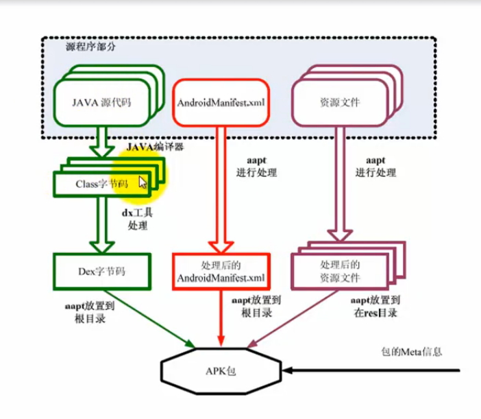
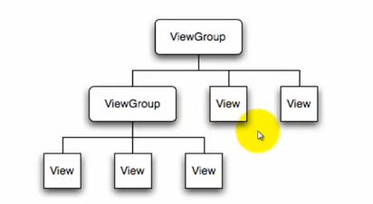

### 系统架构 ###
1. 应用程序层（Application，用java）
Home,Contacts,Phone,Browser....
2. Java框架层（Application Framework（供开发人员使用的类库），用java）
Activity Manager,Winedow Manager,Content Provider,View System,Package Manager,Telephone Manager,Resource Manager,Location Manager,Notification Manager
3.本地框架和Java运行环境层（用C/C++）
3.1. Libraries：Surface Manager,Media framework, SQLite,OpenGL|ES,FreeType,Webkit,SGL,SSL,libc
3.2. Android Runtime：Core Libraries,Dalvic Virtual Machine
4. Linux操作系统及驱动层（Linux Kernel，用C/C++，或linux语言）
Display Driver,Camera Driver,Flash Memory Driver, Binder(IPC) Driver,Keypad Driver,Wifi Driver,Audio Driver,Power Manager

### 官网 ###
developer.android.com/intl/zh-cn/index.html

### 开发环境 ###
1. 配置Java环境
2. 安装ADT：Eclipse插件，用于开发安卓
3. 获取Android SDK，并配置Eclipse中的Android SDK
4. 创建AVD（安卓虚拟设备）

另外有一个Eclipse for Android，就免去2、3步了。

### 常用工具 ###
1. LogCat：查看系统Log信息，可以获取Android系统运行时打印的Log信息。
2. DDMS（Davik Debug Monitor Service）：开发环境中Dalvik虚拟机调试监控服务，如向虚拟机打电话，发短信，查看虚拟机内的文件系统等；
旧版本时再DOS输入ddms就会弹出工具
3. Android的PC客户端：豌豆荚或91助手
4. 命令行调试adb
5. 资源打包工具AAPT
用于对音频、图片、XML配置文件爱你打包。
	`aapt p -A assets -S res -M AndroidMainfest.xml -F \bin\resources.ap_`将assets，res和AndroidMainfest.xml打包到\bin\resources.ap_

### SDK的level是什么? ###
是谷歌内部的SDK版本号，SDK是向后兼容的。

### 工程目录 ###
1. src：编写java代码
2. gen：由系统自动生成，如R类
当R文件不正确时，就用Android Tools的fix eclipse project来修复，不要用Proeject菜单的clean来处理，因为有可能丢失R文件，那么就要重新搭建工程了。
3. assets：外部资源目录，如音频；不能直接给Android使用，要通过AssetManager以流形式来使用。
4. bin：程序编译生成的apk的应用程序
5. libs：项目依赖的第三方jar包
6. res：内部资源目录，内部的资源文件必须以小写字母开头
drawable-XXdpi：图片资源
layout:布局文件
menu：android的应用菜单
values：字符资源，用于国际化
7. AndroidManifest.xml工程配置文件
包名
apk的版本
apk的图片、说明
相关的授权

### Android应用程序构成 ###


### 四大组件+Intent ###
1. Activity
最基础的组件，一个Activity对应一个屏幕，用于显示用户视图并对事件作出相应。
多数应用程序由多个Activity组成。
2. Broadcast
是Android系统中常用的一种机制，用于用户让应用对一个外部事件作出响应，如电话呼入，数据网络可用时等。
3. Services
一个服务是具有较长生命周期且没有用户界面的程序。如后台下载，后台音乐播放。
4. ContentProvider
应用程序将数据保存到文件、SQLite数据库或任何有效的设备。当应用间需要共享数据时，ContentProvider就提供一组标准的方法，从而实现数据共享。
5. Intent用于四大组件的通讯

### Activity ###
1. R.的就到res目录上找（<font color="red">小心:android.R是系统内置资源类，我们要用的自定义的R资源类</font>）
2. 布局方式
2.1. 图形界面拖拽，不适用复杂的布局
2.2. xml布局，常用的方式，只能创建静态页面
2.3. java代码，最灵活，但复杂度大
3. 每个Activity都有一个Window，然后window上有一个ViewGroup作为根节点，下面包含多个View和ViewGroup作为显示效果，view结构

`getWindow(); //获取Activity的Window对象`
4. 4个状态：create、stop、resume和destroy
5. 4个重要的回调函数
onCreate：绘制view
onPause：当activity跳转时，activity不会被删除，而是放在历史记录栈中，onPause就可以用来保存状态。
onStop
onDestroy

### Intent启动Activity ###
1. 定义多个Activity类
2. 在mainfest文件中声明类(若缺失这一步，就会出现ActivityNotFoundException)
     <application>
          <activity android:name="activity类全名"></activity>
      </application>
3. 定义Intent对象
4. 通过Intent对象启动Activity
Intent分为显示意图和隐式意图，显示就是调用了`.setClass`或`.setComponent`来指明类对象或组件名
```// 第一种写法，显示意图
Intent i = new Intent();
i.setClass(当前Activity.this,要跳转的Activity.class);
startActivity(i);
// 第二种写法，显示意图
Intent i = new  Intent(当前Activity.this,要跳转的Activity.class);
startActivity(i);
// 第三种写法，隐式意图
Intent i = new  Intent("在AndroidMainfest.xml中定义的Intent filter的Action的Name属性值");
startActivity(i);
// 第四种写法，隐式意图
Intent i = new  Intent();
i.setAction("在AndroidMainfest.xml中定义的Intent filter的Action的Name属性值");
startActivity(i);
```
```// 第三、第四中写法时，AndroidMainfest.xml中定义如下
<activity android:name="Activity名">
	<intent-filter>
		<action android:name="自定义名称"/>
		<category android:name="android.intent.category.DEFAULT"/> <!-- 隐式意图的category必须为android.intent.category.DEFAULT才能获取并执行 -->
	</intent-filter>
</actitvity>
```
5. 通过Intent来实现Activity间的值传递
```FromActivity.java
// 传值
Intent i = new Intent();
i.setClass(当前Activity.this,要跳转的Activity.class);
i.putExtra(键，值); // 可以传基本数据类型、序列化对象，Bundle对象和list集合
startActivity(i);
```
```ToActivity.java
//在onCreate方法中
Intent i = getIntent();
string val = i.getStringExtra(键名);
```
6. 通过Intent来实现Activity间的值回传
FromActivity.java
	`//activity跳转
	Intent i = new Intent();
	startActivityForResult(i, requestCode（请求码:自定义用于识别回传值的来源）);
	// 重写activity的onActivityResult方法
	@Overrid
	protected void onActivityResult(int requestCode, int resultCode, Intent data){
		super.onActivityResult(requestCode,resultCode,data);
		if(requestCode==自定义 && resultCode==自定义){
			string val = data.getString(键名);
		}
	}`

```ToActivity.java
// 回传结果
Intent i = new Intent();
i.putExtra(键, 值);
// 设置回传Intent
setResult(resultCode（结果码：自定义）,i);
finish(); // 结束Activity的生命周期
```
7. Activity保护现场状态(临时)
7.1. activity有可能被系统删除时（注意：不是用户删除时）保存状态：`onSaveInstanceState`,该方法在Activity响应onStop前调用,只能保存基本数据类型的键值对。
7.2. activity被删除时恢复状态：`onRestoreInstanceState`或`onCreate`中通过入参`Bundle`取出来，手动恢复。
7.3. 系统在什么情况会删除
7.3.1. 按HOME键
7.3.2. 长按HOME键切换到其他程序
7.3.3. 跳转到其他Activity
7.3.4. 按电源休眠
8. Activity保护持久化状态
在`onPause`中将状态保存到数据库
9. Activity生命周期
9.1. Resumed：回到屏幕最前端，获得用户焦点
9.2. Paused：失去焦点，但可重新获取焦点，并当内存紧张时系统就会自动杀死Activity
9.3. Stopped：完全失去焦点，成为后台进程，并当内存紧张时系统就会自动杀死Activity
9.4. 生命周期的回调函数
```// 用于设置静态数据，如控件初始化，绑定数据等
// Activity启动时被调用有且仅有一次
onCreate(Bundle instanceState);
// 在Activity变为可视前被调用
onStart();
// 执行完onResume后程序就进入运行状态了
onResume();

// 失去焦点，可直接重获焦点（直接走onStart,onResume）
onPause();
// 长期失去焦点，重获焦点要经过onRestart(onRestart,onStart,onResume)
onStop();
// 恢复Activity，重获焦点
onRestart();

// 按回退键就会结束，在这里手动释放资源
onDestroy();
```


### Bundle类型 ###
可当作键值对集合来使用。内部就是用HashMap来保存数据。
	
### 日志记录 ###
```private string TAG = 标记名称;
Log.i(TAG, "-->>" + 日志内容);
```

### View ###
1. 宽度、高度设置
fill_parent：和父容器宽度一样
match_parent：和fill_parent差不多
wrap_content：和内容宽度一样

TextView：文本显示控件
CheckedTextView：可标记的显示控件
Chromometer：计时器
DigitalClock：数字时钟（APILevel 1）
TextClock：文本时钟（APILevel 17）
Button：按钮
ToggleButton：两种状态的选择按钮,通过`android:textOn`和`android:textOff`来设置两种状态的字符串;使用`isCheck()`函数来判断选中的状态
EditText：输入框
AutoCompleteTextView：自动填充输入框,通过`android:completionThreshold`属性设置输入多少个字符就出现提示框
```java
	AutoCompleteTextView actv = (AutoCompleteTextView)findViewById(R.id.actv);
	String[] items = { "警察", “IT工程师” };
	ArrayAdapter<String> jobAdapter = new ArrayAdapter(this, android.R.layout.simple_dropdown_item_1line,items);
	actv.setAdapter(items);
```
MultAutoCmpleteTextView：多自动填充输入框
ExtractEditText：全屏输入中文输入框

Spinner：相当于下拉框
```java
	Spinner spinner = (Spinner)findViewById(R.id.spinner);
	String[] items = { "警察", “IT工程师” };
	ArrayAdapter<String> jobAdapter = new ArrayAdapter(this, android.R.layout.simple_spinner_item, jobs);
	spinner.setAdapter(items);
```

RadioGroup：单选组，内部放置多个RadioButton，且默认是垂直排列。可通过`android:orientation="horizontal"`来设置为水平排列

ImageView：图片显示控件
属性：
     android:src=""
     android:scaleType=""
          - matrx：使用图像矩阵显示图片
          - fitXY：拉伸图片（不按比例）来匹配View的宽高
          - center：按原图大小显示图片，若图片大于View高宽，则会截图
          - centerCrop：按比例显示图片，至于View中心
ImageButton：图片按钮
ZoomButton：放大缩放按钮
QuickContactBadge：联系人快捷按钮

TabHost：Tab容器，首先Activity要继承TabActivity,然后layout文件要加入TabHost组件标签
```java
	// 在onCreate方法内
	TabHost th = getTabHost(); // 获取tab容器，不能用findViewById来获取
	th.setCurrentTab(0)；// 设置第一个tab为默认显示的tab
	th.addTab(th.newTabSpec("Tab的tag").setIndicator("标签和图标").setContent("Tab的内容"));// 添加tab
	th.setTabChangedListener(new
	// 切换tab时触发
	TabHost.OnTabChangeListener(){
		@Override
		public void onTabChanged(String tag){
			// TODO
		}
	});
```
动态生成tab内容，只需继承并重写`TabHost.TabContentFactory`的`public View createTabContent(String tag)`即可


## 进度条 ##
对话框进度条:
```
	// 1. 重写Activity的onCreateDialog
	@Overried
	protected Dialog onCreateDialog(int id){
		ProgressDialog dialog = new ProgressDialog(this);
		dialog.setTitle("标题");
		dialog.setMessage("内容");
		dialog.setIndeterminate(true);// 设置等待不确定的时间
		dialog.setCancelable(true);// 设置按Back键就取消
		dialog.setCanceledOnTouchOutside(true); // 设置触摸对话框外边时取消

		return dialog;
	}
	// 2. 调用showDialog方法
	public void onCreate(Bundle savedInstanceState){
		// ......
		showDialog(0);
	}
```

标题栏进度条:
```java
	// 1. 在调用setContentView前，设置窗口特征
	requestWindowFeature(Window.FEATURE_INDETERMINATE_PROGRESS);
	setContentView(R.layout.main);

	// 2. 显示标题栏进度条
	setProgressBarIndeterminateVisibility(true);
	// 3. 隐藏标题栏进度条
	setProgressBarIndeterminateVisibility(false);
```
水平进度条:ProgressBar
属性：
     android:style="@drawable/图片名称" // @drawable对应res/drawable-hdpi
     android:progress=""
     android:max=""
     android:secondaryProgress=""

DatePickerDialog：日期选择对话框
```java
	// 1. 重写Activity的onCreateDialog
	@Overried
	protected Dialog onCreateDialog(int id){
		return new DatePickerDialog(this, dateSet, 年,月,日);
	}
	
	private OnDateSetListener dateSet = new OnDateSetListener(){
		public void onDateSet(DatePicker view, int year, int monthOfYear, int dayOfMonth){
			//....
		}
	};
```
TimePickerDialog：日期选择对话框
```java
	// 1. 重写Activity的onCreateDialog
	@Overried
	protected Dialog onCreateDialog(int id){
		return new TimePickerDialog(this, timeSet, 时,分);
	}
	
	private OnTimeSetListener timeSet = new OnTimeSetListener(){
		public void onTimeSet(TimePicker view, int hourOfDay, int minute){
			//....
		}
	};
```

ListView：列表视图，可使用`android.widget.ListView`或继承`android.app.ListActivity`（通过`setListAdapter`方法设置adapter）。关键在于设置Adapter

GridView：网格视图
```java
	// 基本用法
	GridView gv = (GridView)findViewById("gv");
	gv.setNumColumns(3); // 设置列数
	String[] items = {"a1", "a2", "a3", "b1", "b2", "b3"};
	ArrayAdapter<String> adapter = new ArrayAdapter<String>(this, android.R.layout.simple_list_item_1, items);
	gv.setAdapter(adapter);
```

AbsSeekBar：抽象滚动条
SeekBar：滚动条
RatingBar：评分滚动条
ContentLoadingProgressBar：内容加载进度条

### id属性 ###
android:id="@+id/自定义ID"

### text属性 ###
android:text="字符串"
android:text="@string/常量名称"

### 设置按钮监听器 ###
	Button btn = (Button)findViewById(R.id.自定义ID); //findViewById用于通过ViewID获取View控件
	btn.setOnClickListener(new OnClickListener(){
	     @Override
	     public void onClick(View v){
	          // TODO
	     }
	});

### 设置触摸事件监听 ###
```java
	@Overrid
	public boolean onTouchEvent(MotionEvent event){
		int action = event.getAction(); // 获取动作
		if (action == MotionEvent.ACTION_DOWN){
			// TODO
		}
		int x = (int)event.getX(); // 获取x位置
		int y = (int)event.getY(); // 获取y位置
		super.onTouchEvent(event);
	}
```

### 其他按键事件 ###
```java
	@Override
	public boolean onKeyDown(int keyCode, KeyEvent event){
		return super.onKeyDown(keyCode, event);
	}
	@Override
	public boolean onKeyUp(int keyCode, KeyEvent event){
		return super.onKeyUp(keyCode, event);
	}
	@Override
	public boolean onKeyLongPress(int keyCode, KeyEvent event){
		return super.onKeyLongPress(keyCode, event);
	}
	@Override
	public boolean onKeyShortcut(int keyCode, KeyEvent event){
		return super.onKeyShoftcut(keyCode, event);
	}
	@Override
	public boolean onKeyMultiple(int keyCode, KeyEvent event){
		return super.onKeyMultiple(keyCode, event);
	}
```


### ViewGroup ###
1. 是View的子类
2. 用于以不同的方式组织布局多个View
3. 其子类含：AbsoluteLayout、LinearLayout、RelativeLayout等
4. LinearLayout属性
     android:orientation：设置布局方向
     android:layout_gravity：当前控件在父View的位置
     android:gravity：当前控件的子View的位置
5. RelativeLayout包含的子View会增添的属性（其下的View都要加id）
     android:layout_toLeftOf：在..的左边
     android:layout_toRightOf：在..的右边
     android:layout_above：在..的上面
     android:layout_alignRight：跟...右对齐
     android:layout_alignParentLeft：跟父View左对齐

## 菜单 ##
三类：选项菜单（Option Menu）、上下文菜单（Context Menu）和子菜单（Sub Menu）

### 选项菜单 ###
1. 通过res下的menu文件生成
1.1. 在onCreate方法中，实例化MenuInflater mi = new MenuInflater(this);
1.2. 重写public boolean onCreateOptionsMenu(Menu menu){ mi.inflater(R.menu.菜单文件名, menu);return true; }
1.3. 重写public boolean onOptionsItemSelected(Menu menu){ int id = menu.getItemId(); /* 判断是那个MenuItem被点击 */ ;return true; }
2. 通过代码生成
2.1. 重写public boolean onCreateOptionsMenu(Menu menu){ menu.add(0,0,0,"菜单内容");return true; }
1.3. 重写public boolean onOptionsItemSelected(Menu menu){ int id = menu.getItemId(); /* 判断是那个MenuItem被点击 */ ;return true; }

### 上下文菜单（长时间按下而弹出的菜单） ###
1. 重写public void onCreateContextMenu(ContextMenu contextMenu, View view, ContextMenuInf contextMenuInfo)，根据在哪个View上长按，生成相应的上下文菜单
2. 重写onContextMenuSelected，响应点击菜单事件
3. 调用registerForContextMenu(View view)来为视图注册上下文菜单，只有视图注册了上下文菜单，那么长按视图才弹出上下文菜单

### 子菜单 ###
1. 就是在onCreateXXXXXX中将menu.add改为SubMenu rootMenu = menu.addSubMenu()，那么就可以通过rootMenu.add添加子菜单了。


## 对话框 ##
### 警告对话框(AlertDialog) ###
1. 实例化AlertDialoy.Builder内部类
2. 通过Builder对象设置对话框的标题，按钮和点击事件
3. 调用Builder对象的create方法生成对话框
4. 调用对话框的show方法
### 进度对话框(ProgressDialog) ###
### 日期选择对话框(DatePickerDialog) ###
### 时间选择对话框(TimePickerDialog) ###

### 提示框 ###
Toast

## ViewGroup ##
### 线性布局 ###
内部控件会按垂直或水平方向排序
```
	<LinearLayout
		android:orientation="vertical|horizontal"
		android:gravity="top|bottom|left|right|...">
	</LinearLayout>
```
`android:orientation`控制排列方向
`android:gravity`控制左右上下对齐方式
### 帧布局 ###
### 表格布局 ###
### 相对布局 ###

## Service ##
### 生命周期 ###
onCreate
onStart
onDestroy
onBind
onUnbind
### 建立Service ###
1. 继承`Service`基类
2. 在`AndroidManifest.xml`上注册服务
3. 在`Activity`实例中调用`startService`或`bindService`来启动服务
```java
	// 步骤1
	public class MyService extends Service
	{
	}

	// 步骤2，在AndroidManifest.xml上的<application>下注册服务
	<service android:name=".MyService"/>
	
	// 步骤3
	public class MyActivity extends Activity
	{
		public void onCreate(Bundle state){
			Intent i = new Intent(this, MyService.class);
			startService(i);

		}
	}
```


### 框架 ###
Andbase
Afinal

### 平台接入 ###
百度开放平台
腾讯开发平台
新浪微博开放平台
微信开放平台