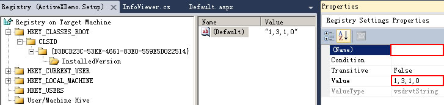

## 一、开发 ##
开发环境：WIN7，VS2010
### 1. 创建类库 ###


### 2. 设置工程属性 ###
1. 在 *应用程序* 页中，打开 *程序集信息* ,勾选 **使程序集COM可见**

2. 在 *生成* 页中， 勾选 **为COM互操作注册**

3. 在 *Properties.AssemblyInfo.cs文件中* 添加 `[assembly:AllowPartiallyTrustedCallers()]`（注意引入：`System.Security`命名空间）

### 3. 添加用户控件 ###
ActiveX以用户控件为载体，加载到网页中

### 4. 添加控件的GUID ###
ActiveX的用户控件均有一个独立的GUID标识，该GUID必须与工程的GUID不同。
1. 通过VS2010->工具->创建GUID

2. 引入`System.Runtime.InteropServices`
3. 将生成的GUID粘贴到用户控件类声明前
```C#
 [Guid("4D39585B-7947-4197-8BDB-B0A6918B1098")]
 public partial class ATC : UserControl
 {
	InitializeComponent();
 }
```

### 5. 开发IObjectSafety接口 ###
为了让ActiveX控件获得客户端的信任，用户控件必须实现`IObjectSafety`接口，并且下面的代码是固定的（GUID也不能变）
```C#
	  [ComImport, Guid("CB5BDC81-93C1-11CF-8F20-00805F2CD064")]
  	[InterfaceType(ComInterfaceType.InterfaceIsIUnknown)]
  	public interface IObjectSafety
  	{
    	[PreserveSig]
      	int GetInterfaceSafetyOptions(ref Guid riid, [MarshalAs(UnmanagedType.U4)] ref int pdwSupportedOptions, [MarshalAs(UnmanagedType.U4)] ref int pdwEnabledOptions);
  
      	[PreserveSig()]
      	int SetInterfaceSafetyOptions(ref Guid riid, [MarshalAs(UnmanagedType.U4)] int dwOptionSetMask, [MarshalAs(UnmanagedType.U4)] int dwEnabledOptions);
 	}
```

### 6. 用户控件实现IObjectSafety接口 ###
```C#
 [Guid("4D39585B-7947-4197-8BDB-B0A6918B1098")]
 public partial class ATC : UserControl, IObjectSafety
 {
	InitializeComponent();
 }

 #region IObjectSafety 成员
 
 private const string _IID_IDispatch = "{00020400-0000-0000-C000-000000000046}";
 private const string _IID_IDispatchEx = "{a6ef9860-c720-11d0-9337-00a0c90dcaa9}";
 private const string _IID_IPersistStorage = "{0000010A-0000-0000-C000-000000000046}";
 private const string _IID_IPersistStream = "{00000109-0000-0000-C000-000000000046}";
 private const string _IID_IPersistPropertyBag = "{37D84F60-42CB-11CE-8135-00AA004BB851}";
 
 private const int INTERFACESAFE_FOR_UNTRUSTED_CALLER = 0x00000001;
 private const int INTERFACESAFE_FOR_UNTRUSTED_DATA = 0x00000002;
 private const int S_OK = 0;
 private const int E_FAIL = unchecked((int)0x80004005);
 private const int E_NOINTERFACE = unchecked((int)0x80004002);
 
 private bool _fSafeForScripting = true;
 private bool _fSafeForInitializing = true;
 
 
 public int GetInterfaceSafetyOptions(ref Guid riid, ref int pdwSupportedOptions, ref int pdwEnabledOptions)
 {
 	int Rslt = E_FAIL;
 
    string strGUID = riid.ToString("B");
    pdwSupportedOptions = INTERFACESAFE_FOR_UNTRUSTED_CALLER | INTERFACESAFE_FOR_UNTRUSTED_DATA;
    switch (strGUID)
    {
        case _IID_IDispatch:
        case _IID_IDispatchEx:
            Rslt = S_OK;
            pdwEnabledOptions = 0;
            if (_fSafeForScripting == true)
                pdwEnabledOptions = INTERFACESAFE_FOR_UNTRUSTED_CALLER;
            break;
        case _IID_IPersistStorage:
        case _IID_IPersistStream:
        case _IID_IPersistPropertyBag:
            Rslt = S_OK;
            pdwEnabledOptions = 0;
            if (_fSafeForInitializing == true)
               pdwEnabledOptions = INTERFACESAFE_FOR_UNTRUSTED_DATA;
            break;
        default:
             Rslt = E_NOINTERFACE;
            break;
    }

    return Rslt;
 }
 
 public int SetInterfaceSafetyOptions(ref Guid riid, int dwOptionSetMask, int dwEnabledOptions)
 {
    int Rslt = E_FAIL;

    string strGUID = riid.ToString("B");
    switch (strGUID)
    {
        case _IID_IDispatch:
        case _IID_IDispatchEx:
            if (((dwEnabledOptions & dwOptionSetMask) == INTERFACESAFE_FOR_UNTRUSTED_CALLER) &&
                   (_fSafeForScripting == true))
                Rslt = S_OK;
            break;
        case _IID_IPersistStorage:
        case _IID_IPersistStream:
        case _IID_IPersistPropertyBag:
            if (((dwEnabledOptions & dwOptionSetMask) == INTERFACESAFE_FOR_UNTRUSTED_DATA) &&
                    (_fSafeForInitializing == true))
                Rslt = S_OK;
            break;
        default:
            Rslt = E_NOINTERFACE;
            break;
    }
 
    return Rslt;
 }
 
 #endregion
```

### 7. 获取ActiveX的Classid ###
1. 打开VS2010->工具->OleView(若没有就自行添加，程序路径：C:\Program Files\Microsoft SDKs\Windows\v7.0A\bin\OleView.exe)。
2. 在`Object Classes`->`Grouped by Component Category`->`.NET Category`找到刚才新建的ActiveX控件
3. 右键复制HTML标签


### 8. 页面引用ActiveX控件 ###
xxx.html
```
	<object classid="clsid:ActiveX控件的clsid" codebase="控件打包后的exe文件名或cab文件名" width="200px" height="200px">
	</object>
```
1. classid：用于指定要加载的ActiveX的clsid，clasid就是用户控件的GUID值；
2. codebase：用于指定clasid的基本URL，可为绝对或相对路径，因ActiveX控件被打包到安装包中，所以codebase必须为安装包的路径。
3. 实例：页面URL为www.test.com/index.html，codebase为test.cab（或test.exe），classid为clasid:xxxxxxxxxxxxxxxxx。那么ActiveX控件的绝对路径就是www.text.com/test.cab(或test.exe)/xxxxxxxxxxxxxxx。

## 二、发布 ##
### 1. 打包 ###
C#开发的Activex不像`OCX`那样直接通过`regsvr32.exe`注册，而采用两种方式发布使其运行在浏览器上。
1. 离线安装：将控件类库打包成MSI安装包，然后在客户端安装。
1.1. 添加安装项目

1.2. 右键“添加”->“项目输出”，选择ActiveX控件为“主输出”

1.3. 双击“解决方案资源管理器”的“检测到的依赖项”下的 **Microsoft.NET Framework** 并修改“启动条件”下 **.NET Framework** 的Version为.NET Framework2.0 

1.4. 修改“主输出来自XXX”的 **Register**属性为 **vsdrpCOM**


2. 在线安装：将MSI再封装成CAB包，并将CAB包随应用一同发布，当浏览器访问含该ActiveX控件时就会自动提示安装。
2.1. 定义cab.ddf
```
.OPTION   EXPLICIT
.Set Cabinet=on
.Set Compress=on
.Set MaxDiskSize=CDROM
.Set ReservePerCabinetSize=6144
.Set DiskDirectoryTemplate="."
.Set CompressionType=MSZIP
.Set CompressionLevel=7
.Set CompressionMemory=21
.Set CabinetNameTemplate="自定义CAB文件名.CAB"
"installer.inf"
"打包的msi文件名称.msi"
```
2.2. 定义installer.inf
```
[Setup Hooks]
hook1=hook1

[hook1]
run=msiexec /i %EXTRACT_DIR%\打包的msi文件名称.msi /qn

[Version]
Signature= "$CHICAGO$"
AdvancedInf=2.0
```
2.3. 定义makecab.bat
```
makecab.exe   /f   "cab.ddf"
```
2.4. 执行makecab.bat就会生成CAB包

### 2. 签名 ###
1. 制作cer证书
使用makecert.exe工具生成cer证书（工具在`C:\Program Files\Microsoft SDKs\Windows\v7.0A\bin`）
```cmd
	makecert -r -n "CN=发行者名称" -b 01/01/2012 -e 01/01/2018 -sv 证书文件名称.pvk 证书文件名称.cer
```
注意：执行命令后将弹出私钥密码对话框，可以设置或不设置私密。

2. （可选项）将cer证书转换为spc证书
使用cert2spc.exe工具（工具在`C:\Program Files\Microsoft SDKs\Windows\v7.0A\bin`）
```cmd
	cert2spc cer证书文件名.cer spc证书文件名.spc
```

3. 将cer证书转换为pfx证书
使用pvk2pfx.exe工具将cer证书转换为pfx证书(PKCS#12证书及私钥)（工具在`C:\Program Files\Microsoft SDKs\Windows\v7.0A\bin`）
命令格式：
```cmd
	pvk2pfx /pvk pvk证书文件名.pvk [/pi pvk证书密码] /spc cer会spc证书文件名.cer或spc [/pfx pfx证书名称.pfx] [/po pfx证书的私密] [/f]
```
说明：
若第一步中，没有设置私钥，那么就`/pi pvk证书密码`就不用填写；
若`/po pfx证书的私密`没有填写，那么pfx证书就使用与pvk证书一样的私钥；
如果存在于-pfx指定的名称相同名称的文件，则需要使用`/f`来覆盖已有的.pfx文件。
示例：
```cmd
	pvk2pfx /pvk fsgmcc.pvk /pi gmcc123 /spc fsgmcc.cer /pfx fsgmcc.pfx  /f
``` 

4. 通过signtool导入证书到cab的ActiveX文件
signtool是vs2010的AuthentiCode签名工具（使用 PKCS#7标准定义的数据结构生成待签名文件的数字签名，并加入到待签名文件的PE结构中即可）。
```cmd
	signtool sign -f pfx证书文件名.pfx [-p pfx密码] ActiveX控件文件.CAB
```
示例：
```cmd
	signtool sign -f fsgmcc.pfx DirBrowser.CAB
```

## 三、部署 ##
### 1. 部署未签名的ActiveX ###
未签名的ActiveX控件不受浏览器端信任，默认是不被允许安装的
1. 将网站加入 **可信站点**
2. 在“可信站点”和“Internet”下的 **自定义级别** 中确认“对未标记为可安全执行脚本的ActiveX控件初始化并执行脚本”项设置为“启用”，“下载未签名的ActiveX控件”项设置为“提示”

### 2. 部署已签名的ActiveX ###
1. 客户端获取pfx证书
2. 客户端安装证书

点击“安装证书”按钮，将该证书安装到“受信任的根证书颁发机构”

开IE的“工具->Internet选项”对话框，选择“内容”选项卡，点击“证书”按钮，打开IE证书对话框，确认在“受信任的根证书颁发机构”选项卡中包含刚才导入的代码签名证书


## 四、自动更新 ##
### 1. 设置ActiveX控件项目的程序集版本号、文件版本号 ###
打开项目属性->程序集信息

### 2. 设置安装程序的版本号（msi文件的版本号） ###
打开项目属性

### 3. 设置注册表中的插件版本号 ###
右键点击安装项目->视图->注册表；

在 HKEY_CLASSES_ROOT下创建 CLSID/{ActiveX控件的GUID}/InstalledVersion；
在 InstalledVersion 下新建字符串值，设置 Value 为如“1,3,1,0“的版本号，删除 属性Name 中的值；

### 4. 设置cab包的版本号 ###
xxx.html页面
```
	<object classid="clsid:xxxxxxxxxx" id="ax" codebase="xxx.CAB#version=1,3,1,0"></object>
```

### 5. 版本检测流程 ###
1. cab包版本号通过object标签codebase属性的version指定；每次加载ActiveX控件时，会用cab包的版本号与注册表中的版本号做对比，若cab包版本号较新则会下载并更新新的cab包；
2. 在安装cab包时，会对比cab包中的msi文件的版本号，若msi版本号较旧，则安装失败；较新则继续安装；
3. 在安装msi文件时，会对比ActiveX控件的版本号，若版本号较旧，则安装失败；较新则继续安装。

## 五、卸载 ##
在“控制面板” -> “程序和功能” 中卸载ActiveX控件

## 六、坑 ##
### 1. IE9下无法加载ActiveX控件 ###
检查是否为64位的IE9。32位的ActiveX控件不能在64位的IE上使用。
通过“任务管理器”查看进程名称，若为浏览器进程名称后跟32就是32位的。

## 七、ActiveX与JS交互 ##
### 1. JS调用ActiveX方法 ###
只需在UserControl子类中（即自定义的ActiveX控件中），编写公共方法即可。
```c#
	[Guid("0203DABD-51B8-4E8E-A1EB-156950EE1668")]
    public partial class Uploader : UserControl, IObjectSafety
	{
		public Uploader(){
			InitializeComponent();
		}

 		// 被JS调用的ActiveX方法
		public void SayHi(msg){
			MessageBox.show(msg);
		}
	}
```
xxx.html文件中
``` 
    // 注意：object必须要写成<object></object>才能通过document.getElementById来获取
	<object classid="clsid:xxxxxxxxxx" id="ax"></object>
	<script type="text/javascript">
	document.getElementById('ax').SayHi('Test');// 调用ActiveX方法
	</script>
```
### 2. ActiveX调用JS方法 ###
1. 引入`Microsoft.mshtml`程序集，该程序集位于`C:\Program Files\Microsoft.NET\Primary Interop Assemblies\Microsoft.mshtml.dll`
2. 实现COM类`IOleClientSite`
```c#
[ComImport,
 Guid("00000118-0000-0000-C000-000000000046"),
 InterfaceType(ComInterfaceType.InterfaceIsIUnknown)]
public interface IOleClientSite
 {
	void SaveObject();
	void GetMoniker(uint dwAssign, uint dwWhichMoniker, object ppmk);
	void GetContainer(out IOleContainer ppContainer);
	void ShowObject();
	void OnShowWindow(bool fShow);
	void RequestNewObjectLayout();
 }
```
3. 实现COM类`IOleContainer`
```c#
[ComImport,
 Guid("0000011B-0000-0000-C000-000000000046"),
 InterfaceTypeAttribute(ComInterfaceType.InterfaceIsIUnknown)]
public interface IOleContainer
 {
	void EnumObjects([In, MarshalAs(UnmanagedType.U4)] int grfFlags,
 	[Out, MarshalAs(UnmanagedType.LPArray)] object[] ppenum);
	void ParseDisplayName([In, MarshalAs(UnmanagedType.Interface)] object pbc,
 	[In, MarshalAs(UnmanagedType.BStr)] string pszDisplayName,
 	[Out, MarshalAs(UnmanagedType.LPArray)] int[] pchEaten,
 	[Out, MarshalAs(UnmanagedType.LPArray)] object[] ppmkOut);
	void LockContainer([In, MarshalAs(UnmanagedType.I4)] int fLock);
 }
```
4. 在用户控件中调用JS方法
在MyUserControl.cs中
```c#
  	  #region 调用js函数
        private Type typeIOleObject = null;
        private IOleClientSite oleClientSite = null;
        private IOleContainer pObj = null;

        /// <summary>
        /// 调用JS函数
        /// </summary>
        /// <param name="fnName">js函数名</param>
        /// <param name="args">入参</param>
        protected void CallJS(string fnName, params object[] args)
        {
            if (typeIOleObject == null)
            {
                typeIOleObject = this.GetType().GetInterface("IOleObject", true);
                object tmpOldClientSite = typeIOleObject.InvokeMember("GetClientSite",
                 BindingFlags.Instance | BindingFlags.InvokeMethod | BindingFlags.Public,
                null,
                this,
                null);

                oleClientSite = tmpOldClientSite as IOleClientSite;
                oleClientSite.GetContainer(out pObj);
            }

            //获取页面的Script集合
            IHTMLDocument pDoc2 = (IHTMLDocument)pObj;
            object script = pDoc2.Script;

            try
            {
                //调用JavaScript方法OnScaned并传递参数，因为此方法可能并没有在页面中实现，所以要进行异常处理
                script.GetType().InvokeMember(fnName,
                BindingFlags.Instance | BindingFlags.InvokeMethod | BindingFlags.Public,
               null,
                script,
                args);
            }
            catch { }
        }
        #endregion
```