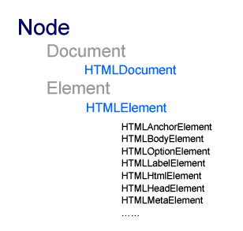

### 判断IE8及以下的浏览器 ###
```javascript
var isLteIE8 = ! + [1,];
```
或
```javascript
var isLteIE8 = ! + '\v1';
```
**分析:**
1. 在IE8及以下浏览器[1,]会隐式转换为"1,",而+"1,"会转换为NaN，那么！NaN就是true；而其他标准浏览器会将[1,]隐式转为"1"，!+"1"就是false。
2. \v表示垂直制表符，而IE8及以下版本无法识别垂直制表符，所以'\v1'会转换为'v1'，而其他标准浏览器会转换为'1'。

### 通过window.onerror捕获异常 ###
1. 在HTML4.1规范中没有`window.onerror`事件的。而msie和mozilla实现了`onerror`事件；
2. 在HTML5规范中就有`window.onerror`事件。webkit内核的浏览器就有了这个事件；
3. 用法
```javascript
	/**
	 * @param {Any} msg， Error对象的message或通过throw抛出的异常信息字符串
	 * @param {String} url， 异常出现的地址
	 * @param {Number} line， 异常出现的行号
	/ 
	window.onerror = function(msg, url, line){
		// 返回true时就表示异常处理完毕，屏蔽默认的处理方式；反之则异常未处理完毕。
	};
```

### 屏蔽右键 ###
```javascript
	document.body.oncontextmenu = function(){ return false; };
```
## 样式模块 ##
1. 基本知识
1.1. 按设置方式分类：1. HTML标签的style属性设置；2.内联样式；3.外部样式
1.2. 按实时运算与否分类：1. 非实时运算样式（如：`style.color`,`style.width`,`style.height`,`style.display`等）；2.实时运算样式（`offsetWidth`,`offsetHeight`,`offsetTop`,`offsetLeft`）

### 读子模块(仅针对非实时运算样式) ###
1. 访问HTML标签的style属性：`el.style`,仅能操作HTML标签的style属性值，并不能反映HTML标签最终渲染的样式；该属性* 可读可写 * 
2. 访问内联样式、外部样式表：`document.styleSheets`
3. 访问最终样式对象`CSSValue`（该方式为只读）
3.1. IE678：通过`el.currentStyle`属性获取`CSSValue`对象
```javascript
	var color = el.currentStyle.getAttribute('color'); // 获取color样式值
	var fontSize = el.currentStyle.getAttribute('fontSize'); // 获取font-size样式值，注意属性名必须用驼峰写法
	var float = el.currentStyle.getAttribute('float');
	或
	var float = el.currentStyle.cssFloat; // 使用点方式获取样式值时，会出现部分属性名与css和el.dom的API不同的情况，所以首选方法getAttribute来访问样式值
```

3.2. IE9和其他浏览器：通过`document.defaultView.getComputedStyle(el, null)`方法获取`CSSValue`对象
```javascript
	/**1. document.defaultView
	 * 为IE9及以上才有的API;
	 * 指向当前document对象的window对象
	 */
	ok(document.defaultView === window);

	/**2. getComputedStyle(HTMLElement元素，伪类)
	 * 为IE9及以上才有的API;
	 * 除了获取元素的最终样式值外，还可以获取伪类的样式值；
	 */
	/**3. getPropertyValue(属性名)
	 * 为IE9及以上才有的API;
	 * 除了获取元素的最终样式值外，还可以获取伪类的样式值；
	 */
	var color = document.defaultView.getComputedStyle(el, null).getPropertyValue('color');
	var fontSize = document.defaultView.getComputedStyle(el, null).getPropertyValue('font-size'); // 属性名使用css样式的写法
	var float = document.defaultView.getComputedStyle(el, null).getPropertyValue('float');
	或
	var float = el.currentStyle.styleFloat; // 使用点方式获取样式值时，会出现部分属性名与css和el.dom的API不同的情况(styleFloat或cssFloat)，所以首选方法getPropertyValue来访问样式值
```

3.3. 获取透明度样式：因为IE10以下均用MSIE私有属性`filter:alpha(opacity=80)`来设置透明度，所以必须用`el.currentStyle`属性来获取

### 写子模块(仅针对非实时运算样式) ###

1. 滤镜`filter`的值必须通过`
2. 
3. 
4. .currentStyle`来获取。
<font color="red">**注意：**仅IE10以下使用filter来设置如透明度的样式，其他一律使用style.opacity来设置。</font>

### 获取当前代码所在的文件路径 ###
1. 针对`firefox`,可使用`document.currentScript.src`获取；
2. 针对`IE`，可使用`document.scripts[document.scripts.length - 1].src`获取。

### 设置不跳转的a标签 ###
```html
	<a href="javascript:false">内容</a>
	<a href="javascript://">内容</a>
	<a href="javascript:void(0)">内容</a>
```

### location.reload ###
```javascript
	// 向服务器发请求
	location.reload();
	location.reload(true);

	// 读缓存
	location.reload(false);
```

### 内存泄露 ###
**定义**：分配给应用的内容不能被重新分配，最终导致内存耗尽。
js内存泄露是DOM元素或event处理器无法被垃圾回收器正常回收而导致。
下面三种情况会导致DOM元素和event处理器无法被回收
1. 循环引用
1.1. 什么是循环引用
```javascript
	// 下面的代码就是a的r属性引用了b，b的r属性引用了a
	var a = new Object();
	var b = new Object();
	a.r = b;
	b.r = a;
	// 下面的代码就是c的r属性引用了自身
	var c = new Object();
	c.r = c;
```
1.2. 正常情况下内存空间的回收情况
```javascript
	function test(){
		var a = new Object();
	}
	test();
```
&emsp;执行test函数时会在内存栈中创建a空间并指向堆空间（new Object()）；当test函数执行结束后就会回收与该函数相关的栈空间，就是说此时堆空间（new Object()）没有其他内存空间被引用，垃圾回收器就会定时回收该堆空间了。
1.3. 循环引用导致内存泄露的原理
&emsp;循环引用会导致虽然栈空间被回收了，但堆空间依然被其他堆空间引用，导致垃圾回收器无法回收该堆空间。
1.4. js中隐藏的循环引用
```javascript
	var dom = document.getElementById('div1');
	dom.onclick = function(){
		// 即使没有显式调用dom变量，但匿名函数的执行上下文的scope上隐式引用了dom，所以就会出现循环引用自身的问题
	};

	解决办法：
	function test(){
		var dom;
		try{
			dom = document.getElementById('div1');
			dom.onclick = function(){
			};
			
			return dom;
		}
		finally{
			dom = null;
		}
	}
```
2. 临时变量引用了DOM元素
&emsp;临时变量不会自动被回收，所以会导致内存泄露
```javascript
	// 隐式类型转换时会产生临时变量
	var str = 'string';
	alert(str.length);
	解决办法：
	alert(String(str).length);

	// IE6下向不在DOM树上的DOM元素通过appendChild添加子DOM元素时会产生临时变量
	var root = document.createElement('div');
	var dom1 = document.createElement('div');
	root.appendChild(dom1);
	解决办法：
	var root = document.createElement('div');
	root.style.display = 'none';
	document.appendChild(root);
	var dom1 = document.createElement('div');
	root.appendChild(dom1);
	root.style.display = 'block';
```

## 判断浏览器的渲染模式 ##
1. 渲染模式会影响DOM样式的获取方式
2. 渲染模式不会影响BOM和DOM属性或方法的可用性（如ie8的`window.onhashchange`方法不会由于渲染模式变化时变得不可用）
### document.documentMode ###
**作用：**
1. 用于判断IE下渲染页面的模式 <font style="color:red;">
2. 将会影响到DOM API（当IE8被设置为IE7仿真模式时，那么`el.querySelector`和`el.querySelectorAll`将无法使用） 
*注意：与用哪个版本的IE没有必然关系*</font>
**浏览器支持：**IE
有`!DOCTYPE html`时的返回值：
>5 —— IE5模式(即为怪异兼容模式)（默认情况下对应IE5）
>6 —— IE6模式（默认情况下对应IE6）
>7 —— IE7模式（默认情况下对应IE7）
>8 —— IE8模式（默认情况下对应IE8）
>9 —— IE9模式（默认情况下对应IE9）

在IE8中（IE8有三种渲染模式：IE8标准模式、IE7仿真模式和怪异模式）
1. IE8标准模式:存在`!DOCTYPE html`
2. IE7仿真模式：存在`!DOCTYPE html`且有`<meta http-equiv="X-UA-Compatible" content="IE=7"/>`
>7 —— IE7模式（可为IE7、8）
3. 怪异模式：
3.1. 存在`!DOCTYPE html`且有`<meta http-equiv="X-UA-Compatible" content="IE=5"/>`
>5 —— IE5模式(即为怪异兼容模式)（可为IE5、6、7、8）

	3.2. 没有`!DOCTYPE html`时的返回值：
>5 —— IE5模式(即为怪异兼容模式)（可为IE5、6、7、8、9）

### document.compatMode ###
**作用：**用于判断渲染模式，分别为Standards Mode标准兼容模式和Quirks Mode怪异兼容模式（IE5的默认模式）
**浏览器支持：**所有浏览器
返回值：
>BackCompat —— 怪异兼容模式
>CSS1Compat —— 标准兼容模式

### Standards Mode和Quirks Mode下获取样式的差异 ###
```javasript
	var isQuirks = document.compatMode === 'BackCompat';
	
	var docEl;
	if (isQuirks){
		docEl = document.body;
	}
	else{
		docEl = document.documentElement;
	}
	
	var keyVal = {
		clientWidth: '', // 可视工作区宽度
		clientHeight: '', // 可视工作区高度
		scrollWidth: '', // 滚动条宽度
		scrollHeight: '', // 滚动条高度
		scrollLeft: '', // 滚动条left
		scrollTop: '' // 滚动条top
	};
	for (var key in keyVal){
		keyVal[key] = docEl[key];
		if (['scrollLeft', 'scrollTop'].indexOf(key) >= 0 && keyVal[key] === 0){
			keyVal[key] = document.body[key];
		}
	}
```
`document.body`表示`<body></body>`节点
`document.documentElement`表示`<html></html>`节点，怪异模式下`<html></html>`节点不被包含在文档的盒子模型中。

## 跨域通信 ##
### 跨子域通信（也就是页面属于同一个大域） ###
1. **document.domain**
1.1. 浏览器支持：所有
1.2. 通过修改页面的域范围实现iframe间通讯，若页面没有域名则返回空字符串`""`
1.3. 坑
>1. 设置的域名必须为当前页面域名的后缀（如当前域名为www.cnblogs.com，那么设置的域名必须为cnblogs.com）
>2. 设置的域名不能为根域名（如当前域名为www.cnblogs.com，那么设置的域名不能为com）
>3. 修改了`document.domain`，并不会影响`location.hostname`的值
>4. 在IE中，修改了`document.domain`，那么在调用`location.href`时会抛异常。可改用`document.URL`或通过
```javascript
	function getURL(){
		var tmpA = document.createElement('a');
		tmpA.href="#";
		return tmpA.href;
	}
```
获取当前页面的url
>5. 修改了页面的`document.domain`就必须修改其iframe的`document.domain`，否则会造成无法通讯。

## IFrame的使用 ##
### 基础知识 ###
1. 每个iframe都是一个独立的窗口，独立显示一个页面；
2. 通过`window.frames[0]`或`window.frames["name"]`获取的都是iframe的window对象；
3. 通过`document.getElementsByTagName("iframe")`或`window["iframeid"]`(IE8获取的是iframe的window对象)获取的是iframe的dom对象，要通过dom对象的contentWindow属性获取window对象；
4. 每个独立的窗口本身就是一个框架；
5. `window.parent`属性指向父框架，若无父框架则指向自身；
6. `window.top`属性指向顶级框架，若自身为顶级框架则执行自身；
7. 框架间的交互就是通过`window.parent.frames["name"]`等形式进行接口暴露和调用的。

### 符合http和https的伪地址 ###
`<iframe src="javascript:0"></iframe>`

### onload事件 ###
1. 触发条件：当iframe内的`document`加载完成后就会触发`onload`事件
2. 主动触发方式：
	1. 重新设置iframe的src属性
	2. 在iframe中调用
```javascript
	document.open();
	document.close();
```
使得`document`重新加载
3. 坑
	1. 绑定方式的差异
```html
	/**
	 * 方式1：html标签直接绑定onload事件
	 */
	<iframe id="iframe1" src="javascript:0" onload="alert('iframe1');"></iframe>
	<button onclick="iframe1.document.open();iframe1.document.close();">重载iframe1</button>

	/**
	 * 方式2：通过dom0事件系统绑定onload事件（有可能触发不了）
	 */ 
	<iframe id="iframe2" src="javascript:0"></iframe>
	<script type="text/javascript">
		document.getElementById('iframe2').onload = function(){
			alert("iframe2");
		};
		或
		iframe2.onload = function(){
			alert("iframe2");
		};
	</script>
	<button onclick="iframe2.document.open();iframe2.document.close();">重载iframe2</button>

	/**
	 * 方式3：通过dom2事件系统绑定onload事件（推荐使用）
	 */
	<iframe id="iframe3" src="javascript:0"></iframe>
	<script type="text/javascript">
		var iframe = document.getElementById('iframe3');
		var anonymous = function(){
			//iframe.detachEvent('onload', anonymous); // 解除onload事件绑定
			alert('iframe3');
		};
		iframe.attachEvent('onload', anonymous);
	</script>
	<button onclick="iframe3.document.open();iframe3.document.close();">重载iframe3</button>
```
方式1：每次点击按钮时都会触发`onload`事件，即是`document.open();document.close();`没有移除事件绑定
方式2：第一次点击按钮时会触发`onload`事件，以后的点击并不会触发`onload`事件。即是即是`document.open();document.close();`移除了事件绑定
方式3：每次点击按钮时都会触发`onload`事件，即是`document.open();document.close();`没有移除事件绑定
	2. 对浏览器的回退、前进按钮的响应
	&emsp;点击浏览器的回退、前进按钮时，会改变iframe的html内容、src属性，但不会改变iframe的dom对象的name等属性

### 使用`ownerDocument`获取元素所属的`document`对象(所有浏览器均支持) ###
在多个`iframe`中来回操作时，可能需要弄清当前操作的HTML元素属于哪个iframe，那么通过`el.ownerDocument`即可获取HTML元素所属的`document`对象。所有浏览器均支持该属性。

### URL Routing在IE6、7下使浏览器回退、前进按钮生效的iframe设置 ###
```
<iframe id="ie67" src="javascript:0" style="width:0;height:0;display:none;" tabIndex="-1" title="empty"></iframe>
<button id="btn">跳转</button>
<script type="text/javascript">
	var ie67 = document.getElementById("ie67");
	// 若不订阅onload事件，历史记录会出异常
	ie67.onload = function(){
		var doc = ie67.contentWindow.document;
		doc.open();
		doc.close();
	};
	document.getElementById("btn").onclick=function(){
		var doc = ie67.contentWindow.document;
		doc.open();
		doc.close();
	};
</script>
```

## property和attribute的区别 ##
1. 定义：
	1. property指的是特性
	2. attribute指的是与其他事物不同的特性
2. 关系：
	1. 语义上：attribute是property的子集
	2. javascript上：
		1. ie8或以上时attribute和property是两个有交集的独立集合,交集部分是DOM标准属性。

		2. ie67时两者是重合的，即没有区分自定义属性和固有属性。
3. 访问方式
	1. 点方式（dom对象.属性名）
	2. `setAttribute`、`removeAttribute`和`getAttribute`
	3. ie8或以上可通过`hasAttribute`来检测是否为显式特性，而ie67要通过`attribut
	4. `和特性的`specified`属性来判断是否显式特性（显式特性就是**在html标签 或 通过`setAttribute`设置的特性**）
	```javascript
		var hasAttribute = function(attr){
			var dom = document.getElementById('dom');
			var attrs = dom.attributes;
			return !!attrs[attr] && attrs[attr].specified;
		};
	```
4. 实例
```javascript
	var dom = document.getElementById('domId');
	/**
	 * 通过两种访问方式操作DOM标准属性
	 */
	dom.id = 'access by .';
	equal('access by .', dom.getAttribute('id'), '');
	dom.setAttribute('id', 'access by setAttribute');
	equal('access by setAttribute', dom.id, '');

	/**
	 * 通过点方式设置私有属性
	 */
	dom.dotProp = 'dotProp';
	equal(undefined, dom.getAttribute('dotProp'), '');
	equal('dotProp', dom.dotProp, '');

	/**
	 * 通过setAttribute等方式设置私有属性
	 */
	dom.setAttribute('attr', 'attr');
	equal(undefined, dom.getAttribute('attr'), '');
	equal('attr', dom.getAttribute('attr'), '');
```
5. 访问方式影响私有属性值的数据类型
	1. 点方式：属性值的数据类型可以是任何的javascript数据类型和DOM、BOM类型。
	2. `setAttribute`等方式： 会调用`toString()`转换为`String`类型并保存到HTML中。
6. DOM标准属性href、src、value值的差异
>1. 点方式访问时得到是计算值；
>2. `getAttribute`得到是元素属性字面量（静态值）。

```javascript
	<a href="#" id="link">Test Link</a>
	
	<input type="text" value="enter text" id="ipt" />
	<script>
		var $ = function(id){return document.getElementById(id);};
		alert($('link').getAttribute('href'));//#
		alert($('link').href);//fullpath/file.html#

		alert($('image').getAttribute('src'))//img.png
		alert($('image').src)//fullpath/img.png

		alert($('ipt').getAttribute('value'))//enter text
		alert($('ipt').value)//enter text
		$('ipt').value = 5;
		alert($('ipt').getAttribute('value'))//enter text	
		alert($('ipt').value)//5
	</script>
```
7. 判断浏览器是否区分自定义属性和固有属性
```javascript
	function isDistAttr(){
		var tmpDom = document.createElement('div');
		/* 注意：在IE8或以上时，这里是设置自定义属性className。若要设置class属性，则为tmpDom.setAttribute('class', val);
		 * 而用点方式的话，则要是用名称映射tmpDom.className了。
		*/
		/* 
		 * ie67则无法通过tmpDom.setAttribute('class', 'test');来设置类名，必须是用名称映射className来设置
		 */
		tmpDom.setAttribute('className', 'test'); 
		return tmpDom.getAttribute('className') !== tmpDom.className;
	}
```

## 事件 ##
### 绑定方式 ###
1. 写在在元素内部
2. DOM0事件系统：`el.onXXX=function(){};`
3. DOM2事件系统：通过`attachEvent`或`addEventListener`来绑定

### DOM2事件系统的两套API ###
1. IE
	1. 绑定事件：`el.attachEvent('on' + type, callback)`
	2. 解除绑定：`el.detachEvent('on' + type, callback)`
	3. 创建事件：`var evt = document.createEventObject()`
	4. 派发事件：`el.fireEvent('on' + type, evt)`
	*无法实现自定义事件*
2. W3C
	1. 绑定事件：`el.addEventListener(type, callback, [phase])`
	2. 解除事件：`el.removeEventListener(type, callback, [phase])`
	3. 创建事件：`var evt = document.createEvent("HTMLEvents"|"MouseEvents"|"UIEvents")`,三种参数分别返回`HTMLEvent`、`MouseEvent`和`UIEvent`类型对象
	4. 初始化事件：`evt.initEvent(type, canBubble, preventDefault)`、`evt.initMouseEvent(type, canBubble, preventDefault)`、`evt.initUIEvent(type, canBubble, preventDefault)`
	5. 派发事件：`el.dispatchEvent(evt)`
	*可实现自定义事件*
	```javascript
		el.addEventListener('myevt', function(){ console.log('myevt'); });	
		var evt = document.createEvent('HTMLEvents');
		evt.initEvent('myevt', false, false);
		el.dispatchEvent(evt);
	```

### 实验：同时使用DOM0和DOM2 ###
```javascript
	el.onclick = function(){ alert('DOM0'); };
	el.attachEvent('click', function(){ alert('DOM2'); });
	// 触发click事件时，会显示DOM0、DOM2字符串
```
两套事件系统独立运行，并不会覆盖DOM0系统的事件绑定。

## ES5 API ##
IE8开始支持`el.querySelector`、`el.querySeletorAll`、`Object.defineProperty(仅接受dom对象)`、`Object.getOwnPropertyDescriptor`、`JSON.parse`和`JSON.stringify`
`Function.prototype.bind`和通过下标访问字符串指定字符（'myname'[2] === 'n'）；
IE9开始全面支持。

### IE8中`Object.defineProperty`的诡异行为 ###
```javascript
	var obj = {};
	
	// 1. 默认enumerable为true，writable为true，configurable为true
	Object.defineProperty(obj, 'x', {
		value: 1
	});
	ok(obj.propertyIsEnumerable('x'));
	obj.x = 2;
	equal(obj.x, 2);
	delete obj.x;
	equal(typeof obj.x, 'undefined');

	// 2. 设置enumerable、writable或configurable为false均抛异常

	// 3. 可以设置getter、setter

	// 4. 只能设置dom对象
```

### 选择器相关 ###
1. `el.querySelector(选择器)`：选择器可以是id、class、tagName或它们的组合，返回一个Element对象
2. `el.querySelectorAll(选择器)`：选择器可以是id、class、tagName或它们的组合，返回NodeList对象
**注意:`el.querySelector`和`el.querySelectorAll`存在bug，具体如下**
```html
	<div id="root">
		<span>
			<a>hello world</a>
		</span>
	<div>
```
```javascript
	var root = document.querySelector('#root');
	var a = root.querySelector('div a'); // <div id='root'>没有div子元素
	console.log(a); // 输出<a>hellow world</a>，但理应输出null

	var self = root.querySelector('div');
	console.log(self); // 输出null 
```
上述表明：`el.querySelector`和`el.querySelectorAll`的入参在匹配子元素时可出现`el`元素自身的选择器信息。
**修复方法：**
```javascript
	var root = document.querySelector('#root');
	var oldId = root.id, id = oldId;
	if (!oldId){
		root.id = '__tmp__';
		id = root.id; 
	}
	var a = root.querySelector('#' + id + ' div a');
	console.log(a); // 输出null
	if (!oldId){
		a.removeAttribute('id');
	}
```
3. `el.getElementsByClassName(类名)`：选择器为class，返回NodeList对象
### 事件相关 ###
`el.addEventListener(type, function(e){}, [phase])`：
`el.removeEventListener(type, function(e){}, [phase])`
`el.dispatchEvent(type)`
`document.createEvent`
`init[|Mouse|UI]Event`
`input`
`window.onhashchange`
### DOM特性 ###
`window.getComputedStyle`
### JSON扩展 ###
1. `JSON.parse(source, reviver)`
2. `JSON.stringify(value, replacer, space)`
### Object扩展 ###
1. `Object.create(prototype, [descriptors])`
1.1. 作用：创建一个具有指定原型且可选择性地包含指定属性的对象。入参`prototype`为必填，用于指定原型，必须为对象或null（表示没有原型）；入参`descriptors`为选填，用于设置对象的属性，并且设置属性的特性。
示例1：
```javascript
	// 创建一个以Object.prototype为原型的的对象
	// 就是与var obj = {}; 原型一样的对象
	var sonOfObject = Object.create(Object.prototype, {
		prop1: {
			value: 'value1',
			writable: true,
			configurable: true,
			enumerable: true
		},
		prop2: {
			value: 'value2',
			writable: true,
			configurable: true,
			enumerable: true
		}
	});
```
若不设置属性特性`writable`、`configurable`或`enumerable`时，他们的默认值为`false`
示例2：
```javascript
	// 创建一个无原型的对象
	var sonOfNull = Object.create(null, {
		prop1: {
			value: 'value1',
			writable: true,
			configurable: true,
			enumerable: true
		},
		prop2: {
			value: 'value2',
			writable: true,
			configurable: true,
			enumerable: true
		}
	});
```
1.2. 异常,抛出TypeError
>1. 入参`prototype`不是对象且不是null；
>2. 入参`descriptors`具有value或writable特性，且具有getter、setter函数
>3. 入参`descriptors`的getter、setter不为有效函数

2. `Object.keys(obj)`
2.1. 作用：返回入参`obj`的自身的可枚举属性和方法名（不包含原型链上的属性和方法名）的数组。
2.2. 异常抛出TypeError
>1. 入参obj不是对象

3. `Object.defineProperty(obj, propertyName, descriptor)`
3.1. 作用：将属性添加到对象或修改现有属性的特性。
3.2. 属性特性说明：
>1. 数据属性
>1.1. `value`：属性的当前值
>1.2. `writable`：为true时可修改属性值
>1.3. `enumerable`：为true时可被`for...in`和`Object.keys()`遍历
>1.4. `configurable`：为true时可随时修改属性特性，和调用`delete`删除属性
>**注意：**
>1.5. `writable`为true，可随时修改`value`和`writable`的值
>1.6. 不是使用`Object.create`、`Object.defineProperties`和`Object.defineProperty`设置的属性，其`writable`、`enumerable`和`configurable`均为true
>2. 访问器属性
>2.1. `get`：getter
>2.2. `set`：setter
>2.3. `enumerable`：为true时可被`for...in`和`Object.keys()`遍历
>2.4. `configurable`：为true时可随时修改属性特性，和调用`delete`删除属性
>**注意：**
>2.5. `get`、`set`不能和`value`、`writable`同时出现，否则会报`TypeError`

若descriptor没有设置`writable`、`enumerable`或`configurable`则他们的为默认值false
示例1：
```javascript
	var obj = {};
	Object.defineProperty(obj, 'x', {
		value: 1
	});
	obj.x = 2;
	console.log(obj.x); // 输出1
	// 无可遍历的属性
	for(var p in obj){
		console.log(p);
	}

	var keys = Object.keys(obj); // keys为[] 
```
示例2：
```javascript
	var obj = {};
	Object.defineProperty(obj, 'x', {
		set: function(value){
			this.__x = value;
		},
		get: function(){
			return this.__x * 2;
		}
	});
	obj.x = 1;
	console.log(obj.x); // 输出2
```

4. `Object.defineProperties(obj, descriptors)`：用法于`Object.defineProperty`一样
5. `Object.getPrototypeOf(obj)`：获取入参`obj`的原型对象
6. `Object.seal(obj)`：阻止修改入参`obj`的属性的特性、阻止添加新属性和阻止删除属性，但可通过点操作修改属性值
7. `Object.freeze`：阻止修改入参`obj`的属性的特性、阻止添加新属性、阻止删除属性并阻止修改属性值
8. `Object.preventExtensions(obj)`：阻止入参`obj`添加新属性
9. `Object.isSealed(obj)`：当入参`obj`无法修改现有属性的特性、无法添加新属性和无法删除属性时，返回true
10. `Object.isFrozen(obj)`：当入参`obj`无法修改现有属性的特性、无法添加新属性和无法删除属性并且无法修改属性值时，返回true
11. `Object.isExtendsible(obj)`当入参`obj`无法添加新属性时返回true
12. `Object.getOwnPropertyDescriptor(obj, 属性名)`：获取对象自身指定属性的特性对象
13. `Object.getOwnPropertyNames(obj)`：获取对象自身的属性名（包含不可遍历的属性）
14. `__proto__`：获取原型对象，该属性不是对象自身的属性`({}).hasOwnProperty('__proto__'); // 输出false`，因此`Object.getOwnPropertyNames`中没有它
### Function扩展 ###
`Function.prototype.bind(context[, args1]*)`
### String扩展 ###
`String.prototype.trim()`
### 数组方法扩展 ###
`Array.isArray`
`Array.prototype.map`
`Array.prototype.forEach(function(el, i, array){}, context)`
`Array.prototype.filter`
`Array.prototype.some`
`Array.prototype.every`
`Array.prototype.indexOf(any[, startIndex=0])`：startIndex默认值为0，搜索时是从startIndex向右搜索。startIndex不一定要传入数字，只要是可转换为数字即可，转换失败则按0处理。
`Array.prototype.lashIndexOf(any[, startIndex=this.length-1])`:startIndex默认值为数组的长度-1，搜索时是从startIndex向左搜索。startIndex不一定要传入数字，只要是可转换为数字即可，转换失败则按0处理。startIndex不传值和传入undefined是不同的，前者默认值为数组长度-1，后者被转换为0
`Array.prototype.reduce(function(previousValue, currentValue, i, array){}, initValue)`：无法绑定第一个入参的this
`Array.prototype.reduceRight(function(previousValue, currentValue, i, array){}, initValue)`：无法绑定第一个入参的this
### 日期扩展 ###
`Date.prototype.toISOString()`:
`Date.now()`：获取当前时间
### 其他特性 ###
1. 对象Getter属性和Setter属性：用于在对象初始化时为属性设置getter和setter方法
```javascript
	// 基本用法
	var obj = {
		get x(){ return this.__x; },
		set x(val){ this.__x = val * 2;},
		otherProperty: 'hello world'
	};
	console.log(obj.x); // 输出undefined
	obj.x = 2;
	console.log(obj.x); // 输出4
	console.log(obj.__x); // 输出4

	// 设置只读属性
	var obj = {
		__x: 1,
		get x(){ return this.__x; }
	};
	console.log(obj.x); // 输出1
	obj.x = 2;
	console.log(obj.__x); // 输出1

	// 设置只写属性
	var obj = {
		get x(){},
		set x(val){ return this.__x = val; }
	};
	console.log(obj.x); // 输出undefined
	obj.x = 2;
	console.log(obj.x); // 输出undefined
	console.log(obj.__x); // 输出2
```
扩展：通过`Object.prototype.__defineGetter__`和`Object.prototype.__defineSetter__`在对象初始化后为属性追加getter和setter方法
```javascript
	var obj = {
		__x: 1
	};
	obj.__defineGetter__('x', function(){
		return this.__x;
	});
	obj.__defineSetter__('x', function(val){
		this.__x = val;
	});
```
通过`Object.prototype.__lookupGetter__`和`Obejct.prototype.__lookupSetter__`获取对象的getter和setter函数
```javascript
	var getter = obj.__lookupGetter__('x');
	var setter = obj.__lookupSetter__('x');
```
2. 通过下标访问字符串指定字符（'myname'[2] === 'n'）
3. 保留字符可作为对象属性
```javascript
	var obj = {
		if: 'reserved word'
	};
```
4. 不可变的undefined
IE9及以下的undefined是可变的
```javascript
	// lte IE 9
	consolel.log(typeof undefined); // 输出'undefined'
	undefined = 1;
	consolel.log(typeof undefined); // 输出'number'
	undefined = void 0;
	consolel.log(typeof undefined); // 输出'undefined'
```
ES5的undefined是不变的，即只读
```javascript
	consolel.log(typeof undefined); // 输出'undefined'
	undefined = 1;
	consolel.log(typeof undefined); // 输出'undefined'
	undefined = void 0;
	consolel.log(typeof undefined); // 输出'undefined'
```

## ES3（ie678支持） ##
### Object ###
1. `obj1.hasOwnProperty(属性名)`：判断对象自身是否含有指定属性名的属性。
2. `obj1.isPrototypeOf(obj2)`：若obj2的原型链上有obj1，就返回true；否则返回false。
3. `obj1.propertyIsEnumerable(属性名)`：判断对象的指定属性是否可以被遍历。当指定的属性为自身属性且可遍历时返回true，否则返回false。
### String ###
1. 生成HTML标签字符串
1.1. `str.anchor(name属性值)`：生成`<a></a>`标签字符串，如`console.log("hello world".anchor("text"))`输出`<a name="text">hello world</a>`
1.2.  `str.big()`：生成`<big></big>`标签字符串， 但HTML5已经移除了`<big></big>`标签。
1.3.  `str.small()`：生成`<small></small>`标签字符串
1.4.  `str.fontsize(size)`：生成`<font size=size></font>`标签字符串,但HTML5已经移除了`<font></font>`标签。
1.5.  `str.blink()`：生成`<blink></blink>`标签字符串,但`<blink></blink>`标签已经废除了
1.6.  `str.bold()`：生成`<b></b>`标签字符串
1.7.  `str.italics()`：生成`<i></i>`标签字符串
1.8.  `str.strike()`：生成`<strike></strike>`标签字符串
2. 
2.1. `str.charAt(index)`：获取字符串中指定索引的字符，小于0或大于字符串长度则返回空字符串
2.2. `str.charCodeAt(index)`：获取字符串中指定索引的字符值Unicode数字值，小于0或大于字符串长度则返回0
2.3. `str.concat(str1,str2,.....)`：连接两个或更多的字符串并返回
2.4. `str.indexOf(searchValue[, fromIndex])`
2.5. `str.lastIndexOf(searchValue[, fromIndex])`

### Date ###
1. `Date.prototype.toJSON(key)`：IE8及以上才可用，获取日期时间的JSON表示形式。效果和ES5的`Date.prototype.toISOString()`一样。

## 日期的基础知识 ##
UTC：协调世界时（世界统一时间、世界标准时间、国际协调时间）。
GMT：格林尼治标准时间。
js中两者可视为一样的。
```javascript
	var now = new Date();
	now.toUTCString(); // 输出 Tue, 13 May 2014 10:30:12 GMT
	now.toGMTString(); // 输出 Tue, 13 May 2014 10:30:12 GMT
	now.toISOString(); // 输出 2014-05-13T10:02:01.982Z
	now.toLocaleString(); // 输出 2014年5月13日 下午6:02:01
	now.toString(); // 输出 Wed May 14 2014 08:45:23 GMT+0800 (中国标准时间)
```
`toUTCString()`、`toGMTString()`和`toISOString()`均是输出0时区的当前时间，而北京时间是0时区的当前时间+8。


## eval ##
### eval和window.eval的区别 ###
1. 在ie678中两者无差异（全局调用时，variable Object指向global Object；在函数体内时，就指向Activation Object）
2. 在ie9级以上或其他浏览器时，两者在non-strict模式下就有明显差异
```javascript
	var x = 'global';
	(function(){
		var x = '';
		eval('x = "eval";');
	})();
	console.log(x); // 输出'global'，eval仅修改了函数的局部变量x的值

	(function(){
		var x = '';
		window.eval('x = "window.eval";');
		console.log(x); // 输出''
	})();
	console.log(x); // 输出'window.eval'，window.eval仅修改全局x变量值
```

### window.eval和window.execScript ###
`window.execScript(代码字符串,编写代码的编程语言)`：效果如同IE9及以上的`window.eval`，用于执行动态代码字符串。仅用在IE6|7|8|9|10上。

### 通过with切换eval的作用域 ###
```javascript
	// 切换到全局,在IE678和IE9及以上浏览器均生效
	var x = 'global';
	(function(){
		var x = '';
		with(window){
			eval('x = "eval";');
		}
	})(); 
	console.log(x); // 输出'eval'

	// 以某个对象为作用域
	(function(){
		var x = '';
		var custExecutionContext = {x: 'cec'};
		with(custExecutionContext){
			eval('x = "eval";');
		}
		console.log(x); // 输出''	
		console.log(custExecutionContext.x); // 输出'eval'
	})(); 
	console.log(x); // 输出'global'
```
### eval.call和window.eval.call ###
1. 对于IE678效果和调用`eval`或`window.eval`是一样的，无论第一个入参是什么；
2. 对于IE9及以上效果和调用`window.eval`是一样的，无论第一个入参是什么；

### JSON反序列化（ie6、7中性能比`new Function`高）,不完全符合JSON协议也可反序列化成功 ###
```javascript
	var json = '{"name": "john"}';
	var person = eval('(' + json + ')');
```

## Function构造函数 ##
用于动态定义函数，性能比静态定义（`function func(){}`）和字面量定义（`var = function(){}`）慢。
### 基本使用方式 ###
```javascript
	var newFunc = new Function('param1', 'param2', 'body');
```
入参个数不定，前N个代表函数的N个形参，最后一个代表方法体
使用示例：
```javascript
	var log = new Function('msg', 'console.log(msg);');
	log('hello world!');
```
### 函数体的作用域和this属性均指向 Global Object ###
```javascript
	var x = 1;
	(function(){
		var x = 2;
		(new Function('console.log(x);'))(); // 输出1
	})();
```
### JSON反序列化（火狐中性能被`eval`高）,不完全符合JSON协议也可反序列化成功 ###
```javascript
	var json = '{"name": "john"}';
	var person = (new Function('return ' + json))(); 
```

## DOM对象类型继承关系 ##
类型继承关系图：

### 扩展 ###
1. 通过扩展`HTMLElement.prototype`或`Element.prototype`就可以对除`HTMLDocument`外的html元素进行扩展
2. IE9都可以访问，IE8只可访问`Element`，IE7连`Element`也无法访问。
```javascript
	// IE下
	var a = document.createElement('a');
	console.log(Object.prototype.toString.call(a)); // 输出 [object Object]
	
	// 其他浏览器
	console.log(Object.prototype.toString.call(a)); // 输出 [object HTMLAnchorElement]
```
3. IE仿真`HTMLElement`的扩展功能
通过修改`createElement`、`getElementById`等获取HTML元素的方法实现功能扩展（*仅限于通过`document`获取html元素时才生效*）
```javascript
	var HTMLElement = HTMLElement || {};
	HTMLElement.extend = (function(){
		return window.dispatchEvent ? function(name, fn){
			HTMLElement.prototype[name] = fn;
		} : Element ? function(name, fn){
			// IE8
			Element.prototype[name] = fn;
		} : function(name, fn){
			// lte IE7
			// 修改createElement方法
			var _createElement = document.createElement;
			document.createElement = function(tagName){
				var el = _createElement(tagName);
				el[name] = el[name] || fn;
			};

			// 修改getElementById
			var _getElmentById = document.getElementById;
			document.getElementById = function(id){
				var el = _getElementById(id);
				el[name] = el[name] || fn;
			};

			// 其他修改。。。。。。。。。。。。
		};
	})();
```
## DOM节点 ##
### 分类 ###
分为文档节点、元素节点、属性节点、文本节点、注释节点
### 文档节点 ###
`document.documentElement`
### 当前得到焦点的元素节点 ###
`document.activeElement`
### #text节点（文本节点） ###
1. 基本概念：文本节点没有子节点，`el.
2. Type === Node.TEXT_NODE`就是文本节点。
2. 获取：IE678通过`innerText`获取文本字符串，但无法获取文本节点。
3. 创建：`document.createTextNode(文本字符串)`
4. 删除：
5. 文本节点对象属性：
5.1. `data`：获取或设置文本节点的内容
5.2. `length`：获取文本节点的内容长度
5.3. `nodeValue`：获取文本节点的内容
6. 文本节点对象方法：
6.1. `deleteData`：删除数据
6.2. `appendData`：追加数据
6.3. `insertData`：插入数据
6.4. `replaceData`：替换数据
6.5. `substringData`：提取数据
6.6. `splitText`：将一个Text节点分割成两个
7.实例
```html
	<div1>测试
		<div2>el1</div2>
		<div3>el2</div3>
	</div1>
```
上述HTML中有3个文本子节点，2个文本孙节点。
3个文本子节点：测试、</div2><div3>间的空白字符串、</div3><div1>间的空白字符串
2个文本孙节点：el1、el2

### 节点的APIs ###
`el.parentNode`或`el.parentElement`：获取父节点
`el.childNodes`：获取子节点
`el.firstChild`：获取首个子节点
`el.lastChild`：获取最后一子节点
`el.nextSibling`:获取下一个兄弟节点
`el.previousSibling`：获取上一个兄弟节点

`el.appendChild(newChild)`：追加子节点，返回新追加的子节点
`el.insertBefore(newNode, targetNode)`：在targetNode前追加兄弟节点，返回新插入的兄弟节点
`el.insertAdjacentElement`：
`el.insertAdjacentHTML`：
`el.insertAdjacentText`：


`el.remove()`：删除节点及其所包含的所有子节点，返回undefined
`el.removeChild(childNode)`：删除子节点，返回被删除的子节点

`el.replaceChild(newChild, oldChild)`：替换子节点，返回oldChild
`el.swapChild(newChild)`：IE678独有方法，用于交换两个节点在DOM树中的位置，返回el
```javascipt
	// 非IE浏览器模拟swapChild方法
	if (HTMLElement && !HTMLElement.prototype.swapChild){
		HTMLElement.prototype.swapChild = function(targetEl){
			var targetSibling = targetEl.nextSibling;
			var targetParent = targetEl.parentNode;

			var thisEl = this.parentNode.replaceChild(targetEl, this);
			targetSibling && targetParent.insertBefore(thisEl, targetSibling) || targetParent.appendChild(thisEl);

			return thisEl;
		};
	}
```

`el.cloneNode(false|true)`：复制节点，入参为true时进行深度复制，返回节点副本

`el.nodeValue`：可读可写，元素节点返回null，属性节点返回属性值，文本节点返回文本字符串
`el.nodeType`：只读，返回节点类型
`el.nodeName`：只读，返回节点类型名称

`el.hasChildNodes()`：判断是否子节点，返回boolean类型值
`el.contains(childNode)`：判断el是否包含childNode节点（childNode必须为元素节点或注释节点），为IE独有方法。
`el.sourceIndex`：表示元素节点为`document.all`集合中索引值，为IE独有属性
`el.compareDocumentPosition(b)`：w3c的方法，用于判断两个节点的位置关系，比`el.contains(childNode)`功能更强大。
*基础值列表*
bits    number      meaning
000000    0         一样的元素
000001	  1         两节点在不同的文档元素（或一个在文档元素外）	
000010	  2         节点b在节点el前面
000100    4         节点el在节点b前面
001000    8         节点b包含节点el
010000    16        节点el包含节点b
100000    32        浏览器私有使用
**`el.compareDocumentPosition(b)`返回的值为上面值的组合（bits列的位与或number列的和）**
```
	// 实例
	<p id="p"><a id="a"></a></p>
	var ret = document.getElementById('p').compareDocumentPosition(document.getElementById('a'));
	console.log(ret); // 20，表示p包含a（16），且p在a前面（4），16+4 == 20
```
```
	// IE模拟compareDocumentPosition
	var compareDocumentPosition = function(a, b){
		if (a.compareDocumentPosition){
			return a.compareDocumentPosition(b);
		}
		else{
			var asi = a.sourceIndex, bsi = b.sourceIndex; 
			return (a.contains(b) && 16 || b.contains(a) && 8 || 0)
				+ ((asi < 0 || bsi < 0) && 1 || asi > bsi && 4 || asi < bsi && 2 || 0);   
		}
	};
```

`el.innerHTML`：
`el.innerText`：
`el.outerHTML`：
`el.outerText`：

### el.childNodes的差异 ###
1. IE876下调用`el.childNodes`仅返回html元素数组和不全的文本节点（实际应有2个文本节点，却得到1个文本节点）；其他浏览器则返回带`el.nodeName === '#text'`和html元素的数组
2. 排除`el.nodeName === '#text'`元素
```javascript
	var el = document.getElementById(id);
	var cns = el.childNodes;
	var ret = [];
	for (var i = 0, len = cns.length; i < len; ++i){
		cns[i].nodeName.toLocaleLowerCase() !== '#text' && ret.push(cns[i]); 
	}
```


## IE678（JScript）下的命名函数表达式 ##
### ie678的诡异行为 ###
1. 生成两个不同的函数
```javascript
	//ie678
	var f = function g(){
		console.log('f:' + argument.callee === f);
		console.log('g:' + argument.callee === g);
	};
	f(); // 输出true，false
	g(); // 输出false，true
	console.log(f == g); // 返回false

	// 现代浏览器
	f(); // 输出true，true
	g(); // 抛异常
```
2. 单纯使用括号不能表示后续内容为表达式
```javascript
	var f = (function(){});
	var t = eval('(function(){return 1;})');

	// ie678
	console.log(f.toString()); // 输出(function(){})
	console.log(t); // 输出undefined
	
	// 现代浏览器
	console.log(f.toString()); // 输出function(){}
	console.log(t); // 输出function(){return 1;} 
```
### 兼容的使用方式 ###
通过逗号运算符表示后续内容为表达式
```javascript
	var f = (0, function(){return 1;});
	var a = eval('(0, function(){return 2;})');
	
	// 所有浏览器
	console.log(f); // 输出function(){return 1;}
	console.log(a);<p>// 输出function(){return 2;}
```


## Host对象 ##
`window`属于Host对象，不受ECMAScript规范。所以不同版本的浏览器执行`Object.prototype.toString.call(window)`的返回值都不相同。


## domReady模块 ##
