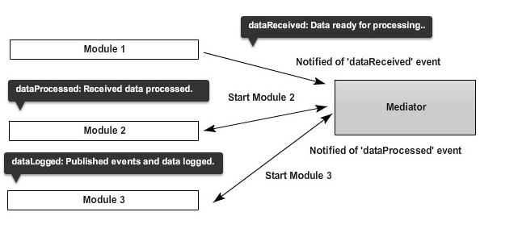

## 模块化 ##
1. 模块间不直接依赖
2. 模块可由更小的模块组成
3. 对第三方库的依赖应移至小模块中
4. 模块可在运行时被动态增删
5. 模块自身提供安全性控制
6. 模块通过状态通知程序其生命周期

### Facade模式 ###
用于封装底层API为高层API，屏蔽底层API的差异性，只提供现存的功能。
用法：
1. 接口抽象，向外提供稳定、统一的接口，一切修改均在内部处理
2. 安全控制，对访问方进行安全检查（哪些模块可以调用该模块，哪些不可以）

### Mediator模式 ###
通过订阅/发布模式，作为各个模块间通讯传递者，使得模块间不是直接相互访问，而系通过向mediator模块发送信号表达通讯需求，然后mediator向其他模块发送信号，订阅该信号的模块将作出响应。
好处：
1. 模块间依赖程度低
2. 模块增删改并不影响其他模块
3. 模块失效不会导致整个系统挂死

坏处：
1. 性能会低些

设计原则

hand-coded缓存机制？
multi-variate缓存机制？
## Memoization技术 ##
  定义：将函数返回值缓存起来的技术。